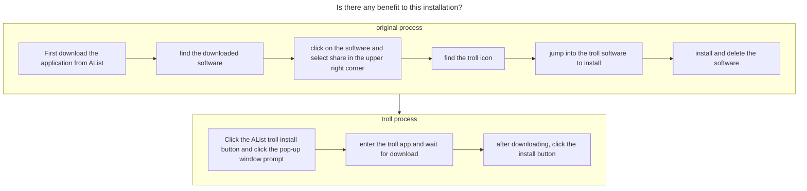

---
# This is the icon of the page
icon: iconfont icon-mini-app
# This control sidebar order
order: 8
# A page can have multiple categories
category:
  - Guide
# A page can have multiple tags
tag:
  - Advanced
  - Guide
# this page is sticky in article list
sticky: true
# this page will appear in starred articles
star: true
---

# IPA install

## **1. IPA native installation**

You can directly upload the ipa file. 

But for **ios>=16**, you need to name the ipa file: `original file name@bundle-identifier.ipa`, that is, you need to add `@bundle-identifier` on the original basis, in which `bundle-identifier` is the `CFBundleIdentifier` of Info.plist in the IPA package. Such as:

- aszs@rn.notes.best.ipa

Recommended to use [ipa-renamer](https://github.com/Xhofe/ipa-renamer) to rename your ipa files automatically and quickly.

- If you are a mobile phone user, you can also rename the IPA file, but you must know the format mentioned above, but there is no mobile phone renaming software, please solve it yourself...

### **Tips**

-  ==.ipa installation requires https and a valid certificate== , not just a package can be installed without a signature

:::tabs#ipa

@tab How to change the name of the computer version

<BiliBili bvid="BV1bT411N7tT" ratio="16:9" low-quality no-danmaku />

**If the video fails, you can watch it here: https://b23.tv/oLvHHC8**

@tab how to change the name of the IOS 16 mobile phone

<BiliBili bvid="BV1kX4y1X7vo"/>

**If the video fails, you can watch it here:https://b23.tv/GxGG8Dn**

:::

**Installation Demo**: Deploy **HTTPS** and **IPA files** are signed prerequisites, if ==IOS16 rename by yourself== If you can’t install it yourself, please check the problem yourself

- **Installation demo environment**: IOS15.4.1 iPhone12PM, personal certificate, HTTPS

<ArtPlayer src="https://r2.izyt.cc/ios/ios_ts.m3u8" />

## **2. TrollStore install**

 ==Requires AList version ≥ 3.12.2 and above==，Devices that support the installation of TrollStore (jailbroken devices are not explained here)

For more devices, please see the table below. The content of the chart comes from [**TrollStore**](https://github.com/opa334/TrollStore)

Chart information update is uncertain, you can go to view <i class="fa-regular fa-hand-point-right" style="color: #B197FC;"></i>  https://ios.cfw.guide/installing-trollstore

|          From          |           To           |                        **arm64 (A8)**                        |                        arm64 (A9-A11)                        |                    arm64e (A12-A17/M1-M2)                    |
| :--------------------: | :--------------------: | :----------------------------------------------------------: | :----------------------------------------------------------: | :----------------------------------------------------------: |
| 14.0 beta 1and earlier | 14.0 beta 1and earlier |                         Unsupported                          |                         Unsupported                          |                         Unsupported                          |
|      14.0 beta 2       |         14.8.1         | [TrollInstallerX](https://ios.cfw.guide/installing-trollstore-trollinstallerx) | [TrollInstallerX](https://ios.cfw.guide/installing-trollstore-trollinstallerx) | [TrollHelperOTA](https://ios.cfw.guide/installing-trollstore-trollhelperota) |
|          15.0          |      15.5 beta 4       | [TrollHelperOTA](https://ios.cfw.guide/installing-trollstore-trollhelperota) | [TrollHelperOTA](https://ios.cfw.guide/installing-trollstore-trollhelperota) | [TrollHelperOTA](https://ios.cfw.guide/installing-trollstore-trollhelperota) |
|          15.5          |          15.5          | [TrollInstallerMDC](https://ios.cfw.guide/installing-trollstore-trollinstallermdc) | [TrollInstallerX](https://ios.cfw.guide/installing-trollstore-trollinstallerx) | [TrollHelperOTA](https://ios.cfw.guide/installing-trollstore-trollhelperota) |
|      15.6 beta 1       |      15.6 beta 3       | [TrollHelperOTA](https://ios.cfw.guide/installing-trollstore-trollhelperota) | [TrollHelperOTA](https://ios.cfw.guide/installing-trollstore-trollhelperota) | [TrollHelperOTA](https://ios.cfw.guide/installing-trollstore-trollhelperota) |
|      15.6 beta 4       |         15.6.1         | [TrollInstallerMDC](https://ios.cfw.guide/installing-trollstore-trollinstallermdc) | [TrollInstallerX](https://ios.cfw.guide/installing-trollstore-trollinstallerx) | [TrollHelperOTA](https://ios.cfw.guide/installing-trollstore-trollhelperota) |
|          15.7          |         15.7.1         | [TrollInstallerMDC](https://ios.cfw.guide/installing-trollstore-trollinstallermdc) | [TrollInstallerX](https://ios.cfw.guide/installing-trollstore-trollinstallerx) | [TrollInstallerX](https://ios.cfw.guide/installing-trollstore-trollinstallerx) |
|         15.7.2         |         15.8.2         | [TrollMisaka](https://ios.cfw.guide/installing-trollstore-trollmisaka) | [TrollInstallerX](https://ios.cfw.guide/installing-trollstore-trollinstallerx) | [TrollInstallerX](https://ios.cfw.guide/installing-trollstore-trollinstallerx) |
|      16.0 beta 1       |      16.0 beta 3       |                        Not Applicable                        | [TrollInstallerX](https://ios.cfw.guide/installing-trollstore-trollinstallerx) | [TrollHelperOTA](https://ios.cfw.guide/installing-trollstore-trollhelperota) |
|      16.0 beta 4       |         16.6.1         |                        Not Applicable                        | [TrollInstallerX](https://ios.cfw.guide/installing-trollstore-trollinstallerx) | [TrollInstallerX](https://ios.cfw.guide/installing-trollstore-trollinstallerx) |
|        16.7 RC         |        16.7 RC         |                        Not Applicable                        | [TrollHelper](https://ios.cfw.guide/installing-trollstore-trollhelper) |                       **Coming Soon**                        |
|          16.7          |         16.7.8         |                        Not Applicable                        |                         Unsupported                          |                         Unsupported                          |
|      17.0 beta 1       |      17.0 beta 4       |                        Not Applicable                        | [TrollInstallerX](https://ios.cfw.guide/installing-trollstore-trollinstallerx) |                       **Coming Soon**                        |
|      17.0 beta 5       |          17.0          |                        Not Applicable                        | [TrollHelper](https://ios.cfw.guide/installing-trollstore-trollhelper) |                       **Coming Soon**                        |
|    17.0.1 and later    |    17.0.1 and later    |                        Not Applicable                        |                         Unsupported                          |                         Unsupported                          |

<a href="https://www.alipan.com/s/Z3mrsfdFY5h"><i class="fa-solid fa-party-horn fa-shake" style="color: #74C0FC;"></i> IPA Resources</a> :gift:

 

### **Installation example**

If you want to use the installation is very simple, click the **TrollStore* button to install

### **other instructions**

1. If you click the **TrollStore** button to open Apple's magnifying glass, it is because of the following reasons

    - Your `TrollStore` version number is less than version 1.3+, it is recommended to update to the latest version directly
    - Your URL scheme is not enabled. If you enable it, remember to click the first option to log out immediately **(Rebuild Now)**
      - 

2. What is the wake-up format of the TrollStore URL?

    > `apple-magnifier://install?url=<URL_to_IPA>`

3. Is there any benefit to this installation?

    - See the flow chart below for explanation

