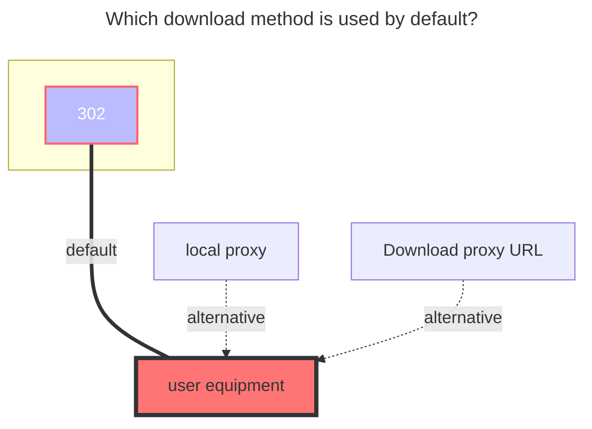

---
# This is the icon of the page
icon: iconfont icon-state
# This control sidebar order
order: 24
# A page can have multiple categories
category:
  - Guide
# A page can have multiple tags
tag:
  - Storage
  - Guide
  - "302"
# this page is sticky in article list
sticky: true
# this page will appear in starred articles
star: true
---

# 115 Cloud / Share

## **115 Cloud**

### **Root folder ID**

Open the official website of 115 Cloud and click the string behind the url when you click into the folder you want to set, such as <https://115.com/?cid=249163533602609229&offset=0&tab=&mode=wangpan>, which is `249163533602609229`

 

### **Login by QRCode**

<button :disabled="state === 3 || state === 1"
style="outline:none;padding:12px;background:#70c6be;border:none;border-radius:8px;cursor:pointer;font-size:20px;"
@click="onClick">
{{ btnText }}
</button>

 

:::info Token: {{ token }}
:::

 

### **Login by Cookie**

The `cookie` is obtained from the request.

 

### **Rapid upload**

- **v.3.27.0** version Enhanced Rapid upload: You can directly upload files with `Alibaba Cloud Disk Open` by copying
  
     - The premise is to upload the file from 115 Rapid upload to Alibaba Cloud Disk Open, the file already exists in Alibaba Cloud Disk Open, otherwise it is a normal copy task.
     - If you want to transfer 115 cloud disk files to Alibaba Cloud Disk in seconds, you need to turn on the Rapid upload option of Alibaba Cloud Disk, otherwise it will be uploaded in normal mode.

If you want to upload files using Miaochuan, it is recommended to build an AList locally on your home computer and add a `local storage` and `115 cloud disk` to copy Miaochuan to save resources.

 

### **Offline Download**

v3.36.0 above versions support calling 115 Cloud offline download function in AList

Select <svg fill="none" stroke-width="0" xmlns="http://www.w3.org/2000/svg" viewBox="0 0 24 24" class="toolbar-toggle hope-icon hope-c-XNyZK hope-c-PJLV hope-c-PJLV-ifkxHPo-css" height="1em" width="1em" style="overflow: visible;"><path fill="currentColor" d="M7 14a2 2 0 100-4 2 2 0 000 4zM14 12a2 2 0 11-4 0 2 2 0 014 0zM17 14a2 2 0 100-4 2 2 0 000 4z"></path><path fill="currentColor" fill-rule="evenodd" d="M24 12c0 6.627-5.373 12-12 12S0 18.627 0 12 5.373 0 12 0s12 5.373 12 12zm-2 0c0 5.523-4.477 10-10 10S2 17.523 2 12 6.477 2 12 2s10 4.477 10 10z" clip-rule="evenodd"></path></svg><svg fill="currentColor" stroke-width="0" xmlns="http://www.w3.org/2000/svg" viewBox="0 0 512 512" class="hope-icon hope-c-XNyZK hope-c-PJLV hope-c-PJLV-iipViGO-css" tips="offline_download" height="1em" width="1em" style="overflow: visible;"><path fill="none" stroke="currentColor" stroke-miterlimit="10" stroke-width="32" d="M421.83 293.82A144 144 0 00218.18 90.17M353.94 225.94a48 48 0 00-67.88-67.88"></path><path stroke-linecap="round" stroke-miterlimit="10" stroke-width="32" d="M192 464v-48M90.18 421.82l33.94-33.94M48 320h48"></path><path fill="none" stroke="currentColor" stroke-linejoin="round" stroke-width="32" d="M286.06 158.06L172.92 271.19a32 32 0 01-45.25 0L105 248.57a32 32 0 010-45.26L218.18 90.17M421.83 293.82L308.69 407a32 32 0 01-45.26 0l-22.62-22.63a32 32 0 010-45.26l113.13-113.17M139.6 169.98l67.88 67.89M275.36 305.75l67.89 67.88"></path> </svg> in the lower right corner and select `115 Cloud` for offline download options

- Support: `magne`, `http`, `ed2k` links

Only 115 Cloud is supported for offline download. If it is not 115 Cloud, the following error message will be displayed:

- unsupported storage driver for offline download, only 115 Cloud is supported

 

### **The default download method used**

## 115 Share

`Sharing link ID`^1^ and `Sharing link extraction code`^2^ How to obtain them respectively is clear at a glance.

### **Root folder ID**

The default is empty and the entire directory file is mounted.

The folder IDs are the root folder ID and the subfolder ID respectively. The following demonstrates how to obtain the `shared root folder directory ID`^1^ and `other subfolder directory ID`^2^ respectively.

::: tabs#115

@tab 1 shared root folder directory ID

Open developer mode (F12) and clear all requests first. Before we enter the folder, clear all requests first.

Let's click on the root folder to enter. There will be a new request on the right, and then select `Load` to see the ID (cid) of our folder.

@tab 2 other subfolder directory ID

Open developer mode (F12) and clear all requests first. Before we enter the folder, clear all requests first.

There will be a new request on the right, then select `Preview` and expand it to see the IDs (cid) of other subfolders.

:::

 

### **Error Tips**

For example, the 115 sharing link shown in the picture below has expired, but the sharing link can still be opened.

But when adding and saving, the following error code will appear:

`Failed init storage but storage is already created: failed init storage: failed to get share snap: json: cannot unmarshal number into Go struct field .data.shareinfo.share_state of type string `

### **The default download method used**

