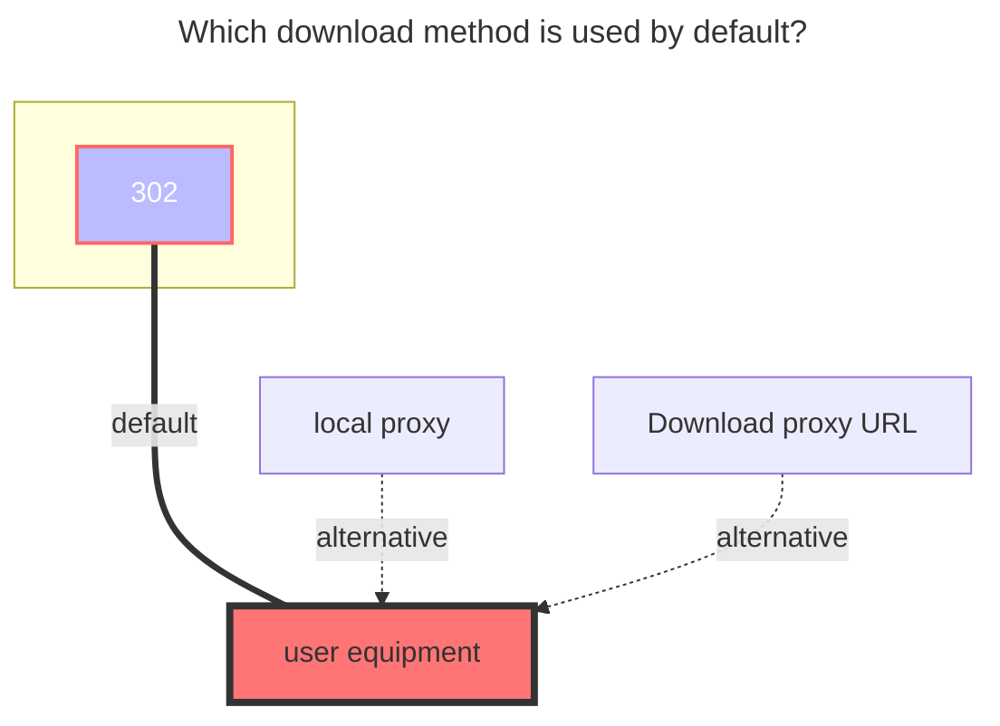

---
# This is the icon of the page
icon: iconfont icon-state
# This control sidebar order
order: 24
# A page can have multiple categories
category:
  - Guide
# A page can have multiple tags
tag:
  - Storage
  - Guide
  - "302"
# this page is sticky in article list
sticky: true
# this page will appear in starred articles
star: true
headerDepth: 5
---

# 115 Cloud / Share

## **115 Cloud**

### **Root folder ID**

Open the official website of 115 Cloud and click the string behind the url when you click into the folder you want to set, 

such as <https://115.com/?cid=249163533602609229&offset=0&tab=&mode=wangpan>, 

which is `249163533602609229`

<br/>


### **Cookie acquisition method**

The following message is displayed when mounting a 115 cloud. This is because 115 has removed the three client applications of `Windows, Mac, and Linux`.

```json
{
"state": 0,
"error": "登录失败，系统已下架！如果你有电脑端的使用需求，我们诚挚邀请你下载体验115产品专属客户端“115浏览器”或在线使用“115网页端(115.com)”，畅享智能高效云生活。",
"errno": 0,
"message": "登录失败，系统已下架！如果你有电脑端的使用需求，我们诚挚邀请你下载体验115产品专属客户端“115浏览器”或在线使用“115网页端(115.com)”，畅享智能高效云生活。",
"code": 0
}
```

The cookies you have obtained from these three devices cannot be used. Please obtain the cookies from other devices again to mount them.

<br/>


#### **1. QRCode scanning method login**

<script setup lang="ts">
import { ref } from "vue";
import { api } from "@Api"
const btnText = ref("Get QRCode");
// 0 -> Initial
// 1 -> Wait qr
// 2 -> Wait Scan
// 3 -> Getting Token
// 4 -> Success
const state = ref(0);
const src= ref('')
const token = ref('')
const ckData = ref('')
const getQr = async ()=>{
  btnText.value = '等待...';
  state.value = 1;
  const resp = await fetch(`${api()}/proxy/qrcodeapi.115.com/api/1.0/web/1.0/token`);
  const res = await resp.json();
  console.log(res)
  btnText.value='Use 115 Cloud APP To Scan Then Click'
  state.value = 2;
  ckData.value = {
    uid: res.data.uid,
    time: res.data.time.toString(),
    sign: res.data.sign,
    _ : (new Date().getTime()/ 1000).toString()
  };
  src.value = `${api()}/qr/?size=400&text=${encodeURIComponent(res.data.qrcode)}`
}
const getToken = async ()=>{
  state.value = 3;
  btnText.value = 'Waiting...';
  const resp = await fetch(`${api()}/proxy/qrcodeapi.115.com/get/status/?uid=${ckData.value.uid}&time=${ckData.value.time}&sign=${ckData.value.sign}&_=${ckData.value._}`);
  const res = await resp.json();
  const {data:{version,status,msg}} = res;
  if(status !==  2){
    state.value = 2;
    btnText.value = 'Use 115 Cloud APP To Scan Then Click'
    alert('Status:' + status);
    return
  }
  token.value = ckData.value.uid
  btnText.value = 'Get Token Success'
  state.value = 4;
  console.log(res)
}
const onClick = async ()=>{
  if(state.value===0){
    getQr()
  }
  if(state.value===2){
    getToken()
  }
}
</script>

<button :disabled="state === 3 || state === 1"
style="outline:none;padding:12px;background:#70c6be;border:none;border-radius:8px;cursor:pointer;font-size:20px;"
@click="onClick">
{{ btnText }}
</button>

<div v-show="src" style="margin:4px">
 
</div>

<div v-show="token" >

:::info Token: {{ token }}
:::

</div>

-----

1. Click <i class="fa-solid fa-up fa-bounce" style="color: #70c6be;"></i> <Badge text="Get QRCode" color="rgb(112,198,190)" type="tip" vertical="middle" />，Then use the 115 mobile APP to scan the code
2. After confirming the login by scanning the QR code using the APP，Click ` Use 115 Cloud APP To Scan Then Click` Button, Get <Badge text="Token" type="info" vertical="middle" />
3. You will get <Badge text="Token" type="info" vertical="middle" /> added to the **`QRcode Token`** option of the AList 115 Cloud, and then select the `Qrcode source` device (leave the Cookie option blank)
   - Equipment to choose from：`Web`、`android`、`ios`、`tv`、`alipaymini`、`wechatmini`、`qandroid`
     - It is not recommended to choose `Web` and `Android` (`ios`), because after logging in with your commonly used device, the original login status will be kicked offline.
4. Fill in the <Badge text="Token" type="info" vertical="middle" /> selection. After selecting the device and saving it, the <Badge text="Token" type="info" vertical="middle" /> will automatically obtain the Cookie of the corresponding device and fill it in automatically.

<br/>


<br/>


#### **2. Log in by manually grabbing Cookies**

The `cookie` is obtained from the request.

<br/>


#### **3. Get Cookies Using Python Script**

 <i class="fa-solid fa-lightbulb fa-bounce" style="color: #4abf8a;"></i> Expand the detailed description to view the tutorial and script source code

:::: details Detailed description

::: details View source

```python
#!/usr/bin/env python3
# encoding: utf-8

"扫码获取 115 cookie"

__author__ = "ChenyangGao <https://chenyanggao.github.io>"
__version__ = (0, 0, 2)
__all__ = [
    "AppEnum", "get_qrcode_token", "get_qrcode_status", "post_qrcode_result", 
    "get_qrcode", "login_with_qrcode", 
]

if __name__ == "__main__":
    from argparse import ArgumentParser, RawTextHelpFormatter

    parser = ArgumentParser(description="""\
扫码获取 115 cookie

默认在命令行输出，需要安装 qrcode: pip install qrcode
    - https://pypi.org/project/qrcode/
可以指定 -o 或 --open-qrcode 直接打开图片扫码
""", formatter_class=RawTextHelpFormatter)
    parser.add_argument("app", nargs="?", choices=("web", "android", "ios", "linux", "mac", "windows", "tv", "alipaymini", "wechatmini", "qandroid"), default="web", help="选择一个 app 进行登录，注意：这会把已经登录的相同 app 踢下线")
    parser.add_argument("-o", "--open-qrcode", action="store_true", help="打开二维码图片，而不是在命令行输出")
    parser.add_argument("-v", "--version", action="store_true", help="输出版本号")
    args = parser.parse_args()
    if args.version:
        print(".".join(map(str, __version__)))
        raise SystemExit(0)

from enum import Enum
from json import loads
from urllib.parse import urlencode
from urllib.request import urlopen, Request


AppEnum = Enum("AppEnum", "web, android, ios, linux, mac, windows, tv, alipaymini, wechatmini, qandroid")


def get_enum_name(val, cls):
    if isinstance(val, cls):
        return val.name
    try:
        if isinstance(val, str):
            return cls[val].name
    except KeyError:
        pass
    return cls(val).name


def get_qrcode_token():
    """获取登录二维码，扫码可用
    GET https://qrcodeapi.115.com/api/1.0/web/1.0/token/
    :return: dict
    """
    api = "https://qrcodeapi.115.com/api/1.0/web/1.0/token/"
    return loads(urlopen(api).read())


def get_qrcode_status(payload):
    """获取二维码的状态（未扫描、已扫描、已登录、已取消、已过期等）
    GET https://qrcodeapi.115.com/get/status/
    :param payload: 请求的查询参数，取自 `login_qrcode_token` 接口响应，有 3 个
        - uid:  str
        - time: int
        - sign: str
    :return: dict
    """
    api = "https://qrcodeapi.115.com/get/status/?" + urlencode(payload)
    return loads(urlopen(api).read())


def post_qrcode_result(uid, app="web"):
    """获取扫码登录的结果，并且绑定设备，包含 cookie
    POST https://passportapi.115.com/app/1.0/{app}/1.0/login/qrcode/
    :param uid: 二维码的 uid，取自 `login_qrcode_token` 接口响应
    :param app: 扫码绑定的设备，可以是 int、str 或者 AppEnum
        app 目前发现的可用值：
            - 1,  "web",        AppEnum.web
            - 2,  "android",    AppEnum.android
            - 3,  "ios",        AppEnum.ios
            - 4,  "linux",      AppEnum.linux
            - 5,  "mac",        AppEnum.mac
            - 6,  "windows",    AppEnum.windows
            - 7,  "tv",         AppEnum.tv
            - 8,  "alipaymini", AppEnum.alipaymini
            - 9,  "wechatmini", AppEnum.wechatmini
            - 10, "qandroid",   AppEnum.qandroid
    :return: dict，包含 cookie
    """
    app = get_enum_name(app, AppEnum)
    payload = {"app": app, "account": uid}
    api = "https://passportapi.115.com/app/1.0/%s/1.0/login/qrcode/" % app
    return loads(urlopen(Request(api, data=urlencode(payload).encode("utf-8"), method="POST")).read())


def get_qrcode(uid):
    """获取二维码图片（注意不是链接）
    :return: 一个文件对象，可以读取
    """
    url = "https://qrcodeapi.115.com/api/1.0/mac/1.0/qrcode?uid=%s" % uid
    return urlopen(url)


def login_with_qrcode(app="web", scan_in_console=True):
    """用二维码登录
    :param app: 扫码绑定的设备，可以是 int、str 或者 AppEnum
        app 目前发现的可用值：
            - 1,  "web",        AppEnum.web
            - 2,  "android",    AppEnum.android
            - 3,  "ios",        AppEnum.ios
            - 4,  "linux",      AppEnum.linux
            - 5,  "mac",        AppEnum.mac
            - 6,  "windows",    AppEnum.windows
            - 7,  "tv",         AppEnum.tv
            - 8,  "alipaymini", AppEnum.alipaymini
            - 9,  "wechatmini", AppEnum.wechatmini
            - 10, "qandroid",   AppEnum.qandroid
    :return: dict，扫码登录结果
    """
    qrcode_token = get_qrcode_token()["data"]
    qrcode = qrcode_token.pop("qrcode")
    if scan_in_console:
        try:
            from qrcode import QRCode
        except ModuleNotFoundError:
            from sys import executable
            from subprocess import run
            run([executable, "-m", "pip", "install", "qrcode"], check=True)
            from qrcode import QRCode # type: ignore
        qr = QRCode(border=1)
        qr.add_data(qrcode)
        qr.print_ascii(tty=True)
    else:
        from atexit import register
        from os import remove
        from threading import Thread
        from tempfile import NamedTemporaryFile
        qrcode_image = get_qrcode(qrcode_token["uid"])
        with NamedTemporaryFile(suffix=".png", delete=False) as f:
            f.write(qrcode_image.read())
            f.flush()
        register(lambda: remove(f.name))
        def open_qrcode():
            platform = __import__("platform").system()
            if platform == "Windows":
                from os import startfile # type: ignore
                startfile(f.name)
            elif platform == "Darwin":
                from subprocess import run
                run(["open", f.name])
            else:
                from subprocess import run
                run(["xdg-open", f.name])
        Thread(target=open_qrcode).start()
    while True:
        try:
            resp = get_qrcode_status(qrcode_token)
        except TimeoutError:
            continue
        status = resp["data"].get("status")
        if status == 0:
            print("[status=0] qrcode: waiting")
        elif status == 1:
            print("[status=1] qrcode: scanned")
        elif status == 2:
            print("[status=2] qrcode: signed in")
            break
        elif status == -1:
            raise OSError("[status=-1] qrcode: expired")
        elif status == -2:
            raise OSError("[status=-2] qrcode: canceled")
        else:
            raise OSError("qrcode: aborted with %r" % resp)
    return post_qrcode_result(qrcode_token["uid"], app)


if __name__ == "__main__":
    resp = login_with_qrcode(args.app, scan_in_console=not args.open_qrcode)
    print()
    print("; ".join("%s=%s" % t for t in resp['data']['cookie'].items()))

```

Source code from：[**https://gist.github.com/ChenyangGao/d26a592a0aeb13465511c885d5c7ad61**](https://gist.github.com/ChenyangGao/d26a592a0aeb13465511c885d5c7ad61)

:::

<br/>

1. You need to install [**Python 3.11.x**](https://www.python.org/downloads/) or above

2. If the QR code cannot be displayed properly in the `CMD` and `powershell` terminals, you can use the `-o` parameter to generate an image to scan the code, or you need to install an additional terminal

   1. Use the `-o` parameter to generate the image method and scan the QR code to confirm
      - ```python
        python main.py wechatmini -o
        ```

   The devices that can be obtained are as follows. If you do not fill in the device, the default device on the `Web` side will be used

   `Web`，`android`，`ios`，~~`linux`，`mac`，`windows`~~，`tv`，`alipaymini`，`wechatmini`，`qandroid`

   - `alipaymini` and `wechatmini` They are Alipay Mini Program and WeChat Mini Program.
   - **Windows、Mac、Linux should not be able to use it anymore. The official client was recently removed from the shelves.**
   - It is recommended to use some devices that you do not commonly use, otherwise logging in will crowd out the previous ones.
   
   -----
   
   2. Additional installation terminal
      - Windows Store：**https://apps.microsoft.com/detail/9n0dx20hk701?rtc=1&hl=zh-cn&gl=CN**
      - GitHub Download：**https://github.com/microsoft/terminal/releases**
   
   3. Other ways, solve it yourself

-----

Execute the command and obtain the QR code. Scan the QR code on the APP to obtain `Cookie`

:::tabs#qr

@tab Direct Execution

```shell
PS C:\Users\233\Desktop\115> python --version
Python 3.12.2
PS C:\Users\233\Desktop\115> python main.py wechatmini
█▀▀▀▀▀▀▀█▀▀▀▀█▀███▀▀▀█▀█▀▀▀██▀█▀▀▀▀▀▀▀█
█ █▀▀▀█ █ █▀▄▀█▄▀▀█▀█  ▄█▀▀ █▀█ █▀▀▀█ █
█ █   █ █▀█  ▄ ▄▀▄ ▀ ▀▄ █▀▄▀█▀█ █   █ █
█ ▀▀▀▀▀ █▀█ ▄▀▄ ▄ ▄ █ ▄▀▄▀█▀█▀█ ▀▀▀▀▀ █
█▀██▀▀▀▀▀▀▀ ▄█ ▀█ █▀▀▀ █▀ ▄▄▄ ▀██▀█▀▀▀█
██▄▀▀▄▀▀▀▀ ▄██▀▄██▀██▄█ █▀▀▀ ▀▀▀▄▄▀ ▄▀█
█   ▀██▀████ ▀ ▀ ▀ █▀ ▀▀▄▄▀▄ █▄▀▄▄ ▀▀▀█
█ ▄▀▀█▄▀█▀▀██ ▀▀▀▀ ▄▀ ▀███▀██▀▄▀▀▄▄   █
██▄█ ▄▀▀█▄   ▀█▄▀▄▄ █ █▀ ▄▀▀  ▄▀█▀█▀█▀█
███▄ █ ▀ ▀█  █▄ ▀▀▀▀█▀█▀█ ▄▀▀ ▄ █  ██▄█
█ █▀▀▀█ █ ▄▄▀▄▄▀ █▄▄▀█▀ █▀▄█  ▀▀▀ ▀█▀ █
█ █   █ █▄ ▄▀ █▀▀ ▀▄▀▀█▀▀  █ █ ▄█▀▄▄ ▀█
█ ▀▀▀▀▀ █▀  █▄▀ ▀ ▄█▄ █▄▀▀█▄ ▀ ▀▄▄ ▄▄ █
▀▀▀▀▀▀▀▀▀▀▀▀▀▀▀▀▀▀▀▀▀▀▀▀▀▀▀▀▀▀▀▀▀▀▀▀▀▀▀
```

Execute the command directly. The QR code will appear in the terminal for display.

@tab Using the -o parameter

```bash
PS C:\Users\233\Desktop\115> python --version
Python 3.12.2
PS C:\Users\233\Desktop\115> python main.py wechatmini -o
```

After using the `-o` parameter, a QR code image will pop up automatically

:::

::::

<br/>


### **Rapid upload**

- **v.3.27.0** version Enhanced Rapid upload: You can directly upload files with `Alibaba Cloud Disk Open` by copying
  
     - The premise is to upload the file from 115 Rapid upload to Alibaba Cloud Disk Open, the file already exists in Alibaba Cloud Disk Open, otherwise it is a normal copy task.
     - If you want to transfer 115 cloud disk files to Alibaba Cloud Disk in seconds, you need to turn on the Rapid upload option of Alibaba Cloud Disk, otherwise it will be uploaded in normal mode.

If you want to upload files using Miaochuan, it is recommended to build an AList locally on your home computer and add a `local storage` and `115 cloud disk` to copy Miaochuan to save resources.

<br/>

### **Offline Download**

<Badge text="v3.37.0" type="info" vertical="middle" /> and above versions support calling `115 Cloud` offline download function in AList

Select <span style="color: rgb(24, 144, 255);"><svg fill="none" stroke-width="0" xmlns="http://www.w3.org/2000/svg" viewBox="0 0 24 24" class="toolbar-toggle hope-icon hope-c-XNyZK hope-c-PJLV hope-c-PJLV-ifkxHPo-css" height="1em" width="1em" style="overflow: visible;"><path fill="currentColor" d="M7 14a2 2 0 100-4 2 2 0 000 4zM14 12a2 2 0 11-4 0 2 2 0 014 0zM17 14a2 2 0 100-4 2 2 0 000 4z"></path><path fill="currentColor" fill-rule="evenodd" d="M24 12c0 6.627-5.373 12-12 12S0 18.627 0 12 5.373 0 12 0s12 5.373 12 12zm-2 0c0 5.523-4.477 10-10 10S2 17.523 2 12 6.477 2 12 2s10 4.477 10 10z" clip-rule="evenodd"></path></svg></span><span style="color: rgb(24, 144, 255);"><svg fill="currentColor" stroke-width="0" xmlns="http://www.w3.org/2000/svg" viewBox="0 0 512 512" class="hope-icon hope-c-XNyZK hope-c-PJLV hope-c-PJLV-iipViGO-css" tips="offline_download" height="1em" width="1em" style="overflow: visible;"><path fill="none" stroke="currentColor" stroke-miterlimit="10" stroke-width="32" d="M421.83 293.82A144 144 0 00218.18 90.17M353.94 225.94a48 48 0 00-67.88-67.88"></path><path stroke-linecap="round" stroke-miterlimit="10" stroke-width="32" d="M192 464v-48M90.18 421.82l33.94-33.94M48 320h48"></path><path fill="none" stroke="currentColor" stroke-linejoin="round" stroke-width="32" d="M286.06 158.06L172.92 271.19a32 32 0 01-45.25 0L105 248.57a32 32 0 010-45.26L218.18 90.17M421.83 293.82L308.69 407a32 32 0 01-45.26 0l-22.62-22.63a32 32 0 010-45.26l113.13-113.17M139.6 169.98l67.88 67.89M275.36 305.75l67.89 67.88"></path> </svg></span> in the lower right corner and select `115 Cloud` for offline download options

- Support: `magne`, `http`, `ed2k` links

Only 115 Cloud is supported for offline download. If it is not 115 Cloud, the following error message will be displayed, Although the offline download prompt was successfully added, an error will be prompted in the background.

- unsupported storage driver for offline download, only 115 Cloud is supported


- Some tips for using 115 offline downloads:
  1. Out of sync problems may occur (manual refresh in the lower right corner <span style="color: rgb(24, 144, 255);"><svg fill="currentColor" stroke-width="0" xmlns="http://www.w3.org/2000/svg" viewBox="0 0 24 24" class="hope-icon hope-c-XNyZK hope-c-PJLV hope-c-PJLV-ifkxHPo-css" tips="refresh" height="1em" width="1em" style="overflow: visible;"><path fill="none" d="M0 0h24v24H0z"></path><path d="M5.463 4.433A9.961 9.961 0 0112 2c5.523 0 10 4.477 10 10 0 2.136-.67 4.116-1.81 5.74L17 12h3A8 8 0 006.46 6.228l-.997-1.795zm13.074 15.134A9.961 9.961 0 0112 22C6.477 22 2 17.523 2 12c0-2.136.67-4.116 1.81-5.74L7 12H4a8 8 0 0013.54 5.772l.997 1.795z"></path></svg></span>)
  2. Currently, when the download is successful, completed tasks in the offline list are deleted.
  3. 115 Task URLs that are already in the offline list cannot be added again.

<br/>

### **The default download method used**




## 115 Share


`Sharing link ID`^1^ and `Sharing link extraction code`^2^ How to obtain them respectively is clear at a glance.

### **Root folder ID**

The default is empty and the entire directory file is mounted.

The folder IDs are the root folder ID and the subfolder ID respectively. The following demonstrates how to obtain the `shared root folder directory ID`^1^ and `other subfolder directory ID`^2^ respectively.

::: tabs#115

@tab 1 shared root folder directory ID

Open developer mode (F12) and clear all requests first. Before we enter the folder, clear all requests first.

Let's click on the root folder to enter. There will be a new request on the right, and then select `Load` to see the ID (cid) of our folder.


@tab 2 other subfolder directory ID

Open developer mode (F12) and clear all requests first. Before we enter the folder, clear all requests first.

There will be a new request on the right, then select `Preview` and expand it to see the IDs (cid) of other subfolders.


:::

<br/>

### **Error Tips**

For example, the 115 sharing link shown in the picture below has expired, but the sharing link can still be opened.


But when adding and saving, the following error code will appear:

`Failed init storage but storage is already created: failed init storage: failed to get share snap: json: cannot unmarshal number into Go struct field .data.shareinfo.share_state of type string `

### **The default download method used**


