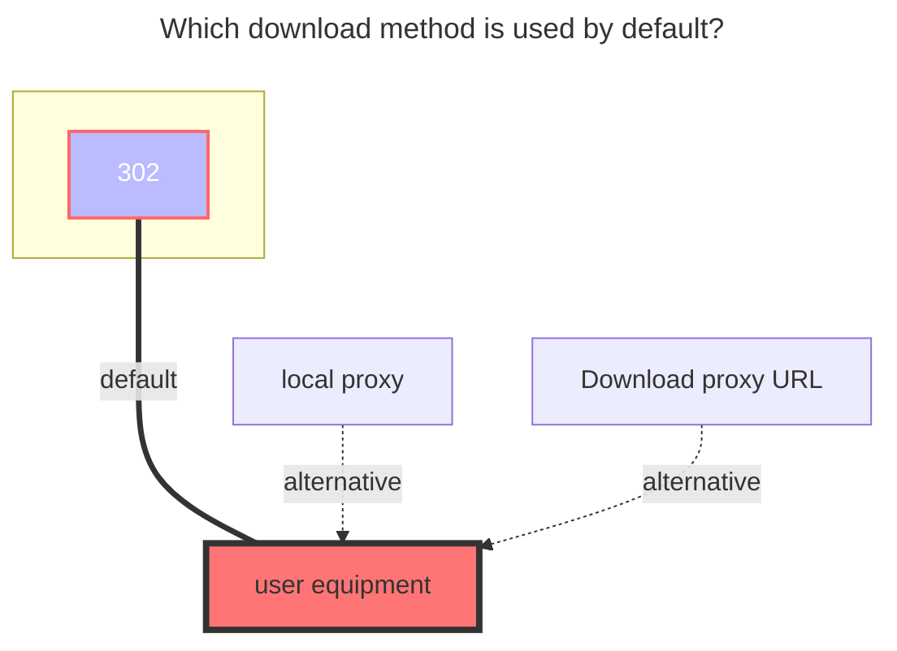

---
# This is the icon of the page
icon: iconfont icon-state
# This control sidebar order
order: 25
# A page can have multiple categories
category:
  - Guide
# A page can have multiple tags
tag:
  - Storage
  - Guide
# this page is sticky in article list
sticky: true
# this page will appear in starred articles
star: true
---

# 115 Cloud Share Link

Driver for 115 share link, supports downloading but not uploading.

:::tip

Due to the restrictions of 115 Cloud Drive, to get the direct download link, you must carry Cookies, so you must log in.

:::

## **Root folder ID**

Default "" is for all content of the shared link

## **Login**

Same as 115 Cloud Drive

## **Share Code/Access Code Acquisition**

115 Cloud Drive share link:  [https://115.com/s/sw60op83nux?password=y908#](https://115.com/s/sw60op83nux?password=y908#)

The Share Code is: **sw60op83nux**
The Access Code is: **y908**

### **The default download method used**

