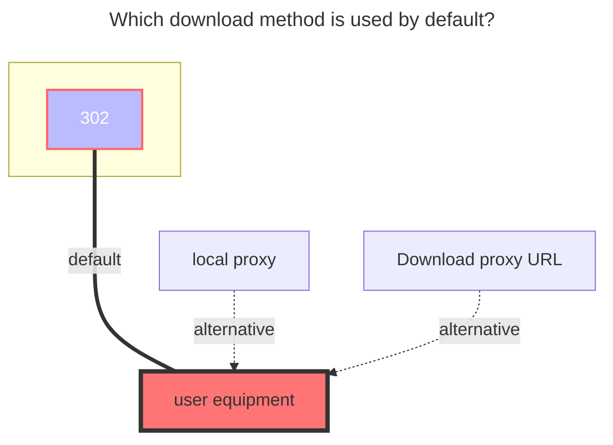

---
# This is the icon of the page
icon: iconfont icon-state
# This control sidebar order
order: 9
# A page can have multiple categories
category:
  - Guide
# A page can have multiple tags
tag:
  - Storage
  - Guide
# this page is sticky in article list
sticky: true
# this page will appear in starred articles
star: true
---

# 123Pan/Share
## **personal**

https://www.123pan.com/

Just fill in the account password.

### **Username**
The mobile phone number used to log in
### **Password**
The password used to log in
### **Root folder file_id**
Enter the folder you want to mount, the last string of the official website URL, such as:

### **Recommendations**

- It seems that the 123 API has a limited number of loads each time, so if you load hundreds of files in a folder at one time, an error may be reported
- It is recommended to A useful approach is not to put too many sub-items in the same folder.

## **Share**

It is estimated that it will be repaired in a few days~

Fill in the driver's **`share key`** and optional **`share password`** (if there is a password, you need to fill in), the root folder ID defaults to `0` to display all files

### **Fill in the example**

### **Share Password**

Fill in if you have it, don't if you don't

### **Root folder file_id**

The ID of the root directory of the shared link is `0`, displaying all files

If you only want to display a certain folder, open the developer mode (F12) to clear all requests (maybe 123 prohibits debug debugging, you need to close this by yourself to continue)

Find the request on the right side of the picture in the upper-level directory request of the directory you want to display, then click `Response`, find the format button `{}` below and format it, and you can see the relevant directory ID.

If you are not sure whether the directory ID is correct or not, there is a directory name under the directory ID

## **The default download method used**

