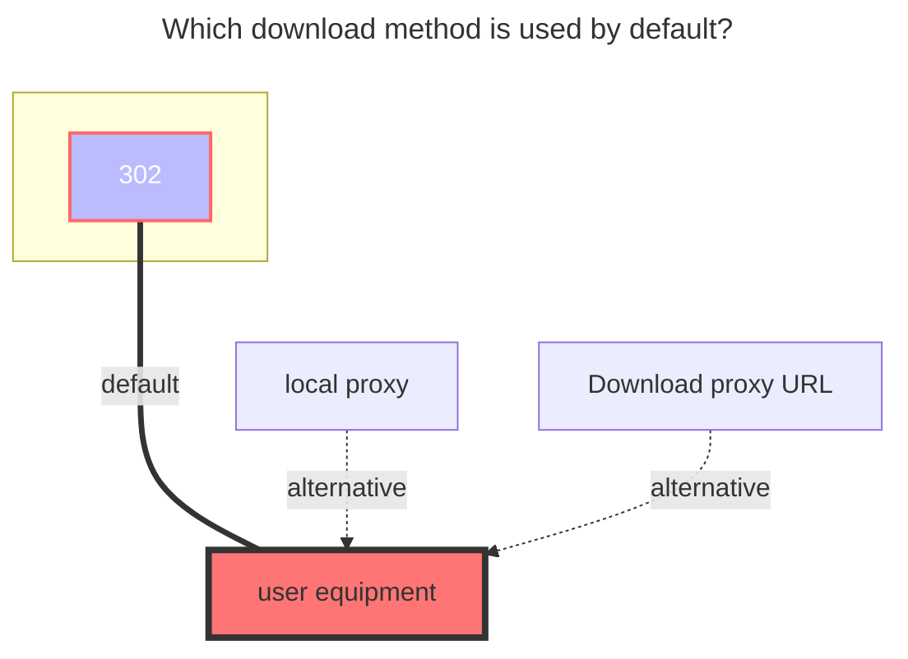

---
# This is the icon of the page
icon: iconfont icon-state
# This control sidebar order
order: 9
# A page can have multiple categories
category:
  - Guide
# A page can have multiple tags
tag:
  - Storage
  - Guide
  - "302"
# this page is sticky in article list
sticky: true
# this page will appear in starred articles
star: true
---

# 123Pan/Share/Link

You can view the content of the tab below to view different mounting methods (including **`Direct link`**, `Personal`, `Share`)

- `Direct link` ：is only adapted to the authentication function, the link also needs to be filled in by yourself, like [UrlTree](/guide/drivers/UrlTree.md), fill in the direct link copied in 123 direct link.

- `Personal`：Free user 10G traffic download, unlimited upload, multi-IP sharing is prohibited


::::: tabs#123

@tab personal

## **personal**

:::: tip

Free user 10G traffic download, unlimited upload, multi-IP sharing is prohibited

- Need to use `v3.33.0` version

::: warning 

```json
failed get objs: failed to list objs:当前账号存在安全风险，请使用短信验证码或者微信进行登录。
```

solution:

- This is because the 123 cloud disk officially prohibits the mounting on strange devices, If you are mounted locally, `or` Windows Server server mount `to open the 123 cloud disk web page to log in or modify a password once
  - example：[#6105](https://github.com/alist-org/alist/discussions/6105#discussioncomment-8628361)、 [#6254](https://github.com/alist-org/alist/discussions/6254#discussioncomment-8884882)

:::

::::

https://www.123pan.com/

Just fill in the account password.

### **Username**

The mobile phone number used to log in

### **Password**

The password used to log in

### **Root folder file_id**

Enter the folder you want to mount, the last string of the official website URL, such as:


### **Recommendations**

- It seems that the 123 API has a limited number of loads each time, so if you load hundreds of files in a folder at one time, an error may be reported
- It is recommended to A useful approach is not to put too many sub-items in the same folder.


@tab Link

::: danger Please read this reminder carefully

Because 123 Cloud Disk Direct Link is a paid purchase with a quota, if you add 123 Direct Link storage, please set passwords, meta information and other measures in time to prevent malicious traffic brushing.

After setting it up, test it yourself in incognito mode first. If you fail to set up the correct anti-theft measures and are maliciously flooded with traffic, you will be responsible for it yourself.

:::

First open **`123 Cloud Disk Direct Link Management`**: **https://www.123pan.com/DirectLink** Set an authentication key in the lower right corner, and then turn on the authentication status switch


- Open Settings 123 Cloud Disk Settings: **https://www.123pan.com/Setting** and find the account ID [`1` label in the picture below]
- How to activate direct link? (You need to activate membership to use it)
  - Find the folder you want to open, right-click on `Enable Direct Link Space`, and after opening it, you will see a link icon in the folder [Tag `2` in the picture below]
- How to get a direct link to a file? [Tag `3` in the picture below]
  - Enter the folder that has 'enabled direct link space', find the file you need to obtain, right-click 'Get direct link', and fill in the AList configuration after obtaining it.


### **Fill in example**

- **Origin urls**：Fill in the direct link to the files we copied one by one

  - It supports creating different folders like [UrlTree](/guide/drivers/UrlTree.md), and supports filling in the file size and modification time (four options are provided for use, like the UrlTree filling, refer to the second example of the picture below)
  - File size unit: `B` bytes. For example, if you want to write a 1MB file, it is 1048567 bytes. You can search for the specific byte conversion in your browser (you can leave it blank).
  - File modification time: It is `Unix timestamp`. You can search in the browser for the specific conversion  (you can leave it blank).

  ```txt
  Fill in the format:
  [FileSize:][Modified:]URL
  127451136:1694101621:https://vip.123pan.cn/1812xxx499/123-link-Test/linuxqq_3.2.0-16736_mips64el.deb
  [FileSize:]URL
  134847488:https://vip.123pan.cn/1812xxx499/123-link-Test/linuxqq_3.2.0-16736_loong64.deb
  [Modified:]URL
  1694101621:https://vip.123pan.cn/1812xxx499/123-link-Test/linuxqq_3.2.0-16736_arm64.AppImage
  URL
  https://vip.123pan.cn/1812xxx499/123-link-Test/linuxqq_3.2.0-16736_x86_64.AppImage
  ```

- **Private key**：

  - You can set up the direct link management page yourself and turn it on. Please turn it on.

- **Uid**：

  - Account ID in the account settings page

- **Valid duration**：

  - The file direct link validity period, in minutes, is filled in by default to 30 minutes

<div class="image-preview">  
    
    
</div>


@tab Share

::: warning 

This driver is no longer actively maintained due to 123Pan's limitations
:::

## **Share**

It is estimated that it will be repaired in a few days~

Fill in the driver's **`share key`** and optional **`share password`** (if there is a password, you need to fill in), the root folder ID defaults to `0` to display all files

### **Fill in the example**


### **Share Password**

Fill in if you have it, don't if you don't


### **Root folder file_id**

The ID of the root directory of the shared link is `0`, displaying all files

If you only want to display a certain folder, open the developer mode (F12) to clear all requests (maybe 123 prohibits debug debugging, you need to close this by yourself to continue)

Find the request on the right side of the picture in the upper-level directory request of the directory you want to display, then click `Response`, find the format button `{}` below and format it, and you can see the relevant directory ID.

If you are not sure whether the directory ID is correct or not, there is a directory name under the directory ID


:::::

## **The default download method used**

