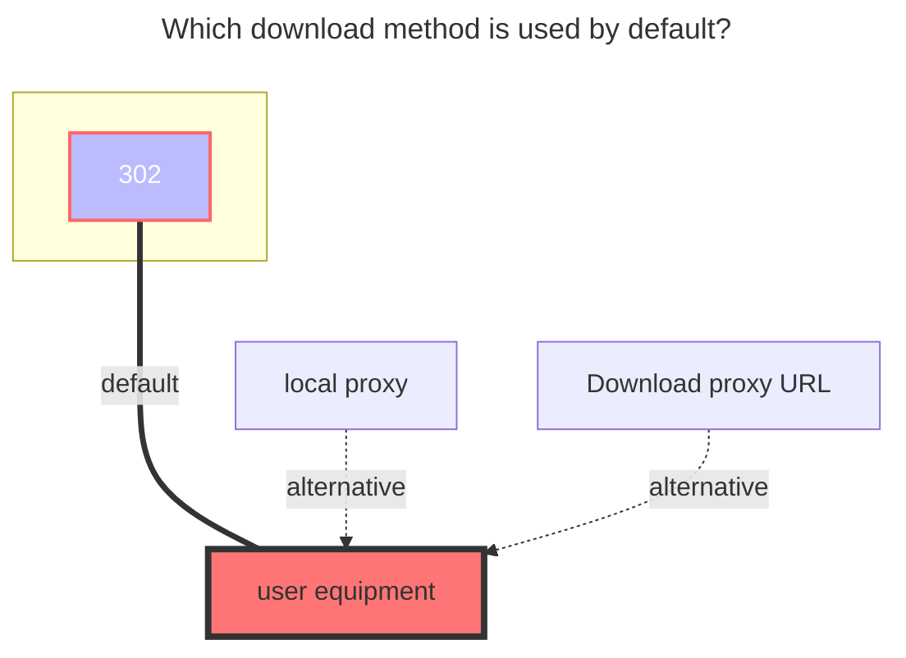

---
# This is the icon of the page
icon: state
# This control sidebar order
order: 7
# A page can have multiple categories
category:
  - Guide
# A page can have multiple tags
tag:
  - Storage
  - Guide
# this page is sticky in article list
sticky: true
# this page will appear in starred articles
star: true
---
# 139Yun

## **Account**

Mobile phone number for login

Cloud disk address：**https://yun.139.com/**

- :warning: The alist version must be greater than `v3.18.0` to use this tutorial (excluding v3.18.0)

:::tip

Update the method of authentication, please get `Authorization` to fill in

:::

## **root folder ID**

- Personal cloud：ROOT will list all of them, cover 18 items (viewing it by itself), and normal files are in **My folder**.
  - If you fill in the folder ID, the normal root directory folder is listed (this method is recommended)

- Family cloud：The root directory is empty is all files
  - If you want to list a folder separately, get the directory ID method in the picture of the family cloud below

## **Type**

Personal Cloud: Choose Personal Cloud

Family Cloud: Choose Family Cloud

## **Other**

1. Other information is taken from the request, which has changed from cookie to obtaining `Authorization`

2. If you can't find the load on the bottom of the request information, go to the top `on the top of the upper row, marked the purple highlight

### **Cloud ID**

Personal cloud does not need to fill in, **Family cloud is dedicated**.

### **Search keywords**

Pay attention to the keywords, use it below to get **`authorization`**

- Personal Cloud：**getDisk**
- Family Cloud：**queryContentList**

### **Personal cloud：**

  
    
    

### **Family cloud：**

Note: Family cloud does not support renames, movement, copying and uploading.

  
    
    

::: details Teaching video

Although the video is V2 version, the way to obtain the directory ID and the cloud ID is the same.

**https://www.bilibili.com/video/BV1US4y1w79a**

From the previous way to get cookies, now replaced it with `Authorization`，You can see the [Fill in the Example](#alist-fill-in-examples) tutorial below

:::

### **AList fill in examples：**

==`Authorization`Just fill in the content of the start after the basic space==

  
    
    

### **The default download method used**

