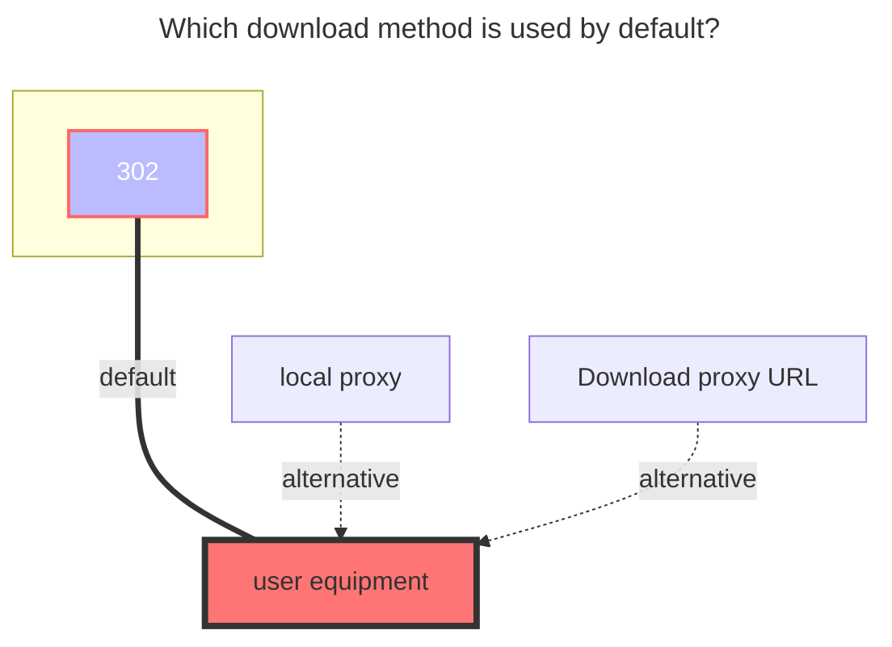

---
# This is the icon of the page
icon: iconfont icon-state
# This control sidebar order
order: 7
# A page can have multiple categories
category:
  - Guide
# A page can have multiple tags
tag:
  - Storage
  - Guide
  - "302"
# this page is sticky in article list
sticky: true
# this page will appear in starred articles
star: true
---
# 139Yun

Cloud disk address：**https://yun.139.com/**

- :warning: The alist version must be greater than `v3.18.0` to use this tutorial (excluding v3.18.0)

:::tip

Update the method of authentication, please get `Authorization` to fill in

:::

 

## **root folder ID**

- Personal cloud：It can be left blank and it will be filled in automatically. All will be listed, covering 18 items (check it yourself). Normal files are in **My Folder**.
  - If you fill in the folder ID, the normal root directory folder is listed (this method is recommended)

- Family cloud：The root directory is empty is all files
  - If you want to list a folder separately, get the directory ID method in the picture of the [family cloud](#family-cloud) below
- Personal new：`/`，It can be left blank and it will be automatically filled in and everything will be listed.
  - If you want to list a folder separately, get the directory ID method in the picture of the [Personal new](#personal-new) below

 

## **Proxy Range**

You need to enable `Web Proxy` or` Webdav Native Proxy` to take effect

- Currently only applicable to：`alias`、`139Yun`、`AList V3`
  - Function Description：**https://github.com/alist-org/alist/pull/6496#issue-2309839607**

 

## **Type**

1. Personal Cloud: Choose Personal Cloud

2. Family Cloud: Choose Family Cloud

3. Personal new：New API
   - Only newly registered accounts are available. You can distinguish them by searching for `getDisk` in the request. If it can be found, it is the old version. If it cannot be found, it is the new version.

If you have a new version of the API, you will not be able to use the `Personal Cloud` type. Although there is no error message, the file will not be loaded.

If there is a `getDisk` request, the `New Personal` type cannot be used, otherwise it will prompt `User does not exist`

 

## **Other**

1. Other information is taken from the request, which has changed from cookie to obtaining `Authorization`
   1. The new personal cloud can be obtained in another way. See the picture example of [Personal new](#personal-new)

2. If you can't find the load on the bottom of the request information, go to the top `on the top of the upper row, marked the purple highlight

 

### **Cloud ID**

Personal cloud does not need to fill in, **Family cloud is dedicated**.

 

### **Search keywords**

Pay attention to the keywords, use it below to get **`authorization`**

- Personal Cloud：**getDisk**
- Family Cloud：**queryContentList**

 

### **Personal cloud：**

  
    
    

 

Note: Family cloud does not support renames, movement, copying and uploading.

### **Family cloud：**

Note: Family cloud does not support renames, movement, copying and uploading.

  
    
    

::: details Teaching video

Although the video is V2 version, the way to obtain the directory ID and the cloud ID is the same.

**https://www.bilibili.com/video/BV1US4y1w79a**

From the previous way to get cookies, now replaced it with `Authorization`，You can see the [Fill in the Example](#alist-fill-in-examples) tutorial below

:::

 

### **Personal new：**

  
    

 

### **AList fill in examples：**

- ==`Authorization`Just fill in the content of the start after the basic space==
- The new personal cloud folder ID will automatically change after you enter the folder. Just open whichever folder you need, and then get the value of `currentCatalogID`^Figure_3^

  
    
    
    

 

### **The default download method used**

