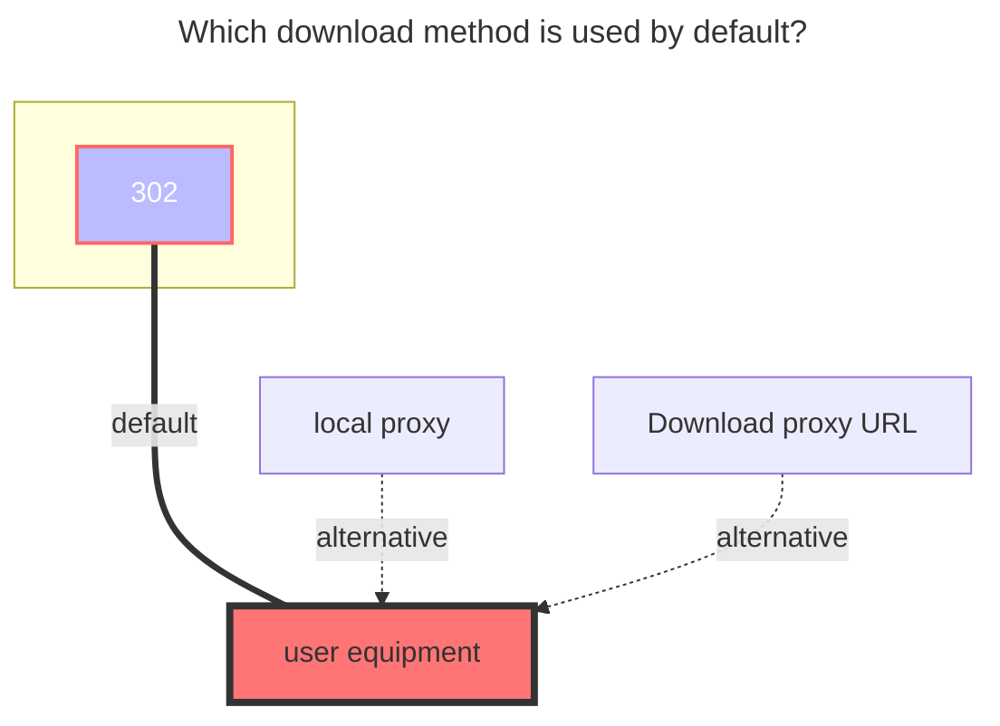

---
# This is the icon of the page
icon: iconfont icon-state
# This control sidebar order
order: 24
# A page can have multiple categories
category:
  - Guide
# A page can have multiple tags
tag:
  - Storage
  - Guide
  - "302"
# this page is sticky in article list
sticky: true
# this page will appear in starred articles
star: true
---

# 163 Music Drive

163 Music Drive can only upload music and other operations on the mobile phone, and the web page cannot operate

 

## **cookie**

Open **https://music.163.com** and then open the F12 developer mode

Open a request at will, just carry the `Cookie` to find the following two parameters and fill in the AList` Cookie`

- **__csrf** 、**MUSIC_U**

 

## **Song Limit**

You can only get 200 songs by default. If you exceed you, you can modify this option

 

### **Precautions**

1. If there are many list files, it is recommended to open pagination loading, otherwise it will not be loaded
2. Cloud space can only upload audio format files, and cannot upload other format files

 

### **The default download method used**

