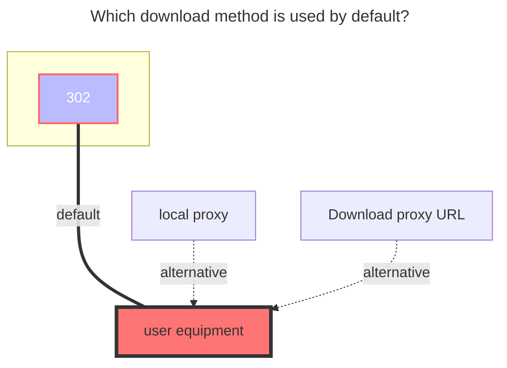

---
# This is the icon of the page
icon: state
# This control sidebar order
order: 6
# A page can have multiple categories
category:
  - Guide
# A page can have multiple tags
tag:
  - Storage
  - Guide
# this page is sticky in article list
sticky: true
# this page will appear in starred articles
star: true
---

# 189Cloud

## Personal Cloud

### username
the phone number used to log in
### password
password for login
### Root folder ID
The string at the end of the official website url, such as:
- https://cloud.189.cn/web/main/file/folder/-11 -> `-11`
- https://cloud.189.cn/web/main/file/folder/71398114617385472 -> `71398114617385472`

## Family Cloud

Use a computer browser, open the developer tool (F12), switch the emulation device and select the mobile device

Open https://h5.cloud.189.cn/main.html#/family, enter the folder you want to mount, you can see the request in the network, and then find the required parameters:

Video reference: **https://www.bilibili.com/video/BV16A4y197De**

## suggestion

It is recommended to use the Tianyi cloud disk client first, [**Notes click to view.**](../../faq/howto.md#when-adding-Tianyi-cloud-disk-client-storage-prompt-need-img-validate-code-verification-code)

### The default download method used

