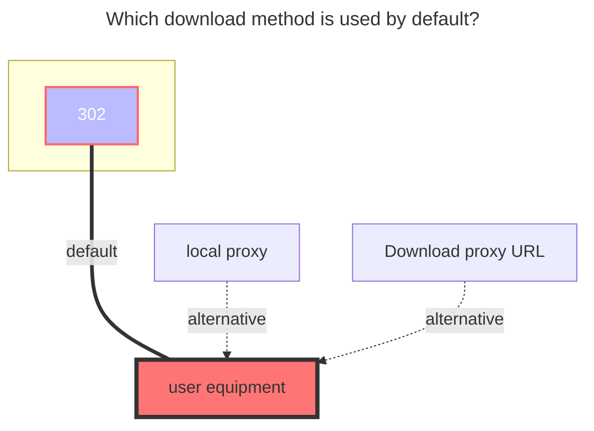

---
# This is the icon of the page
icon: iconfont icon-state
# This control sidebar order
order: 32
# A page can have multiple categories
category:
  - Guide
# A page can have multiple tags
tag:
  - Storage
  - Guide
  - "Native Rroxy"
  - "302"
# this page is sticky in article list
sticky: true
# this page will appear in starred articles
star: true
---
# Alist V2/V3


### **Driver**

First of all, you need to know whether the other party is V2 or V3.


### **root directory path**

- The pathname of the directory to be added, if not filled, it defaults to the root directory, such as:
   - [https://alist.nn.ci](https://alist.nn.ci/) -> `/`
   - https://alist.nn.ci/a -> `/a`
   - https://alist.nn.ci/a/b -> `/a/b`


### **Link**

AList link you want to mount


::::tabs#AList

@tab V3

(**v3.16.3**) If the AList you mounted is "not" enabled [**Allow Mount**](../../config/site.md#allow-mounted), you will not be able to To mount, the following error is prompted

```
Failed init storage: the site does not allow mounted
failed get objs: storage not init: the site does not allow mounted
```

(If) or use the `username&password` provided by the other party to mount, if the other party allows the mount, it must provide `username&password` or enable [**Allow Mount**](../../config/site.md#allow-mounted), otherwise don’t force it

- v3.16.3 How to mount the lower version than v3.16.3, for the time being, you can only use the `username & password` provided by the other party to mount.

-----

:::warning

`Username&Password` can be mounted without writing. In this way, `guest` is used for tourist access. If the other party does not enable the guest account access permission, an error will be prompted when mounting (as follows)

```bash
failed get objs: failed to list objs: request failed,code: 400, message: Key: 'LoginReq.Username' Error:Field validation for 'Username' failed on the 'required' tag
```

- If you started using the `username & password` method to mount, then you switched to using the `meta information password` method to mount
   - You need to manually clear the `token` that was automatically filled before, otherwise it will still use the `username&password` method to mount

:::

### **Meta password**

(The Meta  password option **is not required**, explain to those who need it)

The Meta  password refers to the meta information password

The AList path you want to mount has a meta information password set

- example 1:
  - The path you mount is `/a`
  - Then you need to know what the other party’s `/a` path password is set to see the file, otherwise it will be blank after entering
- Example 2:
  - The path you mount is `/`
  - But the root directory `/` of the other party has no password set, but other individual folders such as Ali, Baidu, 123 have set passwords, so you can fill in these but only one password.
    - If the passwords of the three folders mentioned above are set differently, then you can only enter the folder with this password in the one you fill in, and you will not be able to enter without this password. You should understand.

<br/>


## **Username**

`AList` user name (account) you want to mount

## **Password**

The password corresponding to the `AList` username you want to mount

:::tip Kind tips

It looks very troublesome, but you can understand it after a little operation. The details are written for Xiaobai(The premise is that  [**Allow Mount**](../../config/site.md#allow-mounted) is enabled on the other party)

1. The access path is prioritized using [**root directory path**](#root directory path), if you use `username&password` method for mounting, [**root folder path**](#root folder path) It is recommended to write `/`, otherwise your access rights of this user name do not match [**root directory path**](#root directory path) and an error message will be displayed

    -Example ^1^: [**root directory path**](#root directory path): `file`, the access permission folder of the user name is: `video`, so access will prompt an error

    -Example ^2^: [**root directory path**](#root directory path): `file`, the access permission folder of the user name does not have `file`, so access will prompt an error

2. When `AList Management` is given to others to mount, you can choose the folder to access when creating a new user. The default `/`
    - When the user mounts, [**root directory path**](#root directory path) is recommended to write `/`, so as not to prompt an error because the management has given different access folder permissions

3. In the most extreme case, it is preferred that you know that the `username` added this time can access the folder permissions, whether there is any, and then write the path you want to mount separately to [**root directory path** ](#root directory path)
    - If you don't know [**root directory path**](#root directory path), you can write `/` first, go to the mount page to see the path you want to mount separately, and then modify the background settings

:::

### **Token**

You don’t need to write, it will be automatically filled after filling in `Username & Password` and saving

<br/>


### **Proxy Range**

You need to enable `Web Proxy` or` Webdav Native Proxy` to take effect

- Currently only applicable to：`alias`、`139Yun`、`AList V3`
  - Function Description：**https://github.com/alist-org/alist/pull/6496#issue-2309839607**


@tab V2

### **password**

(The password option **is not required**, explain to those who need it)

The password refers to the meta information password

The Alist path you want to mount has a meta information password set

- example 1:
   - The path you mount is `/a`
   - Then you need to know what the other party’s `/a` path password is set to see the file, otherwise it will be blank after entering
- Example 2:
   - The path you mount is `/`
   - But the root directory `/` of the other party has no password set, but other individual folders such as Ali, Baidu, 123 have set passwords, so you can fill in these but only one password.
     - If the passwords of the three folders mentioned above are set differently, then you can only enter the folder with this password in the one you fill in, and you will not be able to enter without this password. You should understand.


### **Access Token**

(The access token option **is not required**, explain to those who need it)

(This is for the other party to give you, generally no one will hand over their token to outsiders)

- How to get V2: Go to the V2 document to view --> **https://alist-doc.nn.ci/docs/driver/alist#token**
- How to get V3: Background --> Settings --> Others --> **`Token`**

::::

### **The default download method used**


