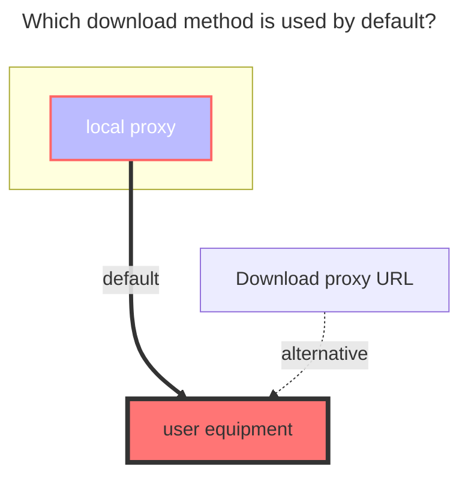

---
# This is the icon of the page
icon: iconfont icon-state
# This control sidebar order
order: 12
# A page can have multiple categories
category:
  - Guide
# A page can have multiple tags
tag:
  - Storage
  - Guide
# this page is sticky in article list
sticky: true
# this page will appear in starred articles
star: true
---

# Crypt

## **introduce**

What is `Crypt`?

It is equivalent to a two -layer password -encrypted safe. No one else can be opened except you have the key to open it. The password and salt value in the configuration are equivalent to the key

Of course, you have to remember the password and salt value. If you lose it yourself, you can't open it yourself, unless you are poor or guess the correct password.

::: tip Use reminder

1. If you don’t know how to use this plus/decryption driver, please check carefully each text
2. Please use it locally to understand and then move to the production environment to deploy and use it, otherwise the data will be lost!
3. The data loss is 100%because the configuration file is modified. If the file has been uploaded, please do not modify the configuration file, otherwise the data will be lost!

==Remind again, please read the document carefully, otherwise the data will be lost and bear the loss！==

:::

## **Instructions for use**

We only need to build a new **blank folder** in the driver (network disk) that has been mounted now.

Then fill in the name of our new blank folder to the `Remote path` `Crypt` drive configuration

E.g:

- Our original driving path was `/123`, we built a new `air` blank folder in the 123 directory
- We are going to `Remote Path` options driven by` Crypt`,Fill in `/123/air`
- To encrypt files, you need to upload them to the newly created "Crypt" drive. Encryption will only be applied when files are uploaded to this drive.
  - Crypto files We go to **`remote path`** can see the encrypted file, unable to open it normally
  - If you want to open it, you need to view it at the `Crypt` Drive Folder

## **Fill in the example**

If you do n’t know how to configure, you can use the simpler default configuration as follows. The role of each configuration will be explained in detail below

:::danger  Please read the precautions carefully --- very important

State again, please do not think you are

Once the configuration is filled in storage, do not modify it, do not modify it, do not modify it! Emphasized things three times

[**Password**](#password) 和 [**Salt**](#salt) Must remember，After clicking, these two options will be encrypted and unable to display (the text above shows that it has not been stored)

- **If you forget the password before uploading the file, you can modify and fill in the password configuration**

-----

If you have not uploaded files in the Crypt drive, you can modify the configuration, otherwise do not modify it!!!

Because different encryption methods will appear in different configuration methods, `Crypt` will not display (filtering) illegal files

- **Illegal files are encrypted files generated by different configurations and no encryption files**

:::

::: warning

There are 5 methods for the encryption combination, (in fact 6 types) Because only the **folder encryption is turned on, the file name is not encrypted** and the configuration does not take effect (the first one of the example below)

1. <Badge text="invalid" color="red" vertical="middle" /> Filename `Off`，Directory `true`
2. <Badge text="efficient" type="tip" vertical="middle" /> Filename `Off`，Directory `false`
3. <Badge text="efficient" type="tip" vertical="middle" /> Filename `Standard`，Directory `false`
4. <Badge text="efficient" type="tip" vertical="middle" /> Filename `Standard`，Directory `true`
5. <Badge text="efficient" type="tip" vertical="middle" /> Filename `Obfuscate`，Directory `false`
6. <Badge text="efficient" type="tip" vertical="middle" /> Filename `Obfuscate`，Directory `true`

:::

 

### <i class="fa-solid fa-files" style="color: #409eff;"></i> **Filename encryption**

If you don’t understand, you can use the default configuration

- 1.**The default is `off` state**
  - Whether the file name needs to be encrypted, and the file name is encrypted after uploading
  
- 2.**Standard Encryption**
  - Standard encryption safety level high^(recommended)^
  
- 3.**Simple Obfuscate**
  - The security level is very low, and the name of the long file is friendly, but for the Chinese file name, special characters will be generated. Some network disk storage does not support special characters.

- The left side of the figure below is encrypted [**Remote path**](#remote-path)，On the right is the decrypted 'crypt` driver to view the file
  - If not open<Badge text="Filename" type="tip" vertical="middle" />encryption，It will be displayed<Badge text="Upper left corner" color="rgb(216,100,69)" vertical="middle" /> A new encrypted suffix is added behind the source file（xxxxx\.xxx **.bin** ）(The suffix name can be customized, not necessarily .bin)
  - If you open<Badge text="Filename" type="tip" vertical="middle" />encryption，It will be displayed<Badge text="Lower left corner" color="rgb(78,130,184)" vertical="middle" />In this way, the file name is also confused with encryption, no suffix and the original file name，Others can't know what it is, but it can be driven by `crypt`（<Badge text="The folder displayed on the right" color="rgb(0.0.0.0)" vertical="middle" />）View the complete decryption and transparent file name

 

### <i class="fa-solid fa-folder-open" style="color: #409eff;"></i> **Directory name encryption**

Use the enable folder to encrypt, the default `false` is not enabled, if you don’t understand, you can choose not to use it

When you turn on the folder encryption, you must select a **filename encryption**. Otherwise, the folder encryption will not take effect

- The left side of the figure below is encrypted [**Remote path**](#remote-path)，On the right is the decrypted 'crypt` driver to view the file
  - If not open<Badge text="Directory" type="tip" vertical="middle" />encryption，It will be displayed<Badge text="Upper left corner" color="rgb(216,100,69)" vertical="middle" />That kind of folder without any change
  - If you open<Badge text="Directory" type="tip" vertical="middle" />encryption，It will be displayed<Badge text="Lower left corner" color="rgb(78,130,184)" vertical="middle" />In that way, the folder name is also confused by encryption

 

### <i class="fa-solid fa-cloud-binary" style="color: #409eff;"></i> **Remote path**

It is the storage and encrypted file, which can be any driver in the driver that can be mounted

 

### <i class="fa-solid fa-lock-keyhole" style="color: #409eff;"></i> **Password**

Just literally meaning password

### <i class="fa-solid fa-lock-keyhole" style="color: #409eff;"></i> **Salt**

It can also be understood as the second password

 

### **Encrypted suffix**

The default is `.bin`, the custom must start with` .`, such as .abc .aaa .Psd.

If the file name is encrypted, the encryption suffix `will not be displayed (but still have to be configured)

- The high -level gameplay is to manually change the suffix to the suffix in the configuration file to display the access (provided that it is consistent with the **`password`** and **`Salt`** when encrypted

 

## **Advanced usage**

Advanced usage is only applicable to those who know about **`rclone`**

If you know the **`rclone`** very well, you can view :point_right: [**rclone crypt document **] (https://rclont.org/crypt) Currently, completely compatible

 

## **The default download method used**

