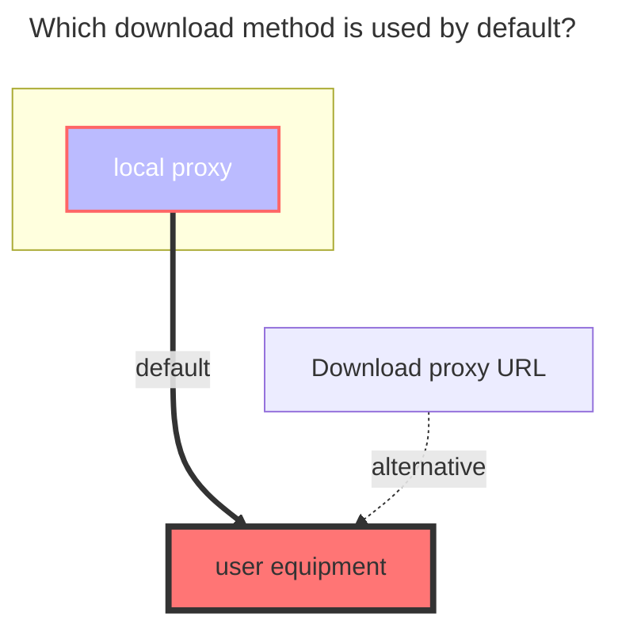

---
# This is the icon of the page
icon: iconfont icon-state
# This control sidebar order
order: 12
# A page can have multiple categories
category:
  - Guide
# A page can have multiple tags
tag:
  - Storage
  - Guide
  - "Native Rroxy"
# this page is sticky in article list
sticky: true
# this page will appear in starred articles
star: true
---

# Crypt

## **introduce**

What is `Crypt`?

In simple words, it's a two-password-protected safe. No one can open it without the key. The password and the salt in the configuration form the key.

::: tip

1. If you don’t know how to use this encryption/decryption driver, please read this guide carefully
2. Please test it locally to understand it fully before use in the production environment.
3. The data loss is 100% caused by configuration change. If data has been stored within Crypt, change configuration won't re-encrypt data, those data will be inaccessible to Crypt!

==Remind again, please read the document carefully, otherwise the data may be lost！==

:::

## **Instruction**

We need to build a new **empty folder** in the driver (network disk) that has been mounted now.

Then fill in the name of our new empty folder to the `Remote path` `Crypt` driver configuration

E.g:

- Our original driving path was `/123`, we built a new `air` empty folder in the '123' directory
- Fill `Remote Path` option in `Crypt` config page with `/123/air`
- To encrypt files, you need to upload them to the newly created "Crypt" drive. Encryption will only be applied when files are uploaded to this driver.
  - Encrypted files are stored in **`remote path`** , and they can't be opened normally due to the encryption
  - If you want to open them, you need to view them in the `Crypt` Driver Folder

## **Config Example**

If you don’t know how to configure, you can use the simpler default configuration as follows. The role of each configuration will be explained in detail below

:::danger  Please read carefully --- very important

Once the configuration is set and started using, do not modify it, do not modify it, do not modify it!

The original [**Password**](#password) and [**Salt**](#salt) should be kept in other places. These two options will be encrypted and can't be reveled after saving.

- **If you forget the password before uploading any file, you can modify and re-fill in the password configuration**

-----

If you have not uploaded any file in the Crypt, you may modify the configuration, otherwise do not modify it!!!

If you have data in Crypt, and changed the configuration, `Crypt` will try to filter out illegal files/folders, but the illegal data still exist in the remote storage

- **Illegal means data that is encrypted by another config**

:::

::: warning

There are 5 methods for the encryption combination, (in fact 6 types) Because only the **folder encryption is turned on, the file name is not encrypted** and the configuration does not take effect (the first one of the example below)

1. <Badge text="invalid" color="red" vertical="middle" /> Filename `Off`，Directory `true`
2. <Badge text="valid" type="tip" vertical="middle" /> Filename `Off`，Directory `false`
3. <Badge text="valid" type="tip" vertical="middle" /> Filename `Standard`，Directory `false`
4. <Badge text="valid" type="tip" vertical="middle" /> Filename `Standard`，Directory `true`
5. <Badge text="valid" type="tip" vertical="middle" /> Filename `Obfuscate`，Directory `false`
6. <Badge text="valid" type="tip" vertical="middle" /> Filename `Obfuscate`，Directory `true`

:::

 

### <i class="fa-solid fa-files" style="color: #409eff;"></i> **Filename encryption**

If you don’t understand, you can use the default configuration

- 1.**The default is `off` state**
  - Whether the file name needs to be encrypted, and the file name is encrypted after uploading

- 2.**Standard Encryption**
  - Standard encryption safety level high^(recommended)^

- 3.**Simple Obfuscate**
  - The security level is very low, but friendly to long file name. Note: for the Chinese file name, special characters will be generated. Some network disk storage may not support them

- The left side of the figure below is encrypted [**Remote path**](#remote-path)，On the right is the decrypted 'crypt` driver to view the file
  - If not enabled <Badge text="Filename" type="tip" vertical="middle" /> encryption，It will be like <Badge text="Upper left corner pic" color="rgb(216,100,69)" vertical="middle" /> A new encrypted suffix is added behind the source file（xxxxx\.xxx **.bin** ）(The suffix name can be customized)
  - If you enabled <Badge text="Filename" type="tip" vertical="middle" /> encryption，It will be like <Badge text="Lower left corner pic" color="rgb(78,130,184)" vertical="middle" /> In this way, the file name is also confused with encryption, no suffix and the original file name，others can't know what it is, but it can be viewed in `crypt`（<Badge text="The folder displayed on the right" color="rgb(0.0.0.0)" vertical="middle" />）

 

### <i class="fa-solid fa-folder-open" style="color: #409eff;"></i> **Directory name encryption**

default is `false`, i.e disabled. don't use it if you don't understand below description

When you turn on the folder encryption, you must select a **filename encryption** type. Otherwise, the folder encryption will not take effect

- The left side of the figure below is encrypted [**Remote path**](#remote-path)，On the right is the decrypted 'crypt` driver to view the file
  - If disabled <Badge text="Directory" type="tip" vertical="middle" /> encryption，It will be like<Badge text="Upper left corner pic" color="rgb(216,100,69)" vertical="middle" /> No change to folder name
  - If enabled <Badge text="Directory" type="tip" vertical="middle" /> encryption，It will be displayed<Badge text="Lower left corner pic" color="rgb(78,130,184)" vertical="middle" /> folder name is encrypted

 

### <i class="fa-solid fa-cloud-binary" style="color: #409eff;"></i> **Remote path**

It is the storage and encrypted file, which can be any driver in the driver that can be mounted

 

### <i class="fa-solid fa-lock-keyhole" style="color: #409eff;"></i> **Password**

Just literally meaning password

### <i class="fa-solid fa-lock-keyhole" style="color: #409eff;"></i> **Salt**

It can be treated as the second password if you don't understand it

 

### **Encrypted suffix**

Advanced options,The default is `.bin`, the custom must start with` .`, such as .abc .aaa .Psd.

If the file name is encrypted, the encryption suffix `will not be used

 

### **Filename encoding**

Advanced options, non -professionals, please do not modify it. The default is **`base64`**, but the options other than **`base64`** are not tested. If you encounter problems, you need to solve it yourself.

-Dy reference [#5109](https://github.com/alist-org/alist/issues/5109)，[#5080](https://github.com/alist-org/alist/issues/5080)

 

## **Advanced usage**

Advanced usage is only applicable to those who know about **`rclone`**

If you know the **`rclone`** very well, you can check :point_right: [**rclone crypt document**](https://rclone.org/crypt) Currently fully compatible

Note: `Alist Crypt` used `filename_encoding = base64` in default. If you want to use Rclone, please config it in the advanced config. (Reason: more friendly to long filename)

Since Alist does not consider any case-insensitive internally, you may encounter problems when remote storage is case-insensitive. e.g.: use alist local driver on Windows, then use Crypt on it.

 

## **Precautions**

When starting alist, I found that the Crypt  prompts errors because Crypt can not find the relevant path when starting, You can fill in the Crypt [order](common.md#order) to make Crypt start slowly

 

## **The default download method used**

