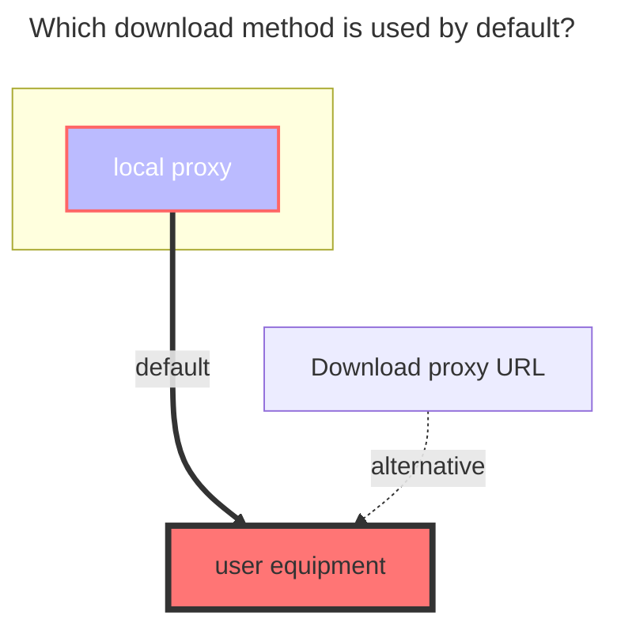

---
# This is the icon of the page
icon: iconfont icon-state
# This control sidebar order
order: 28
# A page can have multiple categories
category:
  - Guide
# A page can have multiple tags
tag:
  - Storage
  - Guide
  - "Native Rroxy"
# this page is sticky in article list
sticky: true
# this page will appear in starred articles
star: true
---
# SMB

It is to mount smb to Alist, instead of sharing Alist through smb, instead of sharing smb like webdav.

Because there are no related equipment and services, it is impossible to test. You can test it yourself according to the method provided in the **`GitHub Discussions`** discussion

**https://github.com/alist-org/alist/discussions/2215#discussioncomment-4104018**

Wait for the more detailed tutorials to be supplemented after the relevant equipment or services are available, or wait for the PR of the boss who has no problem with the test.

### **The default download method used**

