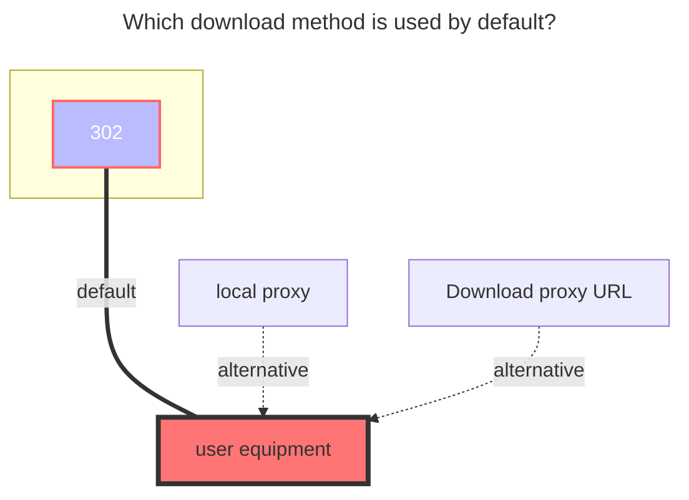

---
# This is the icon of the page
icon: state
# This control sidebar order
order: 38
# A page can have multiple categories
category:
  - Guide
# A page can have multiple tags
tag:
  - Storage
  - Guide
# this page is sticky in article list
sticky: true
# this page will appear in starred articles
star: true
---
# Seafile

Seafile uses libraries as a unit for version control and synchronization.

Use this driver to mount a Seafile repository to Alist, encrypted repositories are not supported yet.

## Root folder path

Directory within the Seafile repository to be mounted, default root directory: `/`

## Address

Your Seafile server address, e.g.
- `https://seacloud.cc`
- `http://192.168.1.24:8000`

## Username

The email or username used to log in to your Seafile server.

## Password

The password for your email or username.

## RepoId

Seafile library ID, e.g. `86fc6316-3f2a-4c64-b6f5-d4d2b341bc9a`

> Open the Seafile library in your browser and you will see the library ID in the address bar.

### The default download method used

