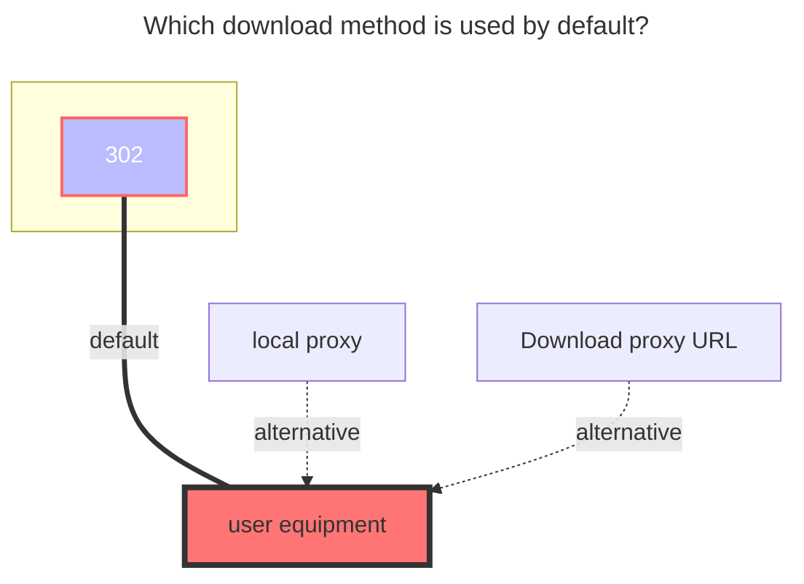

---
# This is the icon of the page
icon: iconfont icon-state
# This control sidebar order
order: 38
# A page can have multiple categories
category:
  - Guide
# A page can have multiple tags
tag:
  - Storage
  - Guide
  - "302"
# this page is sticky in article list
sticky: true
# this page will appear in starred articles
star: true
---
# Seafile

Seafile uses libraries as a unit for version control and synchronization.

Use this driver to mount a Seafile repository to Alist, encrypted libraries are supported.

## **Root folder path**

1. If the `RepoId` is not set, this configuration specifies the name and sub-path of the library to access, defaulting to the root path: `/`, indicating displaying all libraries. Suppose you have a library named `example`, if you only want to mount the contents of this library, you can set this item to `/example`; if you only want to display a directory named `abc` within this library, you can set this item to `/example/abc`, and so on.

2. If the `RepoId` is set, this configuration is used to set the directory within the specified library, defaulting to the root directory: `/`.

## **Address**

Your Seafile server address, e.g.
- `https://seacloud.cc`
- `http://192.168.1.24:8000`

## **Username**

The email or username used to log in to your Seafile server.

## **Password**

The password for your email or username.

## **RepoId (Library ID)**

Seafile library ID, such as: `86fc6316-3f2a-4c64-b6f5-d4d2b341bc9a`

> Open the Seafile library in a browser, and you can see the library ID in the address bar.

Can be left empty, if left empty, all visible libraries for the specified account will be displayed.

## **RepoPwd (Library Password)**

Set the password used to access encrypted libraries, leave blank if no encrypted libraries are present.

After configuring this item, Alist will use this password to access all encrypted libraries for the specified account, without affecting access to unencrypted libraries. If you have multiple encrypted libraries using the same password, they can all be accessed normally.

Different passwords for different libraries within a storage are not currently supported. If you have such a requirement, you can add multiple Seafile storage to achieve this, allowing you to specify different passwords for accessing different encrypted libraries.

> If you still cannot access files within encrypted libraries after setting the library password, please check if the password and other configurations above are correct. It is recommended to restart Alist after modifying this password configuration to avoid caching issues.

### **The default download method used**

