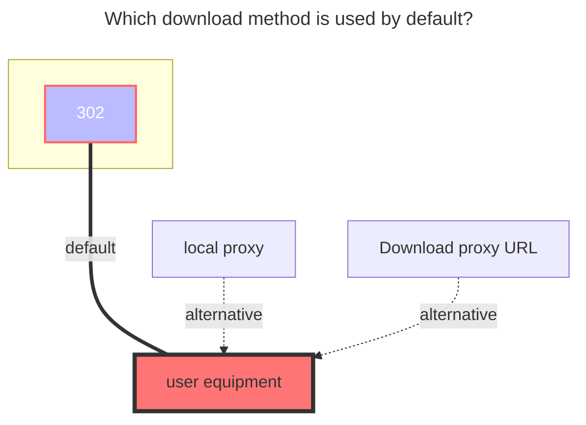

---
# This is the icon of the page
icon: iconfont icon-state
# This control sidebar order
order: 37
# A page can have multiple categories
category:
  - Guide
# A page can have multiple tags
tag:
  - Storage
  - Guide
  - "302"
# this page is sticky in article list
sticky: true
# this page will appear in starred articles
star: true
---

# Terabox

## **refresh token**

[**Click here to log in**](https://www.terabox.com/) to obtain a refresh token

## **jsToken**

View [**HOME**](https://www.terabox.com/main?category=all) source code，use `Ctrl` + `F` search `jsToken`

find string like `%20%3D%20a%7D%3Bfn%28%22xxxxxxxxxxxxxxx%22%29`

This `xxxxxxxxxxxxxxx` is the **jsToken**

 

## **Download api**

**Download api needs to choose ==`Crack`==** ，before you can use ^(v3.29)^

 

#### **Note: The default root file path is /**

- If you don't want to write to the root directory **/** you want to write to other directories
- Mount other single subdirectories, put a picture for reference
   - 

### **The default download method used**

