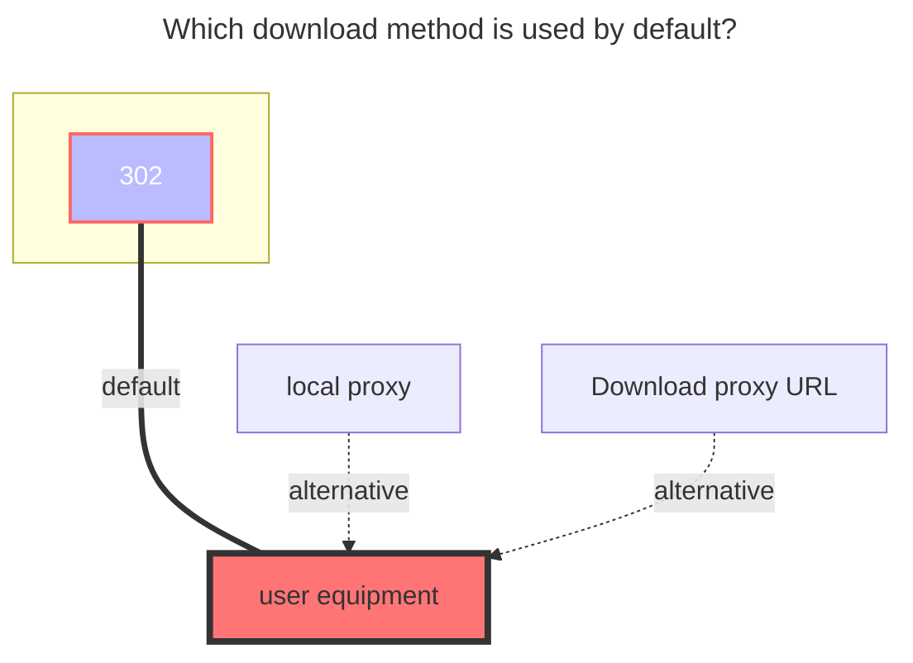

---
# This is the icon of the page
icon: iconfont icon-state
# This control sidebar order
order: 37
# A page can have multiple categories
category:
  - Guide
# A page can have multiple tags
tag:
  - Storage
  - Guide
  - "302"
# this page is sticky in article list
sticky: true
# this page will appear in starred articles
star: true
---

# Terabox


## **refresh token**

~~[**Click here to log in**](https://www.terabox.com/) to obtain a refresh token~~

Since F12 is currently disabled on the web page, we can first open F12 on another page and turn on the `Network` → `Preserve log` option.

<br/>

Then enter https://www.terabox.com in the address bar of this tab to enter the webpage, you can see the reserved request, and then find **`Cookie`** from the reserved request.


<br/>


## **Download api**

**Download api needs to choose ==`Crack`==** ，before you can use ^(v3.29)^

<br/>


## **Root folder id**

- Root folder id is `/`
- Mount other single subdirectories, put a picture for reference
   - 

<br/>


## **Download error using Proxy Url link**

Using [**Proxy Url**](common.md#download-proxy-url) to download error

```json
{
"error_code": 31211,
"error_msg": "access denied"
}
```

View specific reasons：**[https://github.com/alist-org/alist/issues/6508](https://github.com/alist-org/alist/issues/6508#issuecomment-2171762705)**

<br/>


### **The default download method used**


