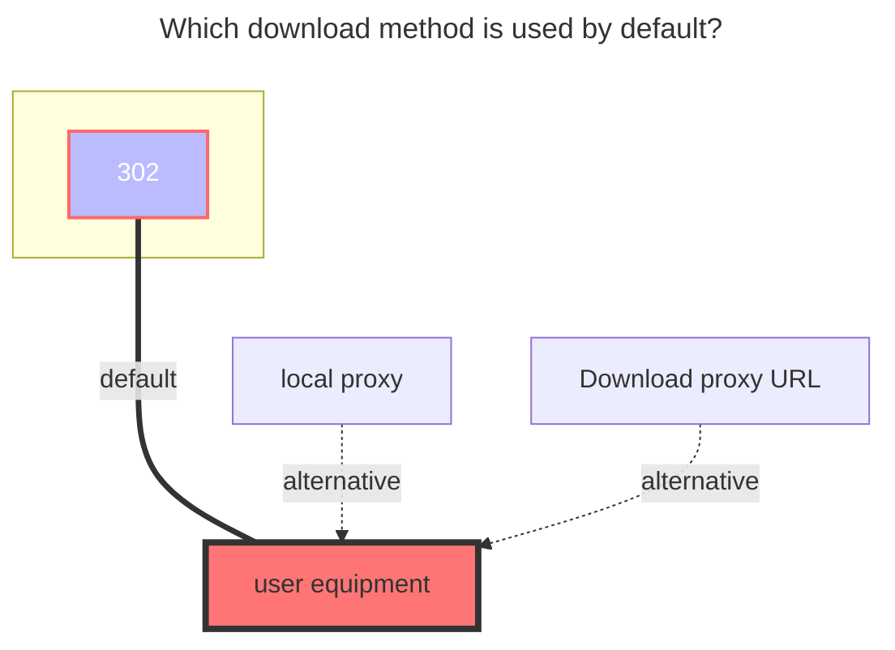

---
# This is the icon of the page
icon: iconfont icon-state
# This control sidebar order
order: 39
# A page can have multiple categories
category:
  - Guide
# A page can have multiple tags
tag:
  - Storage
  - Guide
  - "302"
# this page is sticky in article list
sticky: true
# this page will appear in starred articles
star: true
---
# Trainbit

**Trainbit** official website：https://trainbit.com/

## **AUSHELLPORTAL ，Apikey**

After entering the Trainbit webpage, press F12 to open the developer mode, open any refreshed data in the network option, and then find the one with the Cookie option.

**AUSHELLPORTAL**：`.AUSHELLPORTAL` ` .AUSHELLPORTALws` These two parameters have the same value

**Apikey**：`retkeyapi`

(For specific filling, you can view [fill in the schematic diagram for details](#fill-in-the-example))

## **Root folder id**

- `<directory ID>_<q parameter of directory uploadurl>`

We open the home page and press F12, open the developer mode, select the network, search the list in the search bar, you can see "`listoffiles`", click, and then select the response to format the value in it yourself (you can also format it without formatting Find it slowly by yourself) [fill in the schematic diagram for details](#fill-in-the-example)

- How to format: search your own browser for json online formatting

## **matters needing attention**

1. If you uploaded from `AList` to `trainbit`, a `.delete_suffix` will be added after the file suffix, don’t worry
2. The official website says that the free user files will be deleted after 15 days of downloading, but the files are not deleted now, just in case, do not store important files, and the files will be lost when the time comes

## **Fill in the example**

### **The default download method used**

