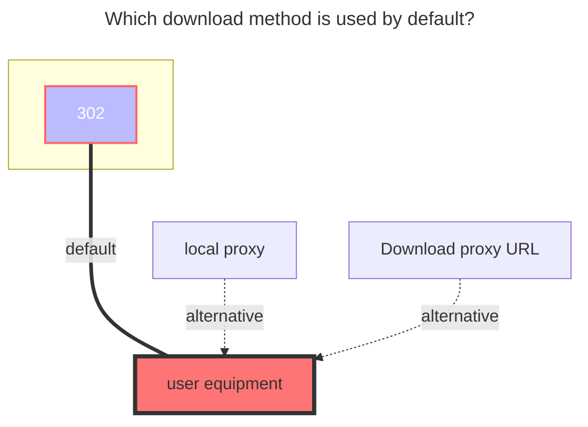

---
# This is the icon of the page
icon: iconfont icon-state
# This control sidebar order
order: 33
# A page can have multiple categories
category:
  - Guide
# A page can have multiple tags
tag:
  - Storage
  - Guide
  - "302"
# this page is sticky in article list
sticky: true
# this page will appear in starred articles
star: true
---
# UrlTree

:::tip
**`UrlTree`** What is it? It is used to mount a single file link. For details, you can check  **→→→[Original Requirements Description](https://github.com/alist-org/alist/issues/3268)←←←**
:::


## **usage**

Let me briefly explain the specific usage. It is recommended to look at the different usages below. The more advanced the gameplay

Don't look at the writing, it looks difficult and long-winded, but in fact, you can understand it in seconds if you operate it yourself.

:::tabs#UrlTree
@tab 1

<Badge text="1" type="info" vertical="middle" />The simplest usage, just write the link directly

##### **input**

``` 
http://pic.rmb.bdstatic.com/bjh/aff9c9c8817d943d6857a73188958d45.jpeg
https://raw.githubusercontent.com/alist-org/alist/main/README_cn.md
```

##### **output**

```
│ aff9c9c8817d943d6857a73188958d45.jpeg
│ README_cn.md
```


@tab 2

<Badge text="2" type="info" vertical="middle" />While there are files, you can also create folders ^the first code example^, or you can create multiple folders ^the second code example^

##### **input**

``` 
http://pic.rmb.bdstatic.com/bjh/aff9c9c8817d943d6857a73188958d45.jpeg
folder:
  http://pic.rmb.bdstatic.com/bjh/aff9c9c8817d943d6857a73188958d45.jpeg
  https://raw.githubusercontent.com/alist-org/alist/main/README_cn.md
```

``` 
http://pic.rmb.bdstatic.com/bjh/aff9c9c8817d943d6857a73188958d45.jpeg
folder:
  http://pic.rmb.bdstatic.com/bjh/aff9c9c8817d943d6857a73188958d45.jpeg
  https://raw.githubusercontent.com/alist-org/alist/main/README_cn.md
http://pic.rmb.bdstatic.com/bjh/a66923e9bfefd03c2998ee998d3b55e7.jpeg
folde2r:
  http://pic.rmb.bdstatic.com/bjh/e919290bf3b8396817d369cedf33b8cd.jpeg
  https://raw.githubusercontent.com/alist-org/alist/main/CONTRIBUTING.md
```

##### **output**

```
│  aff9c9c8817d943d6857a73188958d45.jpeg
└─folder
        aff9c9c8817d943d6857a73188958d45.jpeg
        README_cn.md
```

```
│  	aff9c9c8817d943d6857a73188958d45.jpeg
├─folder
│      aff9c9c8817d943d6857a73188958d45.jpeg
│      README_cn.md
│
├─	a66923e9bfefd03c2998ee998d3b55e7.jpeg
│
└─folder2
        CONTRIBUTING.md
        e919290bf3b8396817d369cedf33b8cd.jpeg
```

There must be two blank spaces at the beginning~


@tab 3

<Badge text="3" type="info" vertical="middle" />You can rename the file resource, in fact, the downloaded one is still the original one, and you can fill in the file size

Format: `new name.suffix:file size:link`

```
new namejpeg:1024:http://pic.rmb.bdstatic.com/bjh/aff9c9c8817d943d6857a73188958d45.jpeg
new name2.md:2048:https://raw.githubusercontent.com/alist-org/alist/main/README_cn.md
```

The size of the file is not written, and it can also be renamed

```
new name.jpeg:1024:http://pic.rmb.bdstatic.com/bjh/aff9c9c8817d943d6857a73188958d45.jpeg
new name2.md:2048:https://raw.githubusercontent.com/alist-org/alist/main/README_cn.md
```


@tab 4

<Badge text="4" type="info" vertical="middle" />Matryoshka doll usage of multiple levels of directories

- The first-level directory folder does not need spaces, but the files in the first-level directory need to be empty with two spaces.

```
folder:
  http://pic.rmb.bdstatic.com/bjh/aff9c9c8817d943d6857a73188958d45.jpeg
  https://raw.githubusercontent.com/alist-org/alist/main/README_cn.md
```

- If you have written the first layer and want to put another one in the first folder, then put a layer under this folder, the writing method is as follows, very simple
  - The directory is empty with two spaces, and the file is four if you add two spaces. If you continue to want to go down one level and continue to add 2 spaces

```
folder11:
  http://pic.rmb.bdstatic.com/bjh/111.jpeg
  folder111:
    http://pic.rmb.bdstatic.com/bjh/111.jpeg
    folder1111:
      http://pic.rmb.bdstatic.com/bjh/111.jpeg
  folder222:
    http://pic.rmb.bdstatic.com/bjh/222.jpeg
    folder2222:
      http://pic.rmb.bdstatic.com/bjh/222.jpeg
folder22:
  http://pic.rmb.bdstatic.com/bjh/222.jpeg
  folder222:
    http://pic.rmb.bdstatic.com/bjh/222.jpeg
    folder2222:
      http://pic.rmb.bdstatic.com/bjh/2223.jpeg
folder33:
  http://pic.rmb.bdstatic.com/bjh/333.jpeg
  folder333:
    http://pic.rmb.bdstatic.com/bjh/333.jpeg
    folder3333:
      http://pic.rmb.bdstatic.com/bjh/333.jpeg
```


- It is not recommended to write like **`2.jpeg, 5.jpeg`**, it is recommended to go to that layer of folders to add links according to the format, not like the following error example to write

##### **incorrect usage**

```
folder22:
  http://pic.rmb.bdstatic.com/bjh/222.jpeg
  folder222:
    http://pic.rmb.bdstatic.com/bjh/222.jpeg
    folder2222:
      http://pic.rmb.bdstatic.com/bjh/2222.jpeg
      folder22222:
        http://pic.rmb.bdstatic.com/bjh/2222.jpeg
        folder222222:
          http://pic.rmb.bdstatic.com/bjh/2222.jpeg
    http://pic.rmb.bdstatic.com/bjh/2.jpeg
        http://pic.rmb.bdstatic.com/bjh/5.jpeg
```

##### **correct usage**

When files like **`2.jpeg, 5.jpeg`** are added, they are added to the corresponding directory, which correspond to the two folders `folder222 and folder22222` respectively

```
folder22:
  http://pic.rmb.bdstatic.com/bjh/222.jpeg
  folder222:
    http://pic.rmb.bdstatic.com/bjh/222.jpeg
    http://pic.rmb.bdstatic.com/bjh/2.jpeg
    folder2222:
      http://pic.rmb.bdstatic.com/bjh/2222.jpeg
      folder22222:
        http://pic.rmb.bdstatic.com/bjh/2222.jpeg
        http://pic.rmb.bdstatic.com/bjh/5.jpeg
        folder222222:
          http://pic.rmb.bdstatic.com/bjh/2222.jpeg
```

@tab 5

<Badge text="5" type="info" vertical="middle" />All integrated example usages include conventional, classified, rename, and marked file size

```
https://jsd.nn.ci/gh/alist-org/alist/README.md
document
  Readme.md:https://pic.rmb.bdstatic.com/bjh/说明.md
  Doc:
    document.doc:https://pic.rmb.bdstatic.com/bjh/测试文档.doc
  pdf:
    pdf2.pdf:https://pic.rmb.bdstatic.com/bjh/测试.pdf
  Excel:
    Excel3.xlsx:https://pic.rmb.bdstatic.com/bjh/测试表格.xlsx 
video:
  https://pic.rmb.bdstatic.com/bjh/222.jpeg
  TV drama:
    https://pic.rmb.bdstatic.com/bjh/222.pm4
  Movie:
    https://pic.rmb.bdstatic.com/bjh/222.flv
music
  https://pic.rmb.bdstatic.com/bjh/222.jpeg
  classical
    https://pic.rmb.bdstatic.com/bjh/222.mp3
  Light music:
    https://pic.rmb.bdstatic.com/bjh/222.flac
    https://pic.rmb.bdstatic.com/bjh/222.wav
software
  https://pic.rmb.bdstatic.com/bjh/222.jpeg
  crack:
    xxexe.exe:252525:https://pic.rmb.bdstatic.com/bjh/222.exe
    xxinstall.zip:259555:https://pic.rmb.bdstatic.com/bjh/222.zip
  IPA:
    GPT.ipa:https://pic.rmb.bdstatic.com/bjh/222.ipa
  APK:
    Ps.apk:https://pic.rmb.bdstatic.com/bjh/222.apk
```


:::

## **Tips**

1. If you click download and find that there is no jump to download but preview, it is because it is determined according to your original link. For example, your original link is download and it will jump to download
2. If you have the same file in a folder, it will be merged and only one will be displayed. By default, the preview is used to view and download your upper (front) or top file.
    - Tips: Do not create two files/folders with the same name in the same directory at the same time~ Just like you create two files/folders with the same name in the resource manager, you will be reminded not to repeat
3. If you write two folders with the same name in the same directory when you add them, they will be merged into one folder, but the files in the lower (lower) folder will not be displayed after the merge, but you can view them through the browser Address bar access (refer to the previous tip)
4. By default, the sorting is based on what you fill in from top to bottom, which is the same as `alist-alias`


### **The default download method used**


