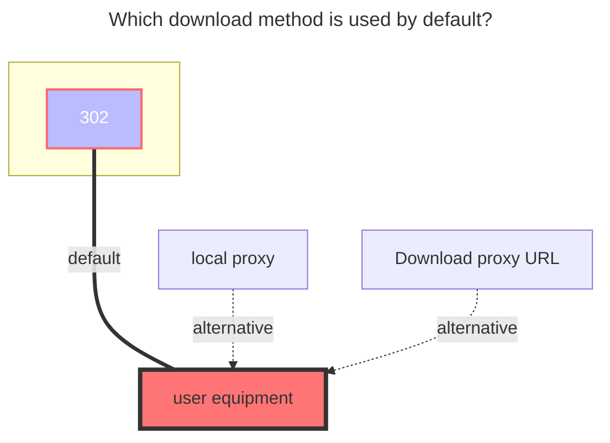

---
# This is the icon of the page
icon: iconfont icon-state
# This control sidebar order
order: 4
# A page can have multiple categories
category:
  - Guide
# A page can have multiple tags
tag:
  - Storage
  - Guide
  - "302"
# this page is sticky in article list
sticky: true
# this page will appear in starred articles
star: true
---

# Aliyundrive/share

:::warning

This driver is not recommended for use, because it is not stable and may be blocked at any time and we will remove it in a future version.
We recommend using the official driver [Aliyundrive Open](./aliyundrive_open.md).

:::

:::tip

Due to the limitation of the referrer of Aliyundrive, the mobile token must be used. Using the desktop web token will result in failure to download and preview.
Of course, you can also turn on the proxy so that `refresh token` of desktop web can work if you use it locally or if the bandwidth is large enough.

:::

### **Refresh token**

Follow to this [issue](https://github.com/Xhofe/alist/issues/88) Capture/find the log on the mobile phone (`/data/media/0/Android/data/com.alicloud.databox/files/logs/trace/`). Or you can click:

<button :disabled="state === 3 || state === 1"
style="outline:none;padding:12px;background:#70c6be;border:none;border-radius:8px;cursor:pointer;font-size:20px;"
@click="onClick">
{{ btnText }}
</button>

 

:::info Token: {{ token }}
:::

_API is hosted on replit.com_

### **Root folder file_id**

Open the official website of Aliyundrive and click the string behind the url when you click into the folder you want to set, such as https://www.alipan.com/drive/folder/5fe01e1830601baf774e4827a9fb8fb2b5bf7940, which is `5fe01e1830601baf774e4827a9fb8fb2b5bf7940`:

### **Second pass**

Check the hash when uploading. If there is one in the cloud, directly generate the file without consuming traffic

### **Internal upload**

If the server you deploy Alist on is Aliyun ECS for Beijing area, turn on this switch to improve the upload speed. Do not turn on this switch for servers that do not meet the requirements, otherwise you will have problems with inability to upload.

 

## **Aliyundrive Share Url**

It is no longer available, and the shared storage method will no longer be developed and maintained in the future. At the same time, the token obtained by [**AliyundriveOpen**](./aliyundrive_open.md) cannot be used in the Alibaba Cloud Disk shared mount storage.

 

### **The default download method used**

