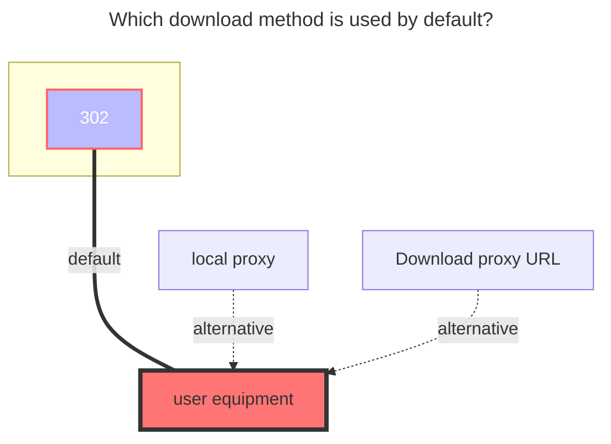

---
# This is the icon of the page
icon: state
# This control sidebar order
order: 3
# A page can have multiple categories
category:
  - Guide
# A page can have multiple tags
tag:
  - Storage
  - Guide
# this page is sticky in article list
sticky: true
# this page will appear in starred articles
star: true
---

# Aliyundrive Open

:::tip

Aliyundrive Open, using the official authorization API development.

:::

::: info Aliyundrive VIP

**Aliyundrive VIP**：[https://www.aliyundrive.com/cpx/member](https://www.aliyundrive.com/cpx/member?userCode=MzAwMDM1)

:::

:::danger Read the precautions carefully

1.  ==The refresh token obtained by this tool can only be used for **Aliyundrive open platform** storage mount method==
2.  The token filled in when Alist is mounted should also be provided by this tool, and the previous acquisition method will not be available
3.  Not applicable to others, but only for Alist
4.  If the same IP requests =={{ max }}== times within =={{ minutes }}== minutes, **Too Many Requests** will appear. :no_entry_sign:So please do not abuse:no_entry_sign:
    - For example, it is counted as a request when ~~saving/editing~~, and viewing files and watching video downloads is not counted.
    - The number of times and time mentioned above are dynamic~
    - New optimization: **will only refresh the token when the request finds that the token is expired, update restart editing if the token is still valid will not refresh.**
5.  Online playback video reminder: **`ExceedCapacityForbidden`** error, the capacity exceeds restrictions, implements restrictions, needs to be expanded or deleted unnecessary file saving space to save space,[View details](#four、)

:::

:::danger About Alibaba Cloud OAUTH verification API cannot be connected

1. Since the original API `https://api.nn.ci` is blocked by SNI, resulting in the case that cannot be connected, two new APIs are provided for use:
    - `https://api-cf.nn.ci` (A layer of Cloudflare)
   - `https://api.xhofe.top` (LiaoNing multi -line， Sponsored by [Asia Cloud](https://www.asiayun.com/aff/QQCOOQKZ))

2. You need to replace the OAUTH token link in the ALIYUNDRIVE_OPEN configuration to
   - `https://api-cf.nn.ci/alist/ali_open/token`
   - `https://api.xhofe.top/alist/ali_open/token`
   - 

3. check the details：https://github.com/alist-org/alist/discussions/4572

:::

## **refresh token**

Go to：**https://alist.nn.ci/tool/aliyundrive/request**

#### **Get example graph**

**refresh_token** can be obtained in the following two ways

  
    
    

### **Root folder file_id**

Open the official website of Aliyundrive and click the string behind the url when you click into the folder you want to set, such as https://www.aliyundrive.com/drive/folder/5fe01e1830601baf774e4827a9fb8fb2b5bf7940

which is `5fe01e1830601baf774e4827a9fb8fb2b5bf7940`

### **Client id，Client secret**

Normal users don’t need to fill in the blank. If they apply for official authorization, they can also use their own to fill in. If it is blank, the default is to use the one provided by Alist.

## **Remove way**

- Trash: Enter the cloud disk recycle bin after AList is deleted, which will occupy the cloud disk space, but it can be retrieved if it is deleted by mistake later.
- Delete: direct deletion will not stay in the recycle bin, and will not occupy cloud disk space, but if deleted by mistake later, it cannot be retrieved.
  - Note: Please do not disclose the Token obtained by your Alibaba Cloud Disk Open, ==If you accidentally leak it, please immediately go to [**Other instructions¹**](#open-alibaba-cloud-disk-app-my-settings-gear-in-the-upper-right-corner-privacy-settings-authorization-management-click-alist-to-view) to deauthorize, and then re-scan the code to authorize a new refresh token , at the same time, all the previous acquisitions will become invalid after the authorization is deactivated, so as to protect the security of your account==

## **Internal upload**

If the server you deploy AList on is Aliyun ECS for Beijing area, turn on this switch to improve the upload speed. Do not turn on this switch for servers that do not meet the requirements, otherwise you will have problems with inability to upload.

- **Internal upload** Can Alibaba Cloud ECS in non-Beijing areas be used? No, because Alibaba Cloud Disk is using object storage in the Beijing area

## **other instructions**

##### one、

> AList only obtained cloud disk users (**name avatar¹**), (**access file permission²**) and (**write file permission³**), and did not obtain mobile phone number permission
>
> Details can be viewed in two ways:
>
> 1. **Prompt** when scanning the QR code to obtain the refresh token
> 2. ###### Open **Alibaba Cloud Disk APP --> My --> Settings gear in the upper right corner --> Privacy Settings --> Authorization Management --> Click AList** to view
>
>    - If you don't use it, you can manually cancel the permission at any time

##### two、

> By default, the built-in player of Aliyun Disk is used - **Aliyun Video Previewer**
>
> The video uploaded to the cloud disk will be converted into an H.264 encoded video stream through the transcoding service. (The good thing is that IOS can play... well, it should be like this)
>
> - For videos newly uploaded to the cloud disk, only the first 30s of the video are pre-transcoded by default. Full video transcoding is triggered on first playback. The transcoded video will be cached, and re-transcoding is not required to trigger playback again.
> - Videos shorter than 30s will not trigger pre-transcoding, and will only start transcoding when they are played for the first time.
> - Real-time transcoding takes some time.
> - The picture quality are: LD|SD|HD|FHD|QHD

##### three、

> Q: Why can’t Alibaba Cloud Disk Open see files of the Office Family Bucket type?
>
> A: Because Aliyun disk has not opened the relevant API, it is temporarily unavailable to view

##### Four、

> Q：Unable to play Alibaba Cloud disk video online, prompt: **`ExceedCapacityForbidden`** error
>
> A：**User capacity exceeded**, playback restricted, need to expand or delete unnecessary files to free up space,The prompts of the Alist and Alibaba Cloud Drive APP are as shown below
>
> 

##### five、

> Q: How to load subtitles?
>
> A: Aliyun Disk Open needs to use **Aliyun Video Previewer** player, and temporarily "**Only support transcoding mkv-encapsulated srt, vtt text format subtitles**"
>
> - Currently only supports transcoding eng, jpn, chi three languages, other languages will be lost

### **The default download method used**

