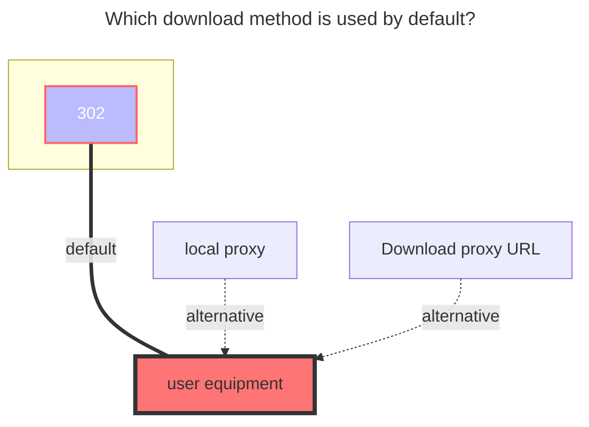

---
# This is the icon of the page
icon: state
# This control sidebar order
order: 3
# A page can have multiple categories
category:
  - Guide
# A page can have multiple tags
tag:
  - Storage
  - Guide
# this page is sticky in article list
sticky: true
# this page will appear in starred articles
star: true
---

# Aliyundrive Open

:::tip

Aliyundrive Open, using the official authorization API development.

:::

:::danger Read the precautions carefully

1.  ==The refresh token obtained by this tool can only be used for **Aliyundrive open platform** storage mount method== 
2. The token filled in when Alist is mounted should also be provided by this tool, and the previous acquisition method will not be available
3. Not applicable to others, but only for Alist
4. If the same IP requests =={{ max }}== times within =={{ minutes }}== minutes, **TooManyRequests** will appear. :no_entry_sign:So please do not abuse:no_entry_sign:
    - For example, a request is counted when saving/editing, and viewing a file or watching a video download is not counted.
    - The number of times and time mentioned above are dynamic~

:::

## refresh token

Go to：**https://alist.nn.ci/tool/aliyundrive/request**

#### Get example graph

**refresh_token** can be obtained in the following two ways

:::tabs#alitoken

@tab Go to login

@tab Scan QrCoden

:::

### Root folder file_id

Open the official website of Aliyundrive and click the string behind the url when you click into the folder you want to set, such as https://www.aliyundrive.com/drive/folder/5fe01e1830601baf774e4827a9fb8fb2b5bf7940

which is `5fe01e1830601baf774e4827a9fb8fb2b5bf7940`

### Client id，Client secret

Normal users don’t need to fill in the blank. If they apply for official authorization, they can also use their own to fill in. If it is blank, the default is to use the one provided by Alist.

## Remove way

- Trash: Enter the cloud disk recycle bin after AList is deleted, which will occupy the cloud disk space, but it can be retrieved if it is deleted by mistake later.
- Delete: Direct deletion will not stay in the recycle bin and will not take up cloud disk space, but if it is deleted by mistake later, it cannot be retrieved.
  - Note: Please do not disclose the Token obtained by your Alibaba cloud disk Open. If you accidentally leak it, please immediately go to [**Other instructions ¹**](#Open%20Alibaba%20Cloud%20Disk%20APP%20-->%20My%20-->%20Settings%20gear%20in%20the%20upper%20right%20corner%20-->%20Privacy%20Settings%20-->%20Authorization%20Management%20-->%20Click%20AList%20to%20view) to deauthorize to protect the security of your account. After 2 hours after deauthorization (recommended more Wait a few hours before authorizing to obtain Token)

## other instructions

one、

> AList only obtained cloud disk users (**name avatar¹**), (**access file permission²**) and (**write file permission³**), and did not obtain mobile phone number permission
>
> Details can be viewed in two ways:
>
> 1. **Prompt** when scanning the QR code to obtain the refresh token
> 2. ###### Open **Alibaba Cloud Disk APP --> My --> Settings gear in the upper right corner --> Privacy Settings --> Authorization Management --> Click AList** to view
>     
>     - If you don't use it, you can manually cancel the permission at any time

two、

>By default, the built-in player of Aliyun Disk is used - **Aliyun Video Previewer**
>
>The video uploaded to the cloud disk will be converted into an H.264 encoded video stream through the transcoding service. (The good thing is that IOS can play... well, it should be like this)
>
>- For videos newly uploaded to the cloud disk, only the first 30s of the video are pre-transcoded by default. Full video transcoding is triggered on first playback. The transcoded video will be cached, and re-transcoding is not required to trigger playback again.
>- Videos shorter than 30s will not trigger pre-transcoding, and will only start transcoding when they are played for the first time.
>- Real-time transcoding takes some time.
>- The picture quality are: LD|SD|HD|FHD|QHD

three、

> If the Alibaba cloud disk you mounted is Open, after restarting, reloading, and updating, you will find a prompt **TooManyRequests**
>
> 
>
> Check whether your account exceeds the number mentioned in the note in the red prompt at the top, that is, the number of open Alibaba Cloud disks you added > =={{ max }}==
>
> 
>
> The solution is to disable all the mounted Alibaba cloud disk Open, wait for =={{ minutes }}== minutes, and then click one by one to enable the number not to exceed =={{ max }}== times, and then wait= ={{ minutes }}== After a few minutes, click to open again, and it will recover slowly.
>
> 
>
> ^(Whispering reminder: If you have more than a dozen accounts, it’s okay, it’s not a big problem to restore =={{ max }}== one at a time. If you have 30 or 50 accounts, it is recommended that you restore about 4 each time , because it will help you refresh the refresh token every 2 hours, and it will also be called to prevent you from causing GG too many times...)^
>
> 
>
> Another problem, if the Alibaba Cloud Disk Open you mounted is a cloud disk account, and then mounted different folders to the account and added multiple accounts, resulting in too many Alibaba Cloud Open accounts added, this is a good solution
>
> 
>
> Solution: Go to the official page of Alibaba Cloud Disk and integrate all the folders you need to mount into one folder, then only mount the integrated folder, and then pass [**alias**](../advanced/alias.md) are mounted separately, just write one for each path, so that a single path can be mounted and displayed separately. Of course, you can also integrate multiple ones together, or use it directly. Example 3 to show different ones can also be
>
> 
>
> If you add more than =={{ max }}== to one account and one network disk, then you can only restore it slowly by starting.

### The default download method used

