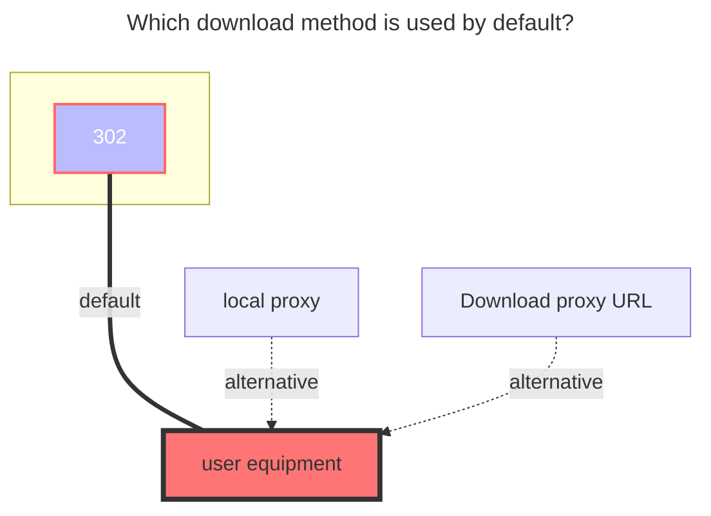

---
# This is the icon of the page
icon: iconfont icon-state
# This control sidebar order
order: 12
# A page can have multiple categories
category:
  - Guide
# A page can have multiple tags
tag:
  - Storage
  - Guide
  - "302"
# this page is sticky in article list
sticky: true
# this page will appear in starred articles
star: true
---

# Baidu Netdisk

:::tip
Due to the limitation of Baidu Disk API, downloading files larger than about 20M needs to carry the header: "User-Agent": "pan.baidu.com", so when downloading files larger than 20M, you need to set the request header yourself, such as using curl:
```bash
curl -L -X GET 'YOUR_LINK' -H 'User-Agent: pan.baidu.com'
```
Or use the proxy function in this program to transfer.
:::

### **Refresh token**
[Click here](https://openapi.baidu.com/oauth/2.0/authorize?response_type=code&client_id=iYCeC9g08h5vuP9UqvPHKKSVrKFXGa1v&redirect_uri=https://alist.nn.ci/tool/baidu/callback&scope=basic,netdisk&qrcode=1) to get the refresh token.


### **Root folder path**
The root foler to mount, defaults to `/`

- Mount a folder separately, according to the following format, `/` is the root directory, just extend to that directory if you want to mount that directory
  - /folder_A/....../folder_x

<br/>


### **Custom crack ua**

[**UA used when using 【Native Proxy & Crack API】**](https://github.com/alist-org/alist/issues/5602#issuecomment-1831188682)

<br/>


### **Download api**
- official: The official interface, very stable, but for larger files, UA needs to be modified and the speed is slow (SVIP speed fast)
- crack: unofficial interface，You must modify the UA and some files may not have a speed limit, but it will be unstable (not guaranteed 100%availability) Need to use a version greater than `3.19.0`
  -  ==Need to change the UA to`netdisk`==，Modification method refer to [add-user-agent-user-example](#add-user-agent-usage-example)
  -  Or turn on the Web proxy, you do not need to modify the UA (you need a large broadband to use it stably)
  -  It is limited to play/download **`video (only tested in the mp4 format other formats are not tested)`**,If it is other format files, such a prompt will appear
  -  This is not a mistake, this is a limit, please do not panic.

```json{3}
{
	error_code: 31119,
	error_msg: "hit black userlist , hit illeage dlna",
	request_id: 541111111111111140
}
# This is not a mistake, this is a limit, please do not panic.
```

<br/>


### **Add "User-Agent" usage example**

::::danger If you don't know how to set "User-Agent" see here

 ==The following methods are limited to Baidu super member users== 

 ==Prompt again The following methods are limited to Baidu super member users== 

It will only be useful if a member finishes modifying **`"User-Agent"`** (choose official and 302)

If you don’t change **`"User-Agent"`**, you can enable ==Web Agent==, the disadvantage is that you need to build an Alist machine for transfer, that is to say, you need a large broadband to help you transfer


:::tabs#ua

@tab Web plugin

- The advantage of using a browser plug-in to modify is that it can be played directly online, of course, downloading is also possible.

Example <Badge text="1" type="info" vertical="middle" />: If you really don’t know it, you can take a look at an example on the web page: **https://www.bilibili.com/video/BV1UA4y1X7J8**

Example <Badge text="2" type="info" vertical="middle" />: Another plugin method covering 360, Chrome, Edge: **https://youtu.be/PP6b0WSzYMc**


@tab Aria2

1. First follow the figure below to set the **`user-agent" `**, and then click the button option in the lower right corner, click ** gear ** (local settings) to configure the parameters well 

2. Then open the third button option in the lower right corner (**Open the check box**), and then go to the list to select the file we want to download
3. Select the files we need to download. After selecting, there will be a row of buttons. Select the second option on the right. One is sent to Aria2.

If you use the webpage to modify the **`user-agent`**, you do not need to configure the `UA` of ==**Aria2**==, and you can download it directly to Aria2


@tab Motrix

1. First follow the figure below to set the **`user-agent" `**, and then click the button option in the lower right corner, click ** gear ** (local settings) to configure the parameters well 
2. Then open the third button option in the lower right corner (**Open the check box**), and then go to the list to select the file we want to download
3. Select the files we need to download. After selecting, there will be a row of buttons. Select the second option on the right. One is sent to Aria2.

If you use the webpage to modify the **`user-agent`**, you do not need to configure the `UA` of ==**Motrix**==, and you can download it directly to Aria2

- Motrix Download link：[Motrix Official website](https://motrix.app/)，[Motrix-GitHub](https://github.com/agalwood/Motrix)


:::

::::

### **The default download method used**


