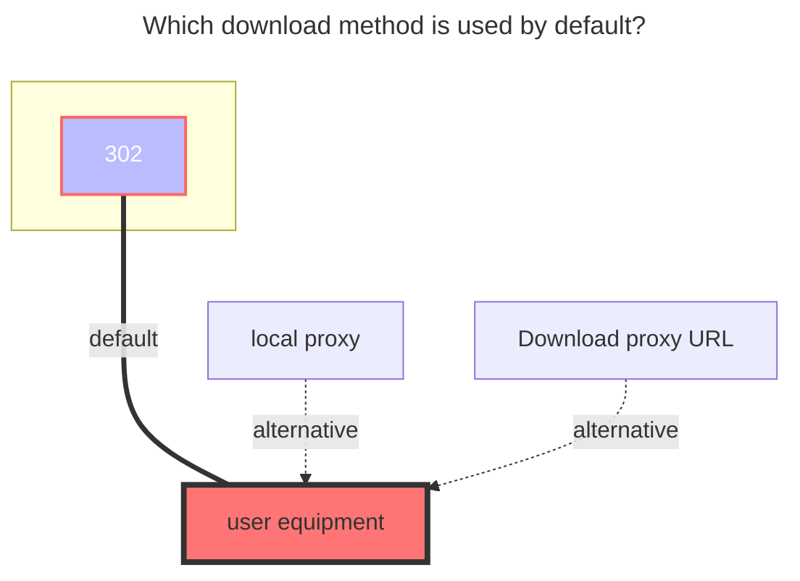

---
# This is the icon of the page
icon: iconfont icon-state
# This control sidebar order
order: 12
# A page can have multiple categories
category:
  - Guide
# A page can have multiple tags
tag:
  - Storage
  - Guide
  - "302"
# this page is sticky in article list
sticky: true
# this page will appear in starred articles
star: true
---

# BaiduYun Share Link

Driver for BaiduYun share link, supports downloading but not uploading, using an unofficial api.

## **Settings**

1. You need to set **surl** and **pwd** to browse the directory, and you need to set BDUSS to download.

2. **surl** is the part before `?` after the sharing address `pan.baidu.com/s/`, **pwd** fill in the 4-digit extraction code, and leave blank if there is no extraction code.

3. **surl** and **pwd** can be filled in with any account, but the account of the **`BDUSS`** parameter must use ==**Baidu Super SVIP member**==

BDUSS is extracted from the cookie

- Method 1: [Reference Tutorial](http://pandownload.net/faq/cookie.html) (the prefix `BDUSS=` is not required in this project).

- Method 2^recommended^:
   - 

## **Root folder file_id**

The root folder to be mounted, the default is `/` 

If you want to mount other folders, please see the example below

## **QA**

|setting|error message|tips|
|---|---|---|
|surl|`{"errno":2,"errtype":0}`|invalid share link|
|pwd|`{"errno":-130,"errtype":"mispwd-9"}`|invalid password|
|BDUSS|`{"errno":9019,"errmsg":"need verify"}`|invalid BDUSS, get a new one|
|UA|`{"error_code":31326,"error_msg":"user is not authorized, hitcode:119"}`|invalid user-agent, set a non-browser UA(ex. netdisk) or use web proxy|
|down|Failed init storage: 200 OK; {"errno":-130,"|The content shared by this link may not be accessible because it involves infringement, pornography, vulgarity and other information!|

## **Developing**

The api is from [github.com/yuantuo666/baiduwp-php](https://github.com/yuantuo666/baiduwp-php), an unofficial project.

We have developed the folder viewing and file downloading function, further developments are welcome.

Since we don't have an official document, there might be some compatible problems. You can give feedback on github.

We can't break those limits from Baidu and you should follow the official laws.

<!-- @include: baidu.md{74-125} --> 

### **The default download method used**

