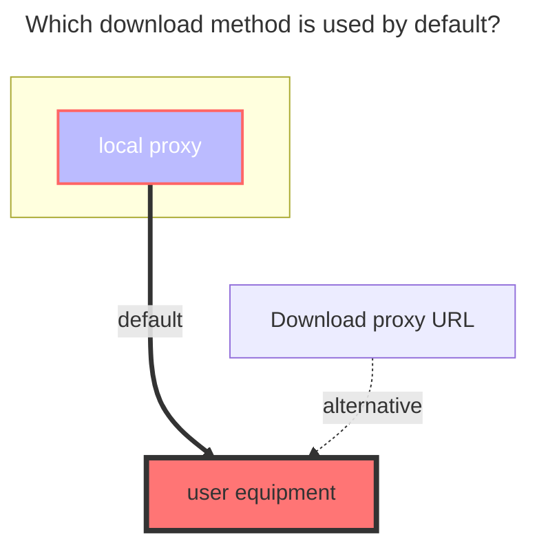

---
# This is the icon of the page
icon: iconfont icon-state
# This control sidebar order
order: 18
# A page can have multiple categories
category:
  - Guide
# A page can have multiple tags
tag:
  - Storage
  - Guide
  - "Native Rroxy"
# this page is sticky in article list
sticky: true
# this page will appear in starred articles
star: true
---

# ChaoxingxingGroupCloud

chaoxingxing group cloud is also affiliated with chaoxingxing. After logging in to chaoxingxing, you can see a group under the left sidebar.

Official website link：**https://i.chaoxing.com**

 

### **Username Password**

chaoxingxing account and password

 

### **Bbsid**

Follow the example process below to obtain

 

### **Root Folder ID**

The default is `-1`. For other subfolder ID acquisition methods, see the example below.

- Search the keyword `getResourceList` in the request. For convenience, we can directly search `list` and see it. Then we enter the folder we need to mount. After entering the folder, we can find the `folder id by looking at the request.`

 

### **The default download method used**

