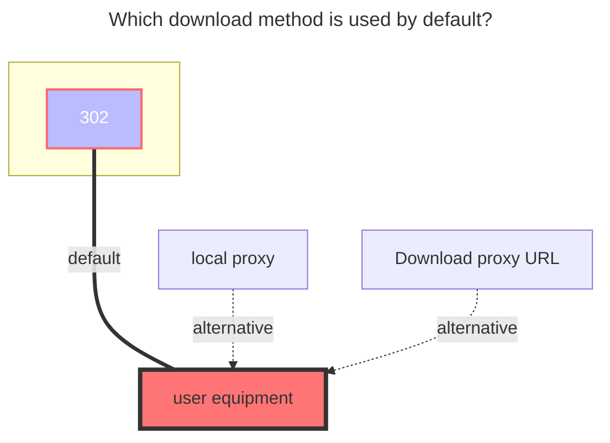

---
# This is the icon of the page
icon: iconfont icon-state
# This control sidebar order
order: 34
# A page can have multiple categories
category:
  - Guide
# A page can have multiple tags
tag:
  - Storage
  - Guide
  - "302"
# this page is sticky in article list
sticky: true
# this page will appear in starred articles
star: true
---

# Dropbox

Dropbox Official：https://www.dropbox.com/

## **Get refresh token**

Go to：**https://alist.nn.ci/tool/dropbox/request.html**

- There are two ways, one is provided directly using AList, and the other is to create a new application by yourself
  - The method of getting as follows (Recommend the first type^{right}^Because the AList provided can no longer create new users)
  - When using the self-built `client ID` and `secret key` on the right, remember to authorize^{the_third_picture}^

  
    
    
    

- If you use your own new applications, you need to fill in the `client id` and the `client secret key`

- The method is shown in the right side of the example above(Create an application link：**https://www.dropbox.com/developers/apps**)

- Redirect URLs：**https://alist.nn.ci/tool/dropbox/callback**

Reference link: [**Click to view**](https://github.com/alist-org/alist/commit/cfee536b96f38e5ba3f3575fab4e89f6c0e1bc5b#commitcomment-119688700)

## **Root folder file_id**

**Empty is the root directory**：display all files

**Single folder ID**：Enter the folder you need to display, copy the top link to fill in `/home` behind

### **The default download method used**

