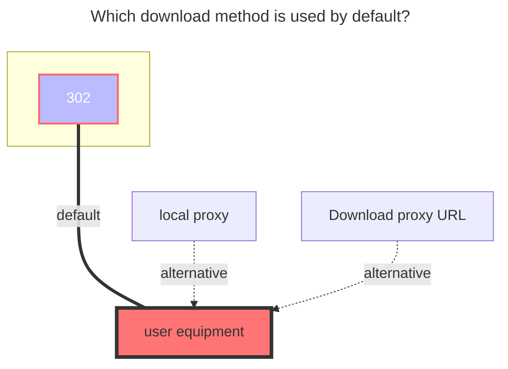

---
# This is the icon of the page
icon: iconfont icon-state
# This control sidebar order
order: 10
# A page can have multiple categories
category:
  - Guide
# A page can have multiple tags
tag:
  - Storage
  - Guide
  - "302"
# this page is sticky in article list
sticky: true
# this page will appear in starred articles
star: true
---

# FebBox

FebBox：https://www.febbox.com

 

## **Root folder ID**

Root directory ID, default is `0`

Other directory IDs can be viewed in the top link address bar after entering the folder

- **https://www.febbox.com/console#/files?parent_id=66889900**

Then the directory ID is `66889900`

 

## **`Client_id`**、**`Client_secret`**

Generate address：**https://www.febbox.com/open/clients**

- The generated client ID and secret key are filled in in the opposite order to the AList, so be careful not to fill them in incorrectly.

 

### **User IP**

**Optional**, the IP address of the user when downloading, quoting the official description

- IP address, Optional parameter. Supports IPv6 format.After filling in, the best download server suitable for the IP location will be selected. If not filled in, the requested IP will be used.

 

### **Things to note**

- The upload function is currently unavailable [**alist-org/alist/issues/7293**](https://github.com/alist-org/alist/issues/7293#issuecomment-2395776474)

 

### **The default download method used**

