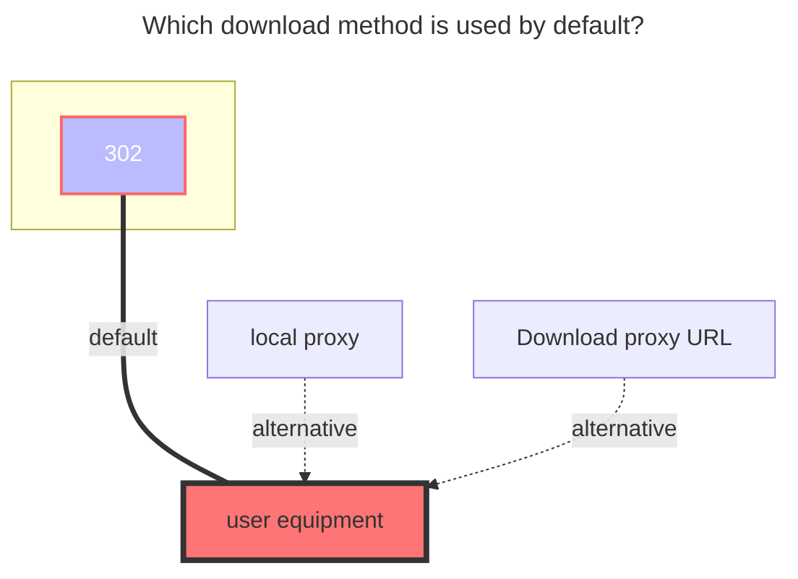

---
# This is the icon of the page
icon: iconfont icon-state
# This control sidebar order
order: 10
# A page can have multiple categories
category:
  - Guide
# A page can have multiple tags
tag:
  - Storage
  - Guide
  - "302"
# this page is sticky in article list
sticky: true
# this page will appear in starred articles
star: true
---

# FeiJi Cloud

FeiJi Cloud：https://feijipan.com/ ( v3.31.0)

## **root folder ID**

root folder ID the default is `0`，Other directory ID View the figure below obtaining method

 

## **username、password**

Just fill in your own Feiji Cloud Account Password

 

### **The default download method used**

