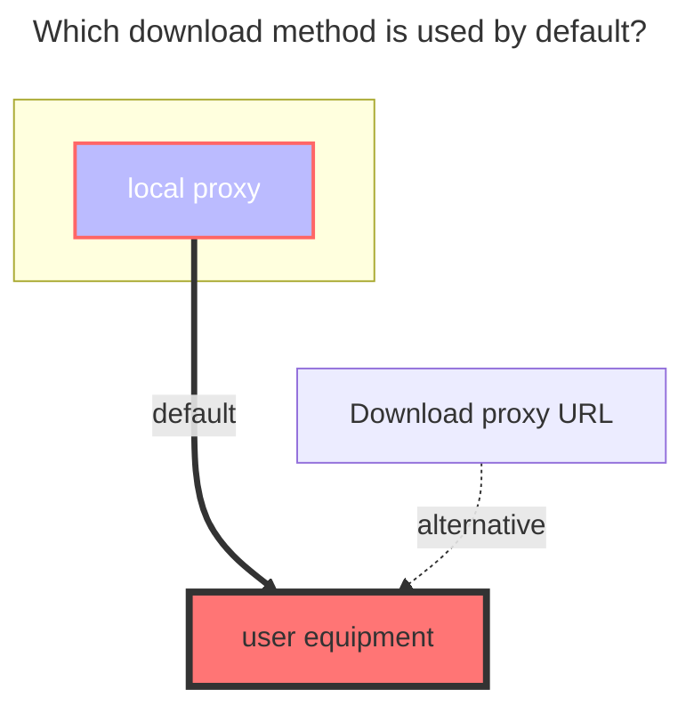

---
# This is the icon of the page
icon: iconfont icon-state
# This control sidebar order
order: 29
# A page can have multiple categories
category:
  - Guide
# A page can have multiple tags
tag:
  - Storage
  - Guide
  - "Native Rroxy"
# this page is sticky in article list
sticky: true
# this page will appear in starred articles
star: true
---

# FTP

### **Address**
FTP address, need contains port.

### **Username**
FTP username

### **Password**
FTP password

### **Root folder path**
root folder , default `/`, same as local storage.

### **The default download method used**

