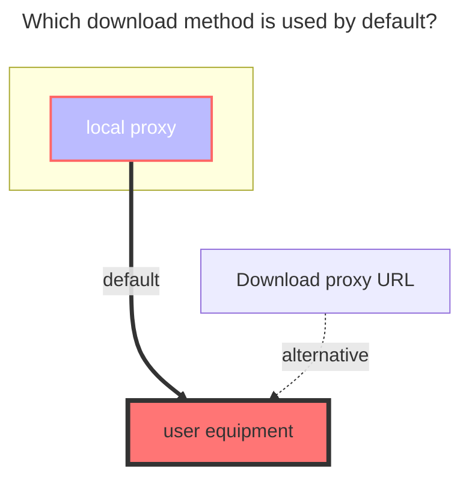

---
# This is the icon of the page
icon: iconfont icon-state
# This control sidebar order
order: 14
# A page can have multiple categories
category:
  - Guide
# A page can have multiple tags
tag:
  - Storage
  - Guide
  - "Native Rroxy"
# this page is sticky in article list
sticky: true
# this page will appear in starred articles
star: true
---

# Google Drive

Support team disk
### **Get client_id, client_secret, refresh_token**
Refer to https://alist.nn.ci/tool/google/request

### **Root directory file_id**
Similar to Aliyundrive, the last string of the official website URL, such as:

### **refresh_token [Google Service Account/SA]**
> You will be allowed to use Google Service Account/SA to access files in your Google Drive in v3.17.0 and later versions. 

> Simply fill in the **refresh_token** field with the **path to the SA file** or the **folder where it is located** to access your Google Drive using the Google Service Account/SA.

The following methods will be allowed(recommend 1st):
  - `/accounts` This method will automatically use all SA files in that folder. 
  - `/accounts/the_sa_file.json` 

As in the example above, all **paths must be absolute**, and the SA file name must also be ***.json** 

#### **Generate your SA file**
> For generating SA files, you can see the following link, [xyou365/AutoRclone](https://github.com/xyou365/AutoRclone/blob/master/Readme.md "AutoRclone")

## **Detailed Text Tutorial**

::: warning matters needing attention

1. The machine that builds the Alist service must first be able to connect to the Google network disk (scientific connection is not possible, the program can be connected), or directly use a foreign server~
2. The test version of the application token seems to be invalid after a while (about 7 days). If a long-term stable token is required, it seems that the application can only be released?
3. A client ID and secret key can only get token once, and you can only recreate **OAuth client ID** when you get it again, and use a new client ID and secret key

:::

**First open https://alist.nn.ci/tool/google/request `1. First click Use own client and then create client (Create client)`**

**If you do not have a Google account, log in to your Google account first, and click `Enabled APIs and Services` or `Library` to choose one of the two options**

**Click `Enabled APIs and Services` or `Library` to enter, then drop down to find `Google Driver API`**

Click **`Google Driver API`** to enter, see the diagram below to enable the API service

**`Google Driver API`** After enabling, we will create an application - look carefully~~~

If it is the first creation, there should be **` ❗If you need to create an OAuth client ID, you must first configure the unified screen `**, let's go to configure it, click on the page  **`Configure the consent screen`** You can jump to the configuration interface.

 ==Look at the next picture for the configuration tutorial== , come back to see this picture after configuration~

Callback parameter URL: **https://alist.nn.ci/tool/google/callback**

**`OAuth consent screen`** Configuration tutorial, if it has been configured, just ignore this picture (you can zoom in if you can’t see it clearly)

After we create **`OAuth Client ID`**, click on the **`OAuth Client ID`** we just created and write whatever you want~ After entering, there are `Client ID` and `Client Secret`

After getting `Client ID` and `Client Secret`

Let's go back to the beginning **https://alist.nn.ci/tool/google/request** and fill in `Client ID` and `Client Secret`

 ==Remember to check the option behind **Cloud Disk** and **Album** when obtaining authorization==

Then start to log in to the account. If it prompts **not verified by Google**, click on the left to continue. After authorization, you will see our token refreshed.

After the above operations, we also got the `refresh token`, let’s go to **`Alist background`** Add account to add it~

After adding an account in the background and saving it, we will mount it successfully~ Let's take a look

The left side is mounted by Alist, and the right side is the contents of Google Drive~ **o(*^＠^*)o**

::: details View video tutorial

**https://www.bilibili.com/video/BV18v4y1W7vo/**

:::

### **The default download method used**

