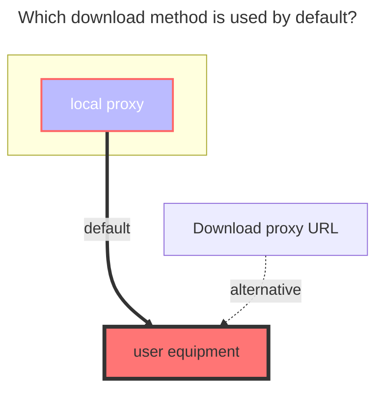

---
# This is the icon of the page
icon: iconfont icon-state
# This control sidebar order
order: 15
# A page can have multiple categories
category:
  - Guide
# A page can have multiple tags
tag:
  - Storage
  - Guide
  - "Native Rroxy"
# this page is sticky in article list
sticky: true
# this page will appear in starred articles
star: true
---

# Google Photos

## **Root folder file_id**

The root directory is root, and other directory IDs are unknown (~~It seems that a separate album cannot be mounted~~ It has not been resolved yet [**Reference**](https://github.com/alist-org/alist/discussions/3264#discussioncomment-4874536))

## **Get client_id, client_secret**

Get the tool https://alist.nn.ci/tool/google/request

How to get your own `client_id (client ID) client_secret (client secret key)` Go to [**Google Drive**](./googledrive.md) which article

::: tip

Tip This app has not been verified by Google

You have been authorized to use an app that is currently in beta. Do not proceed unless you know the developer who invited you.

Let's click **Continue** on the left

Remember to check this option, otherwise an error will be reported, as explained in the following precautions

:::

It is more convenient now. In fact, when obtaining Google cloud disk authorization, select the album permission at the same time, and the token obtained at that time can also be used to mount the album~ kill two birds with one stone

Remember to enable **`Photos Library API`**

- https://console.cloud.google.com/apis/library/photoslibrary.googleapis.com

## **Mount a single album directory**

According to [above](https://alist.nn.ci/tool/google/request) obtained **client ID** and **secret key** and **refresh_token**

We fill in **https://alist.nn.ci/tool/google/album** to get a single catalog ID for each of our Google Photos

- Root file ID (that is, the album ID): default root, display all, if you only want to display a single album, you can fill in the album ID you want to display
- After we fill in, there will also be an **`access_token`** below. This can also be filled in the Alist background refresh token option and used. The refresh token obtained at the beginning can be used for both of them- [Explanation]( https://github.com/alist-org/alist/discussions/3264#discussioncomment-5051171)

#### **Fill in the example diagram**

#get-client-id-client-secret)

## **Two notes:**

1. failed get objs: failed to list objs: Request had insufficient authentication scopes.: []
    - It's because you didn't check the album permission (see the picture mentioned above) `view and organize the content in your Google Photos media library, and upload content to the media library when obtaining authorization. Learn more`
    - You get the `access_token` and the `refresh_token` without declearing the scope of `https://www.googleapis.com/auth/photoslibrary`
    
2. failed get objs: failed to list objs: Photos Library API has not been used in project ... before or it is disabled. Enable it by visiting <https://console.developers.google.com/apis/api/photoslibrary.googleapis.com/overview> then retry. If you enabled this API recently, wait a few minutes for the action to propagate to our systems and retry.: []
    - because **`Photos Library API`** is not enabled in your project, Google Photos API

### **Finish**

### **The default download method used**

