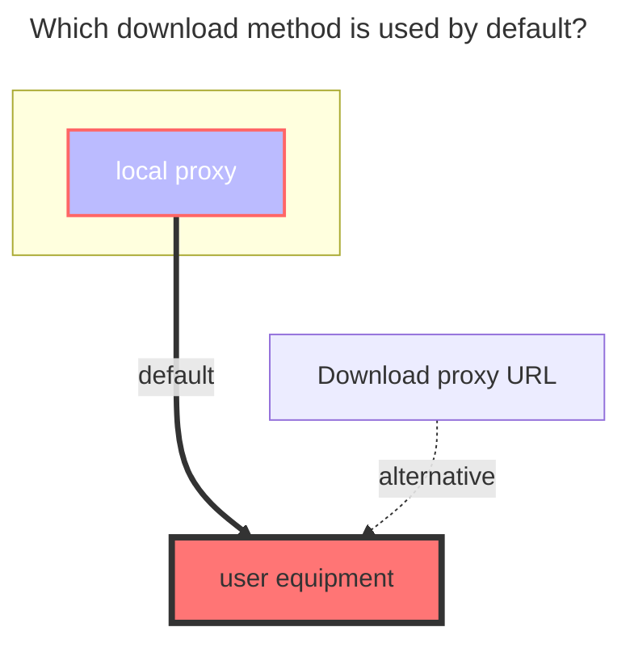

---
# This is the icon of the page
icon: iconfont icon-state
# This control sidebar order
order: 18
# A page can have multiple categories
category:
  - Guide
# A page can have multiple tags
tag:
  - Storage
  - Guide
  - "Native Rroxy"
# this page is sticky in article list
sticky: true
# this page will appear in starred articles
star: true
---

# halalcloud

- `6盘（halalcloud）` Official website：[https://2dland.cn](https://2dland.cn/)

  - Cloud Login：https://drive.2dland.cn

  

- Official announcement, document address：https://2dland.yuque.com/r/organizations/homepage

::: tip

Since `6盘 (halalcloud)` uses the `IPFS` protocol for storage, the block size is limited to `1MB`, so **you can only use `local proxy` for downloading**, and the single-thread speed is slow. **When using it, please try to use multi-threaded download to increase the speed**

:::

 

## **Root folder file_id**

Top address bar path，Root folder file_id is：`/`

Subfolder: `/A folder/C folder/C folder`

 

## **Fill in the example**

When adding a 6盘 (halalcloud) driver for the first time, the `Refresh token` can be left blank. A red error notification will pop up in the upper right corner.

Return to the storage page and click the refresh button. The previously added driver <code style="font-weight: bold;color:red">Click Here</code> area will become clickable. Click it to jump to the 6盘(halalcloud) official website to log in.

**The webpage will be closed automatically after leaving**. After logging in successfully, please copy the `RefreshToken` field parameter link in the top address bar in time.

- Or copy it to other locations and then obtain the `RefreshToken` field in the link

- After copying to other locations, it will automatically be UrlEncoded. Specifically, the `RefreshToken` field is a string starting with `"rt__` and ending with `"`^("is_encoded_to_%22)^
- You can refer to the following extraction example or borrow tools

 

The blue field in the link is the `RefreshToken` we need

	<ul>
		<li>Copy the link in the address bar<code>RefreshToken</code>：</li> 
		<ul> 
			<li style="font-weight: bold;">Before decoding：</li>
			<ul>
                <li>https%3A%2F%2Fstatic.2dland.cn%2Fuser%2Flanding%2F%3Ftype%3Doauth2-response%26payload%3D%7B%22scope%22%3A%22openid%20profile%20email%20phone%22%2C%22refreshToken%22%3A%22rt__2xxxx5_2xxxxxa-4xx7-4xxa-9xx3-exxxxxxxxxx4%22%2C%22state%22%3A%2210xxxx4d3-4cxa-4xx8-axxb-1xxxf3%22%2C%22callback%22%3A%22at_callback_d4dxxxxxxxxxxxxxxxxxxxxxxxxxef_ly8og7b8%22%7D</li>
			</ul> 
			<li style="font-weight: bold;">After decoding：</li>
			<ul>
				<li>https://static.2dland.cn/user/landing/?type=oauth2-response&payload={"scope":"openid profile email phone","refreshToken":"rt__2xxxx5_2xxxxxa-4xx7-4xxa-9xx3-exxxxxxxxxx4","state":"10xxxx4d3-4cxa-4xx8-axxb-1xxxf3","callback":"at_callback_d4dxxxxxxxxxxxxxxxxxxxxxxxxxef_ly8og7b8"}</li>
			</ul> 
            <li style="font-weight: bold;">If you really can't see it, you can use tools to decode it.：<a href="https://tool.chinaz.com/tools/urlencode.aspx">https://tool.chinaz.com/tools/urlencode.aspx</a>
			</li>
		</ul>
	</ul>
    

 

## **Other parameters**

- `Upload thread`：upload thread (default is 3, range 1-32)

- `App id`：`Application ID` (default is filled, no need to fill in)

- `App version`：`Application version` (default is filled, no need to fill in)

- `App secret`：`Application key` (default is filled, no need to fill in)

 

### **The default download method used**

