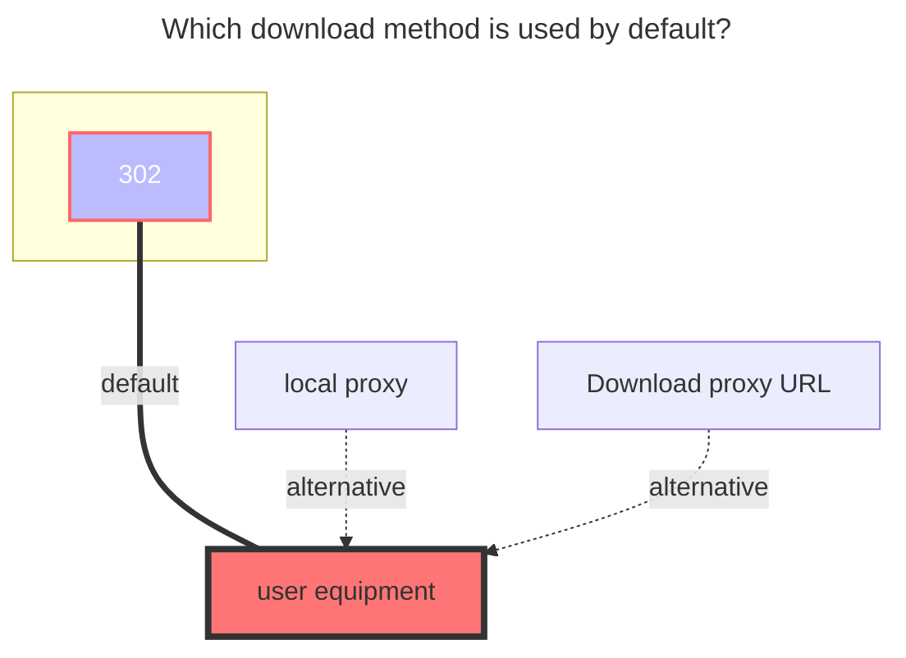

---
# This is the icon of the page
icon: iconfont icon-state
# This control sidebar order
order: 38
# A page can have multiple categories
category:
  - Guide
# A page can have multiple tags
tag:
  - Storage
  - Guide
  - "302"
# this page is sticky in article list
sticky: true
# this page will appear in starred articles
star: true
---
# KodBox

KodBox is a file manager for web. It is also a web code editor, which allows you to develop websites directly within the web browser. Self-hosted file management system with muilt-cloud support. You can run kodbox either online or locally,on Linux, Windows or Mac based platforms. The only requirement is to have PHP 5 available.

Use this driver to mount a KodBox netdisk space to Alist.

## **Root folder path**

Suppose you have a network disk space named `My Files`. If you remount the contents of the network disk space, you need to obtain the path corresponding to `My File`; if you re-display a name in the network disk space for For the directory of `abc`, you must obtain the path corresponding to `My File/abc`, and so on.

Example: How to get the path of KodBox network disk space `My File`, the result path is `{source:5}`
> Open the KodBox network disk space in the browser. In the console mode, you can see the path corresponding to the network disk space. Do not leave it blank.

## **Address**

Your kodbox server address, e.g.
- `https://kodcloud.cc`
- `http://192.168.1.24:8000`

## **Username**

The email or username used to log in to your KodBox server.

## **Password**

The password for your email or username.

### **The default download method used**

