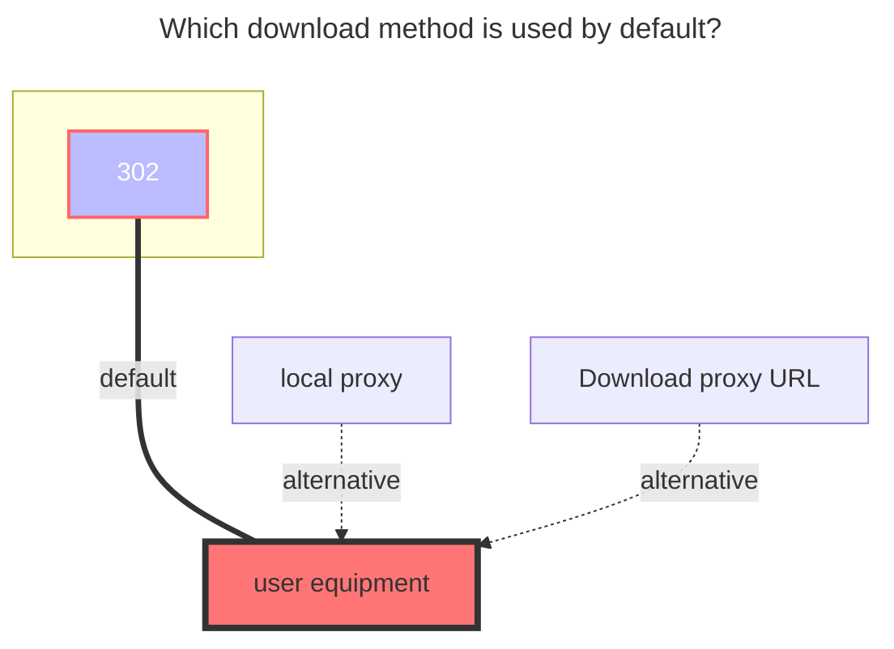

---
# This is the icon of the page
icon: iconfont icon-state
# This control sidebar order
order: 9
# A page can have multiple categories
category:
  - Guide
# A page can have multiple tags
tag:
  - Storage
  - Guide
  - "302"
# this page is sticky in article list
sticky: true
# this page will appear in starred articles
star: true
---

# LanZou Cloud

::: tip

Lanzuo Network Disk has three types of **modes (types)**, which are **accounts, Cookie** and **Url**

- **Account** : You can display all the files of your own cloud disk, you only need to fill in the account password, which will automatically help you refresh the cookie
- **cookie** : All files in the network disk can be displayed, but the cookie of the network disk needs to be provided
- **Url** : only display the content in the link (you can mount it without providing a cookie)

:warning: It is recommended to use the **Account** method to mount：

- Cookie mode needs to manually update Cookie
- Using the Url mode will always cause convulsions. I don’t know what’s going on and suddenly prompts

:::

## **root folder ID**

Lanzuo cloud disk root directory ID, the default is `-1`，If you use `Url`Type to mount the root folder ID, please see the third item of [Fill in instructions](#fill-in-instructions)

- **Additional Folder ID**
  - Two ways to obtain (see the picture below)
  - 

## **Account**

Just fill in your own Lanzou Cloud Account Password

## **Cooike**

Log in to your [**Lanzuo Cloud Disk**](https://pc.woozooo.com/) account, then F12 to open the developer mode, you can find `Cookie`, there is no specific one, such as the left side of the picture Just click one and there will be `Cookie` in the blue part of the right picture.

## **Share link and share password**

- **Share link**: Randomly generate a share link in the Lanzuo cloud disk
   - Small tip: **lanzouX** in the link, the last default **X** content sometimes cannot be opened in some areas, you can try to change it yourself, for example, change to i, x, u, t, etc. Anyway, try it out for yourself.
- **Share password**: the password for the link

## **Repair file info**

If you need **WebDav** service, you need to open it

## **error message**

Use cookie type or account type to add prompt `not find file page param` error because lanzou changed the domain name

- Solution: It is recommended to use account type to add
   - Change the sharing link to `https://wwop.lanzoul.com` and save it. If it still doesn't work, refresh the lower right corner.
   - lanzoul will also make changes in the future

## **Fill in instructions**

1. **Acount mode**: Type selects `account`, fill in` account` and `password` options, and the `root folder ID` (the default is all files of the root directory)

2. **Cookie mode**: Type selects `Cookie`, fill in` Cookie`, and the `root folder ID` (the default is all files of the root directory)

3. **URL mode**: Type selects `Url`, fill in` ShareUrl` and `root folder ID` and`Share Password (if there is a password)` 

   - The sharing link is :point_right: https://xxx.lanzou.com/aaabbbccc :point_left: in this format

   - Fill in `ShareUrl`: https://xxx.lanzou.com

   - Fill in `root folder ID`: aaabbbccc

   - Share Password: if there is a password

### **The default download method used**

