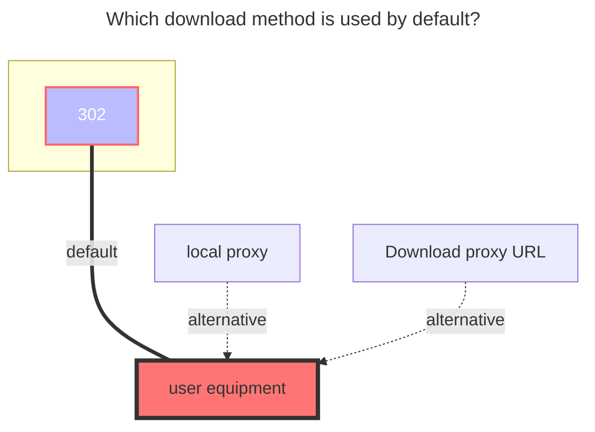

---
# This is the icon of the page
icon: iconfont icon-state
# This control sidebar order
order: 9
# A page can have multiple categories
category:
  - Guide
# A page can have multiple tags
tag:
  - Storage
  - Guide
  - "302"
# this page is sticky in article list
sticky: true
# this page will appear in starred articles
star: true
---

# LenovoNasShare

**https://pc.lenovo.com.cn**

- Need to buy Lenovo equipment

 

## **root folder ID**

Root folder ID: Empty

Subfolder ID：After entering the folder where you need to obtain the subfolder ID, find the request and obtain the subfolder ID.

 

## **Share id and Share pwd**

Share Link Example： https://siot-share.lenovo.com.cn/s/#/Ss.JjMaJJwcgrDT46qhVA   Share pwd：`fr0w`

- **Share id**：The string at the end of the shared link`Ss.JjMaJJwcgrDT46qhVA`
- **Share pwd** ：fr0w

 

### **Host**

The public network is used by default: **https://siot-share.lenovo.com.cn**

If you use a LAN, you can change it to the internal network address of the Lenovo device: **http://192.168.XX.XX**

 

### **The default download method used**

