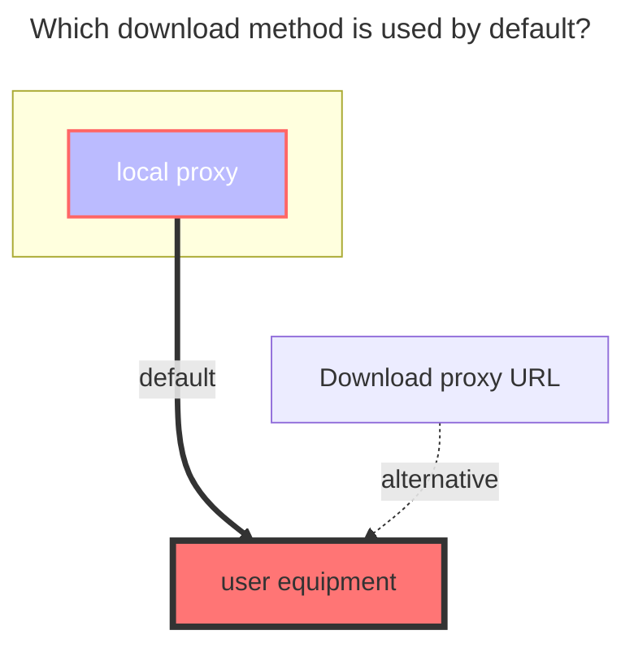

---
# This is the icon of the page
icon: iconfont icon-state
# This control sidebar order
order: 2
# A page can have multiple categories
category:
  - Guide
# A page can have multiple tags
tag:
  - Storage
  - Guide
  - "Native Rroxy"
# this page is sticky in article list
sticky: true
# this page will appear in starred articles
star: true
---
# Local storage

### **Root folder path**

The path of folder you wanted to mount. For example:

- Linux: `/root`
- Windows: `C:`

## **Local storage video thumbnail**

You need to use the `ffmpeg` tool to add, I will not (wait for replenishment) for the time being

- You need to use AList version ≥ [**v3.12.0**](https://github.com/alist-org/alist/releases/tag/v3.12.0)
  - Add thumbnail for video with ffmpeg  -  by [**@GodFinal**](https://github.com/GodFinal) and [**@Xhofe**](https://github.com/Xhofe) in [**#3556**](https://github.com/alist-org/alist/pull/3556) [**(309d6)**](https://github.com/alist-org/alist/commit/309d655)

## **Recycle bin path**

path to recycle bin, delete permanently if empty or keep 'delete permanently'

If you fill in this path, you will move the file into the folder when deleting the local storage file, so that you have a chance to regret it.

The method of filling in the above -mentioned mounting path is different from different system filling methods.

==If you do n’t know if you fill in it correctly, you can test it yourself first and then use the production environment to use it yourself.==

- Linux: `/root`
- Windows: `C:`

### **The default download method used**

