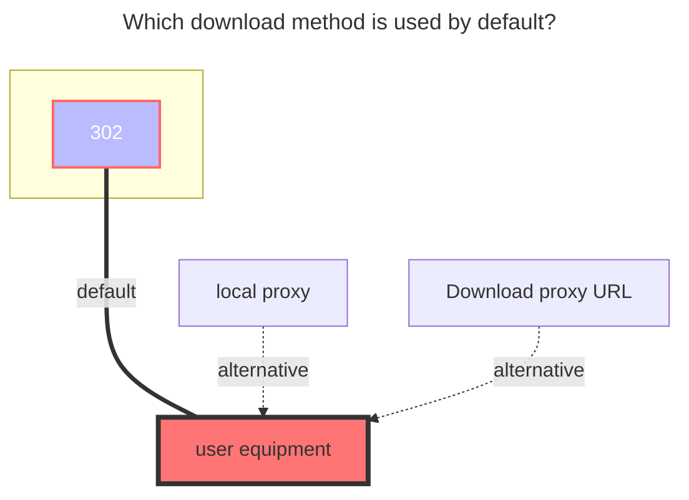

---
# This is the icon of the page
icon: state
# This control sidebar order
order: 10
# A page can have multiple categories
category:
  - Guide
# A page can have multiple tags
tag:
  - Storage
  - Guide
# this page is sticky in article list
sticky: true
# this page will appear in starred articles
star: true
---

# Mediatrack

### **Access token**
You can get it in request header after logging in

### **Project id**
Get from official website url:

### **Root folder id**

Get it from the request after logging in

### **The default download method used**

