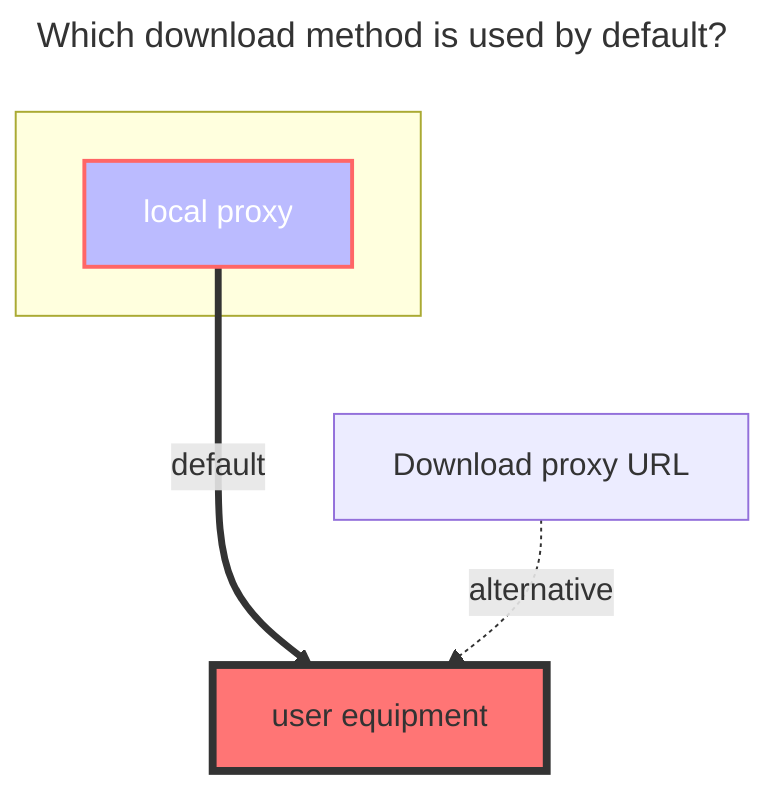

---
# This is the icon of the page
icon: iconfont icon-state
# This control sidebar order
order: 26
# A page can have multiple categories
category:
  - Guide
# A page can have multiple tags
tag:
  - Storage
  - Guide
  - "Native Rroxy"
# this page is sticky in article list
sticky: true
# this page will appear in starred articles
star: true
---

# MEGA Disk

MEGA official website: **https://mega.nz/login**

### **Mail**

MEGA login account

### **password**

login password

## **2FA**

Non -filling options,If you open 2FA, you need to fill in it,If you don’t use 2FA, you don’t need to fill in it

### **Two fa secret**

**https://mega.nz/fm/account/security/two-factor-authentication**

Click to enable `Enable two-factor authentication (2FA)` and then see a QR code, there is a string of letters below the QR code, This is `Two fa secret`, please record before scanning the code and do not lose it, Should the `Two-factor authentication (2FA) secret` be lost, you can unbinding and then retrieve a new 2FA QR code for setup.

### **Two fa code**

To enable 2-factor authentication, you need to install a app that support 2FA (such as [Google Authenticator](https://play.google.com/store/apps/details?id=com.google.android.apps.authenticator2), [Microsoft Authenticator](https://support.microsoft.com/en-us/account-billing/download-and-install-the-microsoft-authenticator-app-351498fc-850a-45da-b7b6-27e523b8702a)), on your phone.

Then login to ALIST manage and goto `Profile` page, click `Enable 2FA` button, scan the QR code with your 2FA app, and enter the code generated by your 2FA app.

Scan the QR appearing on the screen. At the same time, this QR code is also [two-fa-secret](#two-fa-secret)

 

## Fill in example:

 

### **The default download method used**

