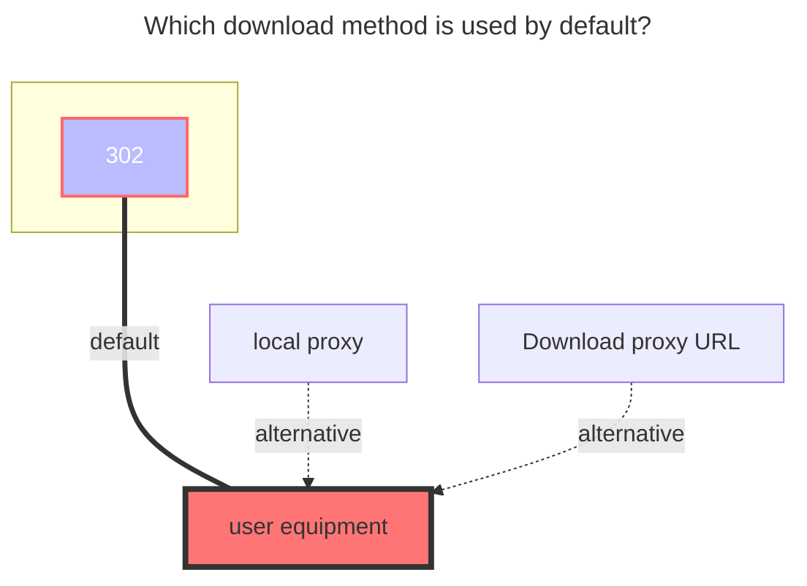

---
# This is the icon of the page
icon: iconfont icon-state
# This control sidebar order
order: 8
# A page can have multiple categories
category:
  - Guide
# A page can have multiple tags
tag:
  - Storage
  - Guide
  - "302"
# this page is sticky in article list
sticky: true
# this page will appear in starred articles
star: true
---
# MoPan

MoPan address：**https://mopan.sc.189.cn/mopan/#/downloadPc**

- There is no web version, only `Android`, `iOS`, `PC-Win64bit`, `iPad`, and `TV`.
- :warning: Alist version > ==3.30.0== to use this driver

 

## **Sms code**

Enter the option of the mobile phone number and password when the first addition, and then enter the `SMS Code` input ==Send==, and then click Save to send it to you.

 

## **root folder ID**

Do not fill in this option, it will automatically fill into the root directory

- Due to encrypted requests, an appropriate method for obtaining folder IDs has not yet been found

 

### **Tips**

1. `root folder ID`,` equipment information `does not need to be filled in, will automatically help you fill
2. If you enter the send in [SMS Code] (#SMS-Code), it is found that it has been saved,Please click Edit to enter the verification code received

 

### **The default download method used**

