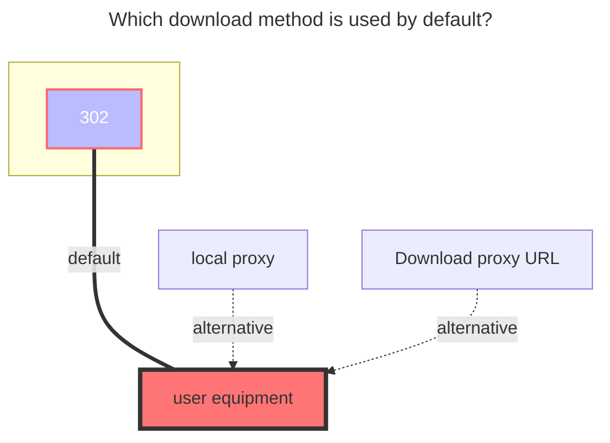

---
# This is the icon of the page
icon: state
# This control sidebar order
order: 0
# A page can have multiple categories
category:
  - Guide
# A page can have multiple tags
tag:
  - Storage
  - Guide
# this page is sticky in article list
sticky: true
# this page will appear in starred articles
star: true
---
# MoPan

MoPan address：**https://mopan.sc.189.cn/mopan/#/downloadPc**

- There is no web version, only `Android`, `iOS`, `PC-Win64bit`, `iPad`, and `TV`.
- :warning: AList v3.19.0 version and above can use this driver

::: danger

==MoPan has multiple security issues, therefore it is not recommended to store confidential files in it. It is also advised not to use commonly used passwords as the server may store them unencrypted.==

1. Due to encrypted requests, an appropriate method for obtaining folder IDs has not yet been found, so currently it can only be set to -11 (root folder ID).
2. Folders under the ID -11 cannot be deleted arbitrarily, otherwise various bugs may occur. (If you don't plan to use the fancy official functions, you can delete them all 🤔）
3. The folder named Files in the directory is the user space, Private Space corresponds to the private space, and the one named a long string of numbers is the shared space.
   - The folder named Albums corresponds to the album function, but direct operation may cause bugs and there are no plans to adapt the album yet.
     - Directly uploading files to the album folder in AList's shared space not be displayed in the app.
   - Currently there is a bug in the official software regarding the folder deletion function, and we are waiting for a fix.

:::

## **root folder ID**

`-11`

- Due to encrypted requests, an appropriate method for obtaining folder IDs has not yet been found, so currently it can only be set to -11 (root folder ID).

### **AList fill in examples：**

You only need to fill in your `phone number` and `password` to mount, and you don't need to fill in the `device info`, as it will be automatically filled in for you.

### **The default download method used**

