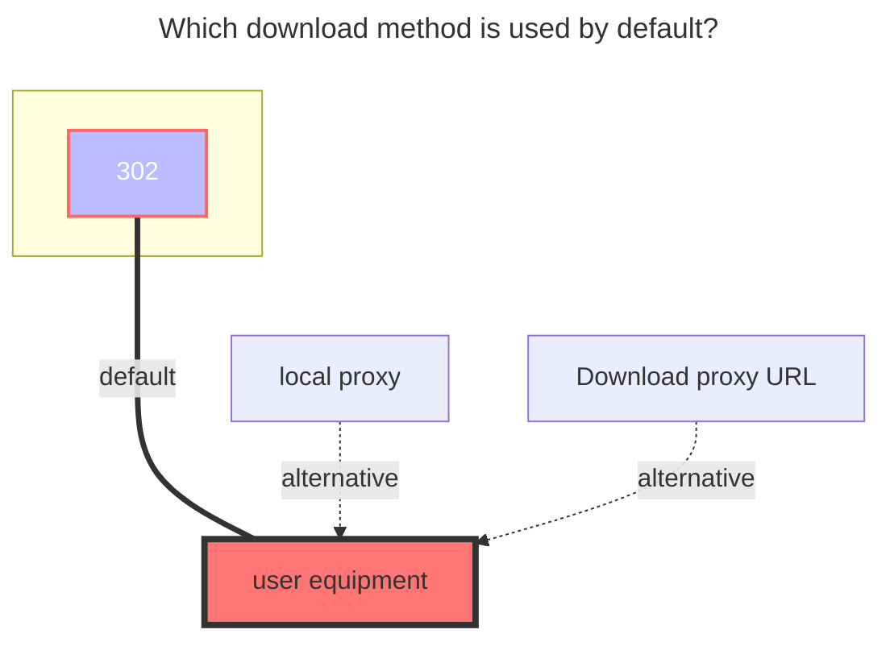

---
# This is the icon of the page
icon: iconfont icon-state
# This control sidebar order
order: 5
# A page can have multiple categories
category:
  - Guide
# A page can have multiple tags
tag:
  - Storage
  - Guide
  - "302"
# this page is sticky in article list
sticky: true
# this page will appear in starred articles
star: true
---

# OneDrive

:::tip
If your account does not support the API, (for example, the school account has not verified the administrator, or the administrator has disabled the API), then you can also mount it through webdav. For details, see [webdav](webdav.md)
:::

First open https://alist.nn.ci/tool/onedrive/request

### **Create an application**
> You can also choose to skip this step and use the client provided by default, but requires the approval of the organization administrator.

- On the page that opens, select the region and click Create Application
- After logging in, select `Register Application`, enter `Name`, and select `Accounts and Individuals in Any Organization Directory` (note that you don't look at the location selection but the text here. Some people may be the middle option, don't select a single Tenant or other options, otherwise it will cause problems when logging in), enter the redirect URL as <https://alist.nn.ci/tool/onedrive/callback>, `register`, and then you can get client_id
  
- After registering the application, select `Certificate and Password`, click `New Client Password`, enter a string of passwords, select the one with the longest time, and click `Add`
  (Note: The password entered after adding will disappear, please record the value of client_secret)
  
- Select `API Permissions`, click `MicroSoft Graph`, enter file in the `Select Permissions`, and check `Files.read` (Note: Files.read is a read-only minimum permission. The permission in the figure is larger, and the same can be done ), click `Update Permission`
  
### **Get refresh token**
Fill in the client_id and client_secret obtained in the previous step into the https://alist.nn.ci/tool/onedrive/request page, click Get Refresh Token, you can get the refresh token

### **Get Sharepoint site_id**
If you need to mount Sharepoint, after completing the previous step, an input site address will appear on the interface that displays the refresh token. After entering the site address, click Get site_id.
### **Add storage**
Fill in the values ​​obtained in the above process one by one.
#### **Root folder path**
The default is `/`, if you need to customize, just fill in the path, starting from the root path, the same as the local path, such as `/test`

### **The default download method used**

