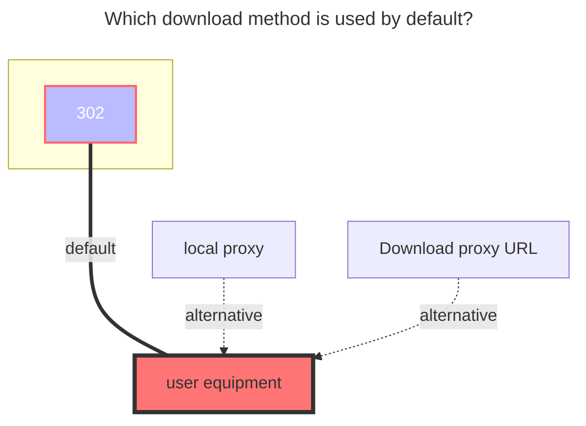

---
# This is the icon of the page
icon: iconfont icon-state
# This control sidebar order
order: 5
# A page can have multiple categories
category:
  - Guide
# A page can have multiple tags
tag:
  - Storage
  - Guide
  - "302"
# this page is sticky in article list
sticky: true
# this page will appear in starred articles
star: true
---

# OneDrive APP

## **Benefits and Precautions**

1. The advantage is that the administrator is only authorized to log in once, and the same is used when adding parameters later. When adding, everything is the same except for the mailbox.
   - For example, E5 has 25 5T accounts. After you log in and initialize in advance, you can directly use the parameters before the CV. You don’t have to get the refresh token every time as before, and it will expire after a long time
   - A1, A1P, etc. can distribute more accounts (500 - **unlimited**)


2. After the administrator authorizes in this way, he can view the account of each member in the organization at will, which will leak his own files
   - It is recommended to apply for OneDrive E5 to get better

----

::: tip
It is not applicable to the home version. If you are in the configuration process, it does not match the options that appear in the tutorial. It may not be supported
:::


First log in with your personal or organizational account

**https://entra.microsoft.com/#view/Microsoft_AAD_IAM/TenantOverview.ReactView?Microsoft_AAD_IAM_legacyAADRedirect=true**

Login to get our<Badge text="tenant ID" type="info" vertical="middle" />


## **Create process**

:::danger Read the precautions carefully
Please read carefully the following **`serial numbers , view in sequence`** , if there is any error, please feedback in time
:::

:::tabs#onedrive_app
@tab 1

1. Register an application, choose the type yourself, it is recommended to choose the third

2. Redirect URL (callback parameter), select Web as the type, and fill in the parameters **https://entra.microsoft.com/TokenAuthorize** ,Otherwise, it will not be able to authorize later
3. After filling out, click on the registration below and you can see it after jumping<Badge text="client ID" type="info" vertical="middle" />


@tab 2

Let's get a client secret key, just get it as shown in the figure below, remember<Badge text="secret key" type="info" vertical="middle" />save in time, it will only appear once


@tab 3

Once you have obtained the client secret key, go to authorize the **`API`** to be used, and follow the picture below to get it


@tab 4

After the API is authorized, we go to authorize the organization application

- Left sidebar ---> Enterprise applications ---> All applications ---> **{choose which application name we started to create}** ---> Permissions ---> Click for `xxxx `Grant admin consent


matters needing attention

- If you start to register the application, the callback parameters are not the same, you may get an error when you click Authorization, remember to write the same
- How to check whether the authorization is successful. If it is not authorized, the page will prompt `The application has not been found to have the authorization of the administrator's permission`. After the authorization is successful, refresh the page and you will see three API permissions, as shown in the figure below
  - The above is what it looks like when it is not authorized, and the following is what it looks like after authorization (just refresh the page after authorization)


@tab 5

From the beginning to the present, we have obtained the following parameters: tenant ID^1^, registered application^2^, client ID/secret key^3^, authorization API/administrator API^4^

Then open the browser and finally authorize it through the following format, which are<Badge text="tenant ID" type="info" vertical="middle" /><Badge text="client ID" type="info" vertical="middle" /><Badge text="Callback URL" type="info" vertical="middle" />Change to your own final login to receive

```html
https://login.microsoftonline.com/{tenant ID or common}/adminConsent?client_id={client ID}&redirect_uri={Callback URL}
```


If you log in according to the spelled link and find that you are redirected to a blank page, such as the sample code and picture below, the authorization is successful, don’t worry

```
https://entra.microsoft.com/TokenAuthorize?admin_consent=True&tenant={Tenant ID}#
```


:::


## **Fill in the example**

Fill in the values obtained in the above process one by one. If you don’t know which email address it is, you can find it by [**view all users of the organization**](#view-all-users-of-the-organization)


<BiliBili bvid="BV1Ro4y1s725" ratio="16:9" low-quality no-danmaku />


## **View all users of the organization**

If you don't know how many users there are in your OneDrive organization, you can go to the link below to log in to the `admin` account to view

**https://admin.microsoft.com/Adminportal/Home?source=applauncher#/users**


## **Error message**

- Tips：**Either scp or roles claim need to be present in the token**  Error

because you didn't do it in step `4` <Badge text="grant xxx administrator consent" type="info" vertical="middle" /> caused by,Pay attention to the tips below the fourth step

- Tips：**failed get objs: failed to list objs: Unable to retrieve user's mysite URL** Error

The newly created `OneDrive` user account does not take effect in real time, Delay takes effect, wait for a few hours and try again [**Case**](https://github.com/alist-org/docs/discussions/189#discussioncomment-5928892)


## **Add OneDrive_App accounts in batches**

software used：**https://github.com/yzbtdiy/alist_batch**


:::details Fill in the parameters. If you don’t understand, you can watch the video below.

Do not leave blank lines in the two configuration files, as this will also report an error

**config.yaml**

```yaml
# Your own AList site, which can be local or remote server IP or domain name, but cannot have "/" at the end
url: ALIST_URL
# The three parameters of auth are your AList administrator account password and refresh token
auth:
    username: USERNAME
    password: PASSWORD
token: ALIST_TOKEN
# enable Turn on whichever option you need, and turn off the one you don’t need
aliyun:
    enable: false
    refresh_token: ALI_YUNPAN_REFRESH_TOKEN
pikpak:
    enable: false
    username: PIKPAK_EMAIL
    password: PIKPAK_PASSWORD
# What we need here is onedrive_app, turn this on
onedrive_app:
    enable: true
# global is global, such as E5 A1 A1P, Vianet is cn, German version is de, American version is us
    region: global
    tenants:
        - id: 1
          client_id: client_id
          client_secret: client_secret
          tenant_id: tenant_id
# Here you can mount different domains and different accounts at the same time, each domain can be written according to the above configuration
# Client ID Client Secret Key Tenant ID Needless to say?
```

**onedrive_app.yaml**

```yaml
# Category 1 Mount x can be changed at will, which is equivalent to the mount path when adding storage
# 1 This refers to which domain/organization configuration in the above configuration file is to be used
# What follows is your email account~ If you don't write ":/folder1", the root directory will be mounted, and if you write it, you will mount this directory
# Anyway, the format is: Mount path: domain/organization: email account: / folder directory (optional)
Category:
    mount: 1:user1@xxx.onmicrosoft.com
    mount2: 1:user2@xxx.onmicrosoft.com:/folder1
    mount3: 1:user2@xxx.onmicrosoft.com:/folder2
# You can mount it in multiple different lists, and write according to the format
Category2:
    mount11: 1:user1@xxx.onmicrosoft.com
    mount22: 1:user2@xxx.onmicrosoft.com:/folder1
    mount33: 1:user2@xxx.onmicrosoft.com:/folder2
```

:::

<BiliBili bvid="BV1vc411V78S" ratio="16:9" low-quality no-danmaku />

### **The default download method used**

