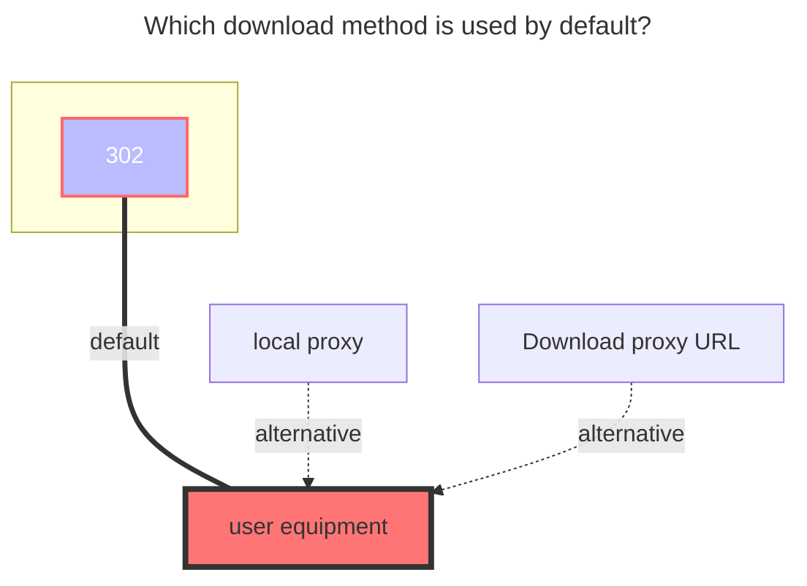

---
# This is the icon of the page
icon: iconfont icon-state
# This control sidebar order
order: 16
# A page can have multiple categories
category:
  - Guide
# A page can have multiple tags
tag:
  - Storage
  - Guide
  - "302"
# this page is sticky in article list
sticky: true
# this page will appear in starred articles
star: true
---

# PikPak / share

::: danger

1. `Pikpak`：Who makes the request, who can use it
   
   
   
   - For example, if you build an AList on the server with IP `1.1.1.1`, but your own IP is `2.2.2.2`, you cannot play or download it.
   - Or enable Proxy policy

-----
2. `PikPak Share`：There is a size limit. After the specified file size is exceeded, only 40%~50% can be played.

   

   - The specific size of the file is currently unknown

:::

## **PikPak**

### **Username**

email or phone?

### **Password**

password

 

### **Root folder id**

Can get with https://mypikpak.com/ , default `root`.

 

### **Disable media link**

- **https://github.com/alist-org/alist/issues/4735**

 

### **Offline Download**

<Badge text="v3.36.0" type="info" vertical="middle" /> and above versions support calling `Pikpak` offline download function in AList

Select <svg fill="none" stroke-width="0" xmlns="http://www.w3.org/2000/svg" viewBox="0 0 24 24" class="toolbar-toggle hope-icon hope-c-XNyZK hope-c-PJLV hope-c-PJLV-ifkxHPo-css" height="1em" width="1em" style="overflow: visible;"><path fill="currentColor" d="M7 14a2 2 0 100-4 2 2 0 000 4zM14 12a2 2 0 11-4 0 2 2 0 014 0zM17 14a2 2 0 100-4 2 2 0 000 4z"></path><path fill="currentColor" fill-rule="evenodd" d="M24 12c0 6.627-5.373 12-12 12S0 18.627 0 12 5.373 0 12 0s12 5.373 12 12zm-2 0c0 5.523-4.477 10-10 10S2 17.523 2 12 6.477 2 12 2s10 4.477 10 10z" clip-rule="evenodd"></path></svg><svg fill="currentColor" stroke-width="0" xmlns="http://www.w3.org/2000/svg" viewBox="0 0 512 512" class="hope-icon hope-c-XNyZK hope-c-PJLV hope-c-PJLV-iipViGO-css" tips="offline_download" height="1em" width="1em" style="overflow: visible;"><path fill="none" stroke="currentColor" stroke-miterlimit="10" stroke-width="32" d="M421.83 293.82A144 144 0 00218.18 90.17M353.94 225.94a48 48 0 00-67.88-67.88"></path><path stroke-linecap="round" stroke-miterlimit="10" stroke-width="32" d="M192 464v-48M90.18 421.82l33.94-33.94M48 320h48"></path><path fill="none" stroke="currentColor" stroke-linejoin="round" stroke-width="32" d="M286.06 158.06L172.92 271.19a32 32 0 01-45.25 0L105 248.57a32 32 0 010-45.26L218.18 90.17M421.83 293.82L308.69 407a32 32 0 01-45.26 0l-22.62-22.63a32 32 0 010-45.26l113.13-113.17M139.6 169.98l67.88 67.89M275.36 305.75l67.89 67.88"></path> </svg> in the lower right corner and select `Pikpak` for offline download options

- Support: `magne`, `http`, `ed2k` links

- Also supports: X, TikTok, Facebook, TG URL links

Only Pikpak is supported for offline download. If it is not Pikpak, the following error message will be displayed, Although the offline download prompt was successfully added, an error will be prompted in the background.

- unsupported storage driver for offline download, only Pikpak is supported

 

## **PikPak Share**

::: warning
~~As of **February 4, 2023**, the sharing mount  has been officially banned. Currently, you can only watch the first 4 minutes.Stay tuned for when it will be restored~~

~~**v3.12.0 fix,How long it can be used this time is unknown**~~

It is known that PIKPAK sharing can only see 40%-50% **(v3.35.0)**

:::

You only need to fill in **`Username`, `Password`, `Shared ID`** three items, **root folder ID** can be written or not, if not written, the default is the root directory (root directory)

- Root folder ID: If it is a multi-layer directory, which directory do you want to display as the root directory, you can write which root directory.
- Sharing password: if there is a password to share, write it, if not, don’t write it

 

### **Batch add PikPak shared mounts**

software used：**https://github.com/yzbtdiy/alist_batch**

Tutorial video：**[BV1Ps4y1U7Zu](https://www.bilibili.com/video/BV1Ps4y1U7Zu)**

 

## **Precautions**

**Q**: Prompt when adding storage: **Failed init storage: invalid_account_or_password** What should I do, the password I entered is correct

**A**: If the account password is not filled in incorrectly, it may be that you used Google, FB and other third-party quick registration when you registered. Although it seems that the account is a Google mailbox, you cannot log in with the mailbox, but you must use the first Three-party verification, **Alist** does not support this kind of jumping to third-party verification, **so you need to bind an email address in the account settings and set a login password**, or register a new account

-----

**Q**: Prompt when adding mount: **failed get objs: failed to list objs: Sorry, sharing is not available in the current region**

**A**: Because access to ^PikPak^ is prohibited in China, just use a proxy for `AList`, how to make `AList` use a proxy [**One of the reference solutions, this method is limited to Windows build**](https://anwen-anyi.github.io/index/07-wenti.html#_41-alist%E5%A6%82%E4%BD%95-%E4%BD%BF%E7%94%A8-%E5%90%83%E5%88%B0-%E4%BB%A3%E7%90%86-proxy)

 

### **The default download method used**

