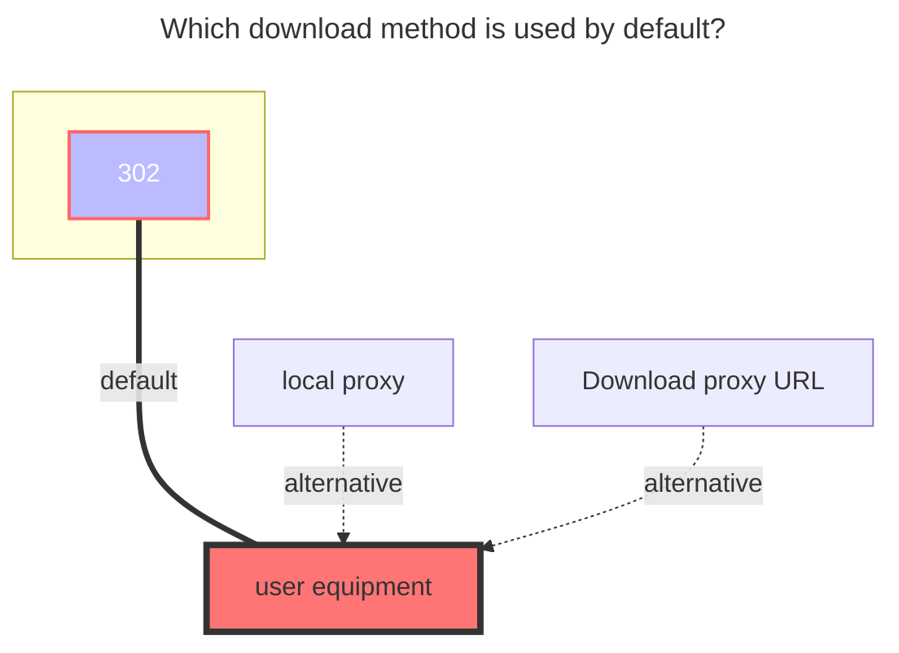

---
# This is the icon of the page
icon: iconfont icon-state
# This control sidebar order
order: 16
# A page can have multiple categories
category:
  - Guide
# A page can have multiple tags
tag:
  - Storage
  - Guide
  - "302"
# this page is sticky in article list
sticky: true
# this page will appear in starred articles
star: true
---

# PikPak / share

## **PikPak**

### **Username**

email or phone?

### **Password**

password

 

### **Root folder id**

Can get with https://mypikpak.com/ , default `root`.

 

### **Disable media link**

- **https://github.com/alist-org/alist/issues/4735**

  

## **PikPak Share**

::: warning
~~As of **February 4, 2023**, the sharing mount  has been officially banned. Currently, you can only watch the first 4 minutes.Stay tuned for when it will be restored~~

~~**v3.12.0 fix,How long it can be used this time is unknown**~~

It is known that PIKPAK sharing can only see 40%-50% **(v3.35.0)**

:::

You only need to fill in **`Username`, `Password`, `Shared ID`** three items, **root folder ID** can be written or not, if not written, the default is the root directory (root directory)

- Root folder ID: If it is a multi-layer directory, which directory do you want to display as the root directory, you can write which root directory.
- Sharing password: if there is a password to share, write it, if not, don’t write it

 

### **Batch add PikPak shared mounts**

software used：**https://github.com/yzbtdiy/alist_batch**

Tutorial video：**[BV1Ps4y1U7Zu](https://www.bilibili.com/video/BV1Ps4y1U7Zu)**

 

## **Precautions**

**Q**: Prompt when adding storage: **Failed init storage: invalid_account_or_password** What should I do, the password I entered is correct

**A**: If the account password is not filled in incorrectly, it may be that you used Google, FB and other third-party quick registration when you registered. Although it seems that the account is a Google mailbox, you cannot log in with the mailbox, but you must use the first Three-party verification, **Alist** does not support this kind of jumping to third-party verification, **so you need to bind an email address in the account settings and set a login password**, or register a new account

-----

**Q**: Prompt when adding mount: **failed get objs: failed to list objs: Sorry, sharing is not available in the current region**

**A**: Because access to ^PikPak^ is prohibited in China, just use a proxy for `AList`, how to make `AList` use a proxy [**One of the reference solutions, this method is limited to Windows build**](https://anwen-anyi.github.io/index/07-wenti.html#_41-alist%E5%A6%82%E4%BD%95-%E4%BD%BF%E7%94%A8-%E5%90%83%E5%88%B0-%E4%BB%A3%E7%90%86-proxy)

 

### **The default download method used**

