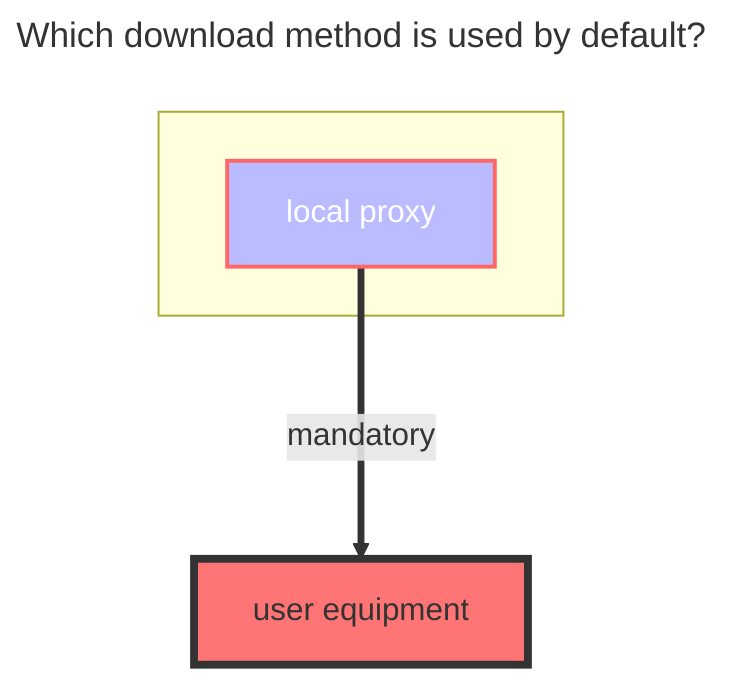

---
# This is the icon of the page
icon: iconfont icon-state
# This control sidebar order
order: 18
# A page can have multiple categories
category:
  - Guide
# A page can have multiple tags
tag:
  - Storage
  - Guide
  - "Native Rroxy"
# this page is sticky in article list
sticky: true
# this page will appear in starred articles
star: true
---

# Quark

:::danger
Due to the speed limit of Quark Cloud,Quick Cloud must use local agents for transmission now,[For details, see](https://github.com/alist-org/alist/issues/4318#issuecomment-1536214188)
:::

### **Cookie and Root folder ID**

The cookie and root folder ID are obtained from the request:

Or the root directory id can also be obtained from the address bar:

Note that only Cookies captured in Chrome is available, use Firefox's Cookies may remain in guest and still require login.

### **The default download method used**

illustrate：[**alist/issues/4318**](https://github.com/alist-org/alist/issues/4318#issuecomment-1536214188)