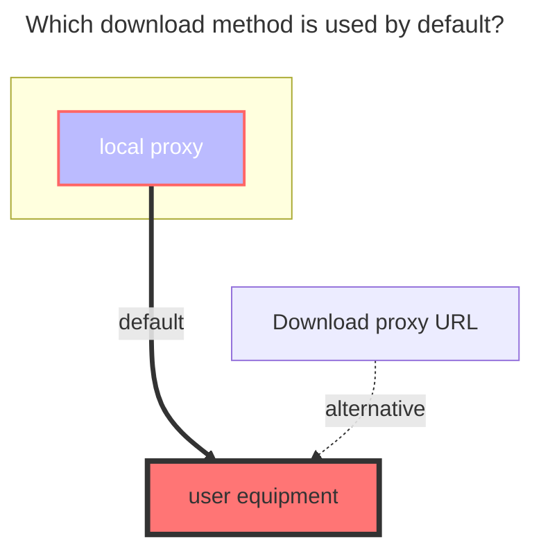

---
# This is the icon of the page
icon: iconfont icon-state
# This control sidebar order
order: 16
# A page can have multiple categories
category:
  - Guide
# A page can have multiple tags
tag:
  - Storage
  - Guide
  - "Native Rroxy"
# this page is sticky in article list
sticky: true
# this page will appear in starred articles
star: true
---

# Quqi Cloud

Quqi Cloud：https://quqi.com ( v3.31.0)

 

### **Phone、Password**

Log in with your mobile phone number and password. It is recommended to use [Cookie](#cookie) to log in.

 

### **Cookie**

Login using cookies **can keep multiple terminals online at the same time**. If you use `mobile phone number, password` to mount, the login status of other terminals will be forced offline.

- Obtaining method: Just find one carrying the `Cookie` parameter in the `F12` network request and copy it

 

### **Root folder id**

The root folder ID is `0`, other subfolder IDs refer to the figure below

 

### **CDN**

Improve the single-connection download speed for VIP users and solve the problem of limiting the number of download connections for non-VIP users. **CDN content needs to be decrypted, which will occupy some computing resources**

 

### **The default download method used**

