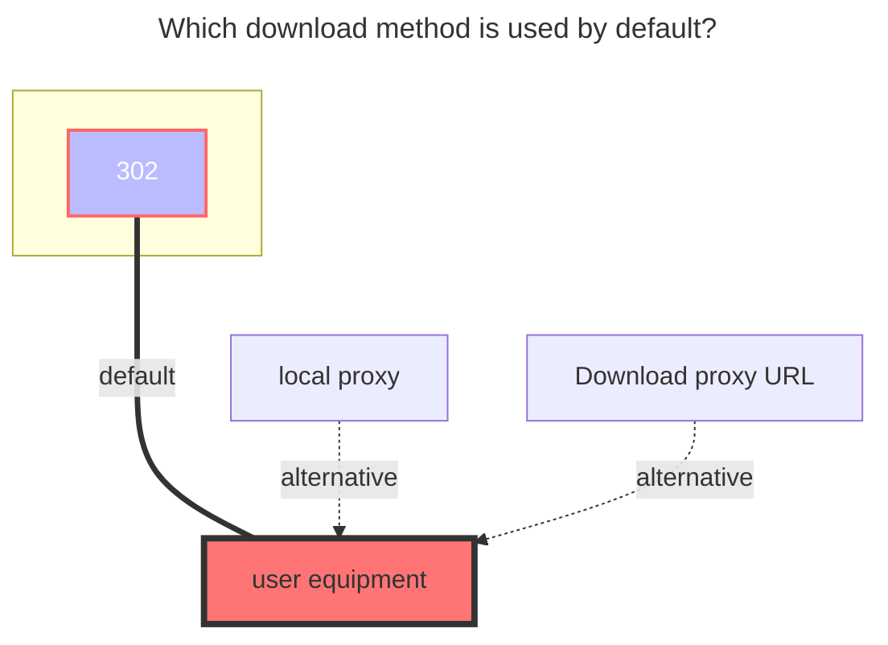

---
# This is the icon of the page
icon: iconfont icon-state
# This control sidebar order
order: 20
# A page can have multiple categories
category:
  - Guide
# A page can have multiple tags
tag:
  - Storage
  - Guide
  - "302"
# this page is sticky in article list
sticky: true
# this page will appear in starred articles
star: true
---

# S3

S3 object storage protocols, such as COS, OSS, B2, etc.

### **BucKet**

bucket name

### **Endpoint**

Endpoint address (If you don’t know, you can read the official documents below)

### **Region**

area (If you don’t know, you can read the official documents below)

### **Access key id**

Access key id

### **Secret access key**

Secret access key

## **Session token**

Session token，Normally, the three-segment token needs to be used, and the two-segment token does not need to fill in this option.

### **Root folder path**

Root path, if not filled, it defaults to the root directory.

### **Custom Host**

Custom cdn acceleration domain name

### **Sign url expire**

The validity period of the signed download address is 4 hours by default. If a custom accelerated domain name is used, this option is invalid.

### **Placeholder**
The name of placeholder file.

### **Force path style**
If enable ForcePathStyle, usually needed for minio.

### **List object version**
Refer to s3 sdk documents.


## **Add object storage examples and official documents**

`S3 Object Storage` includes but is not limited to these. There are many more, such as Microsoft and Google, which have not been added. There are no examples here because it is difficult to register and activate and cannot provide example tutorials. If you have an account, please contact us and provide an account and I will add it.

::::tabs#S3

@tab Alibaba

[**Alibaba Cloud OSS Official Website**](https://oss.console.aliyun.com/)

[**Comparison Table of Endpoints in Different Regions of OSS under Public Cloud**](https://help.aliyun.com/document_detail/31837.html)

::: tip
Alist needs to skip `referer` to mount **Alibaba Cloud Disk**. If you do not allow `referer` to be empty in anti-leech, it will not work, because Alibaba Cloud Disk uses Alibaba Cloud OSS (in Beijing area)

In fact, the `Region|Region` option can be written as `Endpoint`, but for the sake of specification, let’s write it according to the comparison table.:::

:::

Fill in example:


@tab Tencent

[**Tencent Cloud COS Official Website**](https://console.cloud.tencent.com/cos)

[**Collection Table of Endpoints in Each Region of COS under the Public Cloud**](https://cloud.tencent.com/document/product/436/6224)

Fill in example:


@tab Tianyi

[**Tianyi Cloud OOS Official Website**](https://oos-cn.ctyun.cn/oos/ctyun/consoleBucket.html)

[**Comparison Table of Endpoints of OOS Regions under Public Cloud**](https://www.ctyun.cn/document/10026693/10027878)

Fill in example:


@tab Baidu

[**Baidu Cloud BOS official website**](https://console.bce.baidu.com/bos)

[**Self-configure Bucket’s Referer whitelist permissions**](https://cloud.baidu.com/doc/BOS/s/Bk6kqu8eq#Setrefererwhitelist)

[**comparison table of Region and Endpoint of BOS under public cloud**](https://intl.cloud.baidu.com/doc/BOS/s/xjwvyq9l4-en)


**Endpoint comparison table compatible with AWS S3**[**Click to view details**](https://cloud.baidu.com/doc/BOS/s/xjwvyq9l4)

Fill in example:


@tab Qiniu

[**Qiniu Cloud Kodo official website**](https://portal.qiniu.com/kodo/bucket)

[**Region and Endpoint comparison table of Kodo under the public cloud**](https://developer .qiniu.com/kodo/4088/s3-access-domainname)

Fill in example:


@tab Huawei

[**HUAWEI CLOUD OBS Official Website**](https://www.huaweicloud.com/intl/en-us/)

[**Check the Region and Endpoint comparison table of OBS under the public cloud**](https://developer.huaweicloud.com/intl/en-us/endpoint), the secret key AK/SK[acquire](https://console.huaweicloud.com/iam/?region=cn-north-4#/mine/accessKey) to set by yourself.

Fill in example:


@tab JD

[**JD CLOUD OBS Official Website**](https://www.jdcloud.com/cn/products/object-storage-service)

Advantages: [free 10G](https://www.jdcloud.com/cn/activity/oss), support IPV6
Disadvantages: need to precharge 100 to open，However, after the pre-deposit is completed, the object storage is activated, and the pre-deposited amount can still be used after withdrawal.

[**Region and Endpoint comparison table of Kodo under the public cloud**](https://docs.jdcloud.com/cn/object-storage-service/oss-endpont-list)

Fill in example:


@tab Doge

[**Doge Cloud OSS Official Website**](https://www.dogecloud.com/product/oss)，If you want to add Doge, use a separate `DogeCloud` driver to add, please do not use the `S3` the driver

Region Code：

```json
// 0: 上海（华东），1: 北京（华北），2: 广州（华南），3: 成都（西南）
```


@tab 139

[**139 CLOUD EOS Official Website**](https://console.ecloud.10086.cn/api/page/eos-console-web/CIDC-RP-00/eos/bucket?productType=os&v=new)

need to precharge 100 to open

[**Region and Endpoint comparison table of Kodo under the public cloud**](https://ecloud.10086.cn/op-help-center/doc/article/48082)

Fill in example:


@tab upyun

[**Yupyun USS Official Website**](https://console.upyun.com/services/file/):[Click here to configure USS](./uss.md)

@tab Amazon

[**Amazon S3 Official Website**](https://s3.console.aws.amazon.com/s3/)

The endpoint URL contains the name of the region where the bucket is located

Example ^1^, if your bucket is in the US East (Ohio) region

> Then the format of the Endpoint URL is **`s3.us-east-2.amazonaws.com/your-bucket-name`**
>
> Region parameter: **`us-east-2`**
>
> Bucket name: **`your-bucket-name`** (your own bucket name)

Example^2^, my storage bucket is `Tokyo`, and the name of the storage bucket is `cdn-aw`, then the complete parameter filling is as follows

>1. **Endpoint**: s3.ap-northeast-1.amazonaws.com
>2. **Region**: ap-northeast-1
>3. **Bucket Name**: cdn-aw

Let's take a look at the complete parameter filling example

Fill in example:


@tab R2

[**cloudflare R2 Official Website**](https://dash.cloudflare.com/)

**Endpoint** ：The S3 endpoint is available via the  **`https://<ACCOUNT_ID>.r2.cloudflarestorage.com`**  endpoint.

**`ACCOUNT_ID`** ：This account ID can be seen everywhere, and the simplest is the position at the top of the browser. The string of IDs behind the website link is your account ID.

填写示例：


@tab B2

[**B2 Official Website**](https://secure.backblaze.com/b2_buckets.htm)

The full name is **`Backblaze`**, no verification information is required, and it is said that the first 10G is free.

Fill in example:


@tab scaleway

[**Scaleway Official Website**](https://console.scaleway.com/object-storage/buckets)

Card required, verification information

[**Region and Endpoint comparison table of Kodo under the public cloud**](https://www.scaleway.com/en/docs/storage/object/concepts/#object-storage)

Fill in example:


@tab Minio

Those who use `Minio` self-built object storage should know how to obtain the ID and secret key, so I won’t talk about it here

You only need to fill in the four options of bucket name, access key ID, security access key, and Endpoint, and leave the region empty

**Endpoint：http(s):\//《YOUR_IP/URL》:9001/**，You can use IP or domain name

Finally, remember to enable **`Force Path Style`** to use, otherwise it cannot be used [Click to view details](https://github.com/alist-org/alist/discussions/4920#discussioncomment-6635452)

填写示例：


@tab Google Cloud

I assume you already have a Google Cloud account, so let’s go directly to the Google Cloud Storage settings page.[Click me](https://console.cloud.google.com/storage/settings;tab=interoperability)

Then you will enter the following page:


You can see Endpoint and Access Key on this page, you need to select an account and create an Access Key


Access Key/Secret will be displayed on the new page, They will only be displayed this time. Please save them properly.


At this point, the EndPoint, access key Id, and security access key required by Alist have been obtained. Please view the remaining buckets and regions in the corresponding buckets.


::::


### **The default download method used**


