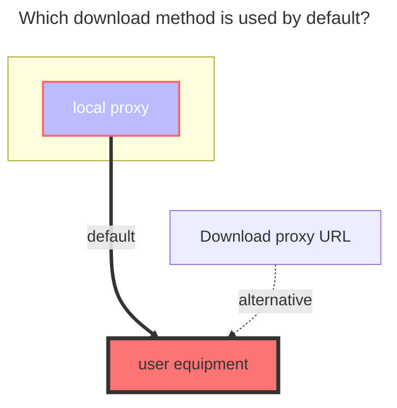

---
# This is the icon of the page
icon: iconfont icon-state
# This control sidebar order
order: 30
# A page can have multiple categories
category:
  - Guide
# A page can have multiple tags
tag:
  - Storage
  - Guide
  - "Native Rroxy"
# this page is sticky in article list
sticky: true
# this page will appear in starred articles
star: true
---

# SFTP

That is to access files through the ssh protocol.

### **Address**
SSH address, need contains port.

### **Username**
ssh username, usually root

### **Password**
ssh password

### **Private key**
Use Private key to auth otherwise password.

### **Root folder path**
root path to mount

### **The default download method used**

