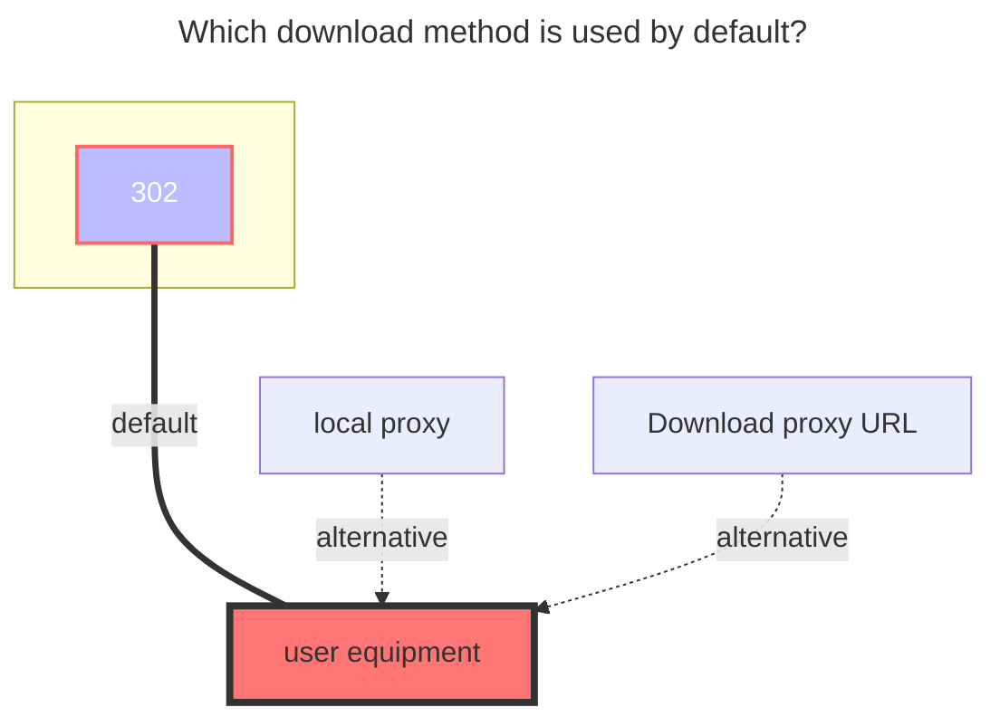

---
# This is the icon of the page
icon: iconfont icon-state
# This control sidebar order
order: 11
# A page can have multiple categories
category:
  - Guide
# A page can have multiple tags
tag:
  - Storage
  - Guide
  - "302"
# this page is sticky in article list
sticky: true
# this page will appear in starred articles
star: true
---

# Teambition

Teambition project file, supports Chinese server and international server.

### **Cookies**

After login, the validity period is unknown

### **Project ID and root folder id**

Get it from the URL after logging in

### **The default download method used**

